# warden-connect

**The connection control plane for AI agents.**

A policy engine decides whether an agent may take *an action*. warden-connect decides
whether two parties may be *connected at all*, and bounds what that connection can
ever carry. One is per-call authorisation. The other is the standing relationship the
calls happen inside.

> **Beta.** Not independently audited, and no hardening pass has been run. What this does
> not do is stated in [docs/07-hld.md §7.13](docs/07-hld.md) (open questions) and
> [docs/08-lld.md §8.16b](docs/08-lld.md) (deliberately not built). The detailed
> limitations and production-readiness registers were retired in the 2026-08-21 docs
> rewrite and live in git history at `3f30697`.

---

## The walkthrough, slide by slide

The two-and-a-half minute film runs twelve slides. Each one is below: the text
as the film states it, a description of what it means in the implementation,
and a **Reference** line into the design documents, the use cases and the
walkthrough. If you arrived here from the video, those links are where the
slide is specified in full.

### 1 · Title

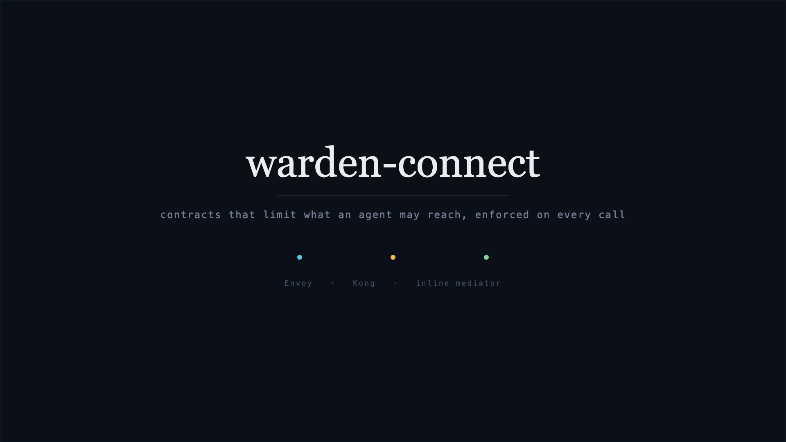

*warden-connect — the connection control plane for AI agents*
*contracts that limit what an agent may reach, enforced on every call*
*Envoy · Kong · inline mediator*

The title slide names the product and the three enforcement points. The eleven
slides after it describe how a contract is created and how it is enforced.

**Reference** · [HLD](docs/07-hld.md) — the design in one document · [end-to-end guide](docs/guides/end-to-end.md) — walk it yourself

### 2 · The token only names a service

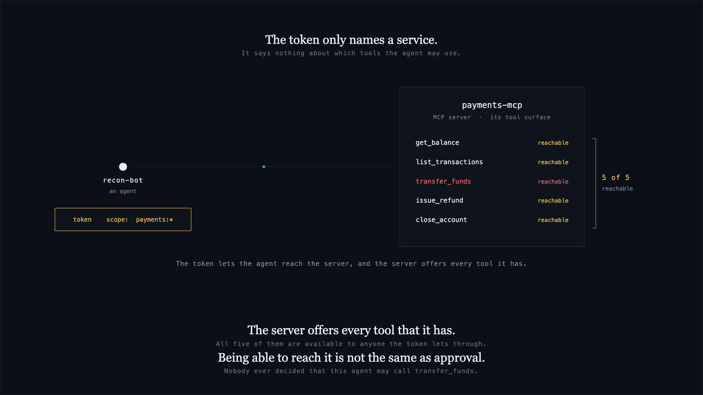

> The token only names a service. It says nothing about which tools the agent may use.
> The server offers every tool that it has — all of them available to anyone the token lets through.
> Being able to reach it is not the same as approval. Nobody ever decided that this agent may call `transfer_funds`.

A bearer token has an audience of one service. It carries no list of tools. When
the agent calls `tools/list`, the MCP server returns its whole catalogue, so any
caller the token admits can attempt any tool the server exposes, including
`transfer_funds`. No record exists of a decision about individual tools.

**Reference** · [HLD §7.1 Scope and context](docs/07-hld.md#71-scope-and-context) · [LLD §8.6.4 the catalogue filter](docs/08-lld.md#864-filter--the-catalogue) · [UC-03 · Mediated capability discovery](docs/use-cases/UC-03-mediated-capability-discovery.md)

### 3 · The same defect, repeated

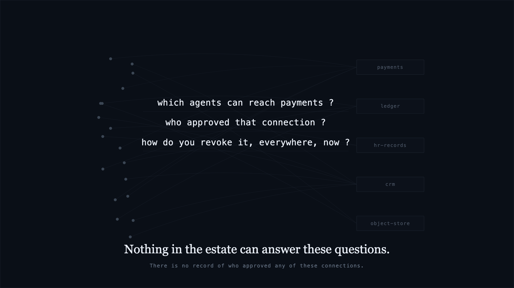

> Nothing in the estate can answer these questions. There is no record of who approved any of these connections.

The estate is a graph, not a pair: agent to agent to tool to agent, assembled at
runtime. Every edge is a separate connection, and every edge has the same
missing record. `connect inventory` reads the declared paths across an
organisation's repositories and reports which connections exist, without probing
any endpoint.

**Reference** · [HLD §7.1 Scope and context](docs/07-hld.md#71-scope-and-context) · [LLD §8.5.11 inventory](docs/08-lld.md#8511-offer-need-pipeline-scm-proposal-receipt-inventory) · [UC-08 · Shadow estate detection](docs/use-cases/UC-08-shadow-estate-detection.md)

### 4 · Two separate questions

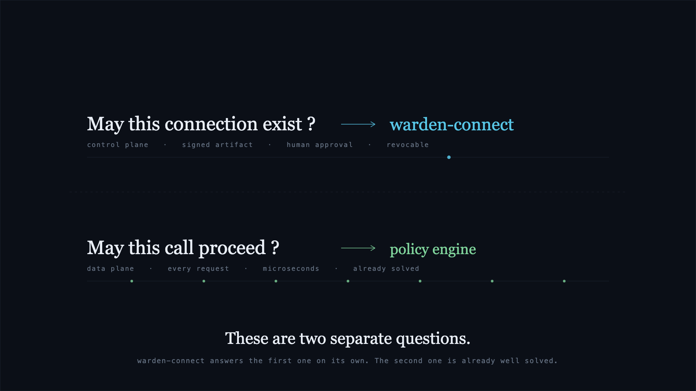

> These are two separate questions. warden-connect answers the first one on its own. The second one is already well solved.

| Question | Answered by | When |
|---|---|---|
| May these two parties be connected at all? | warden-connect | once, at issuance |
| May this call proceed? | a policy engine | on every call |

The two run at different times and are owned by different components.
warden-connect answers the first and does not evaluate per-call policy.

**Reference** · [HLD §7.6 Two policies, two moments](docs/07-hld.md#two-policies-two-moments) · [HLD §7.7 Integration with a policy engine](docs/07-hld.md#77-integration-with-a-policy-engine) · [LLD §8.5.5 may this contract exist?](docs/08-lld.md#855-cpolicy--may-this-contract-exist)

### 5 · Each side declares in its own repository

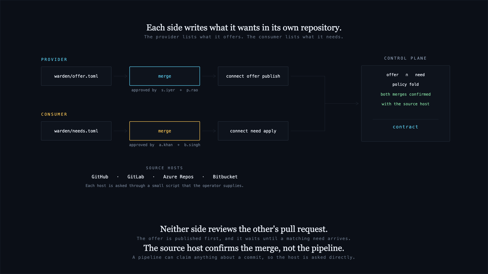

> Each side writes what it wants in its own repository. The provider lists what it offers; the consumer lists what it needs.
> Neither side reviews the other's pull request. The offer is published first, and it waits until a matching need arrives.
> The source host confirms the merge, not the pipeline. A pipeline can claim anything about a commit, so the host is asked directly.

The provider commits `warden/offer.toml`. The consumer commits
`warden/needs.toml`. Each is reviewed and merged in its own repository, so
neither party can produce a contract alone and neither needs a signing key.

warden-connect reads the merge result from the source host through an
operator-supplied shim, not from CI output, because a pipeline can assert
anything about a commit. The approver list is read at the merge's base commit
rather than its head, so a pull request that adds its own author to that list
cannot be approved by that author. A host that does not report a base commit is
refused with `WC-3025`.

**Reference** · [HLD §7.6 Reserved paths](docs/07-hld.md#reserved-paths) · [LLD §8.5.11 offer, need, scm, authority](docs/08-lld.md#8511-offer-need-pipeline-scm-proposal-receipt-inventory) · [UC-01 · Register an agent](docs/use-cases/UC-01-register-and-admit-an-agent.md) · [UC-02 · Onboard a tool server](docs/use-cases/UC-02-onboard-a-tool-server.md) · [guide §07–§10](docs/guides/end-to-end.md)

### 6 · Three dispositions

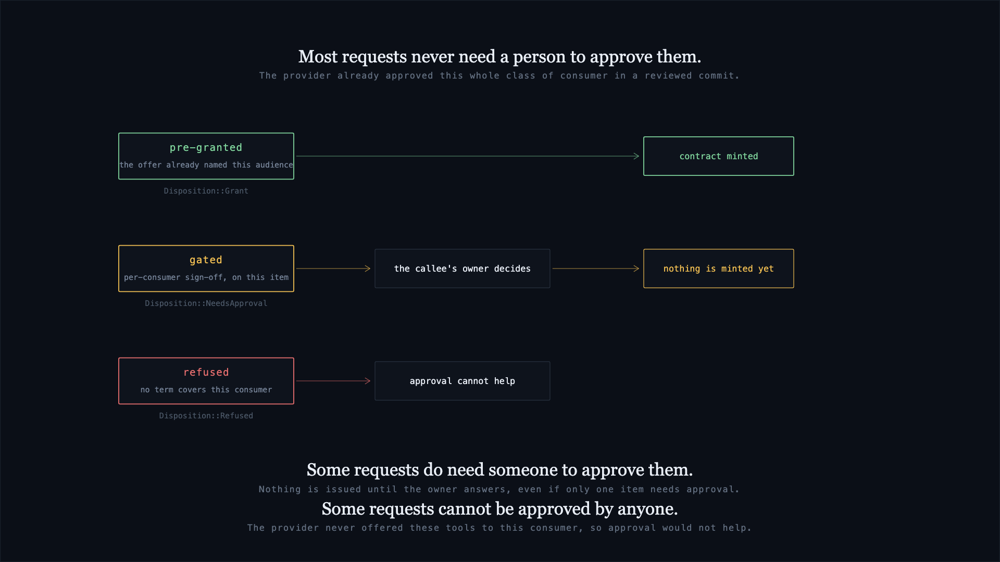

> Most requests never need a person to approve them. The provider already approved this whole class of consumer in a reviewed commit.
> Some requests do need someone to approve them. Nothing is issued until the owner answers, even if only one item needs approval.
> Some requests cannot be approved by anyone. The provider never offered these tools to this consumer, so approval would not help.

`connect need apply` returns one of three values:

| Disposition | Offer term | Result |
|---|---|---|
| `Grant` | `pre_granted` | a contract is minted immediately |
| `NeedsApproval` | `named_consumer` | the request is parked until the provider merges an approval file |
| `Refused` | not offered | the diff is returned; no approval can satisfy it |

Refusals are evaluated before gating, so one refused item refuses the whole
need. One gated item holds the whole need until it is answered.

**Reference** · [LLD §8.5.11 Disposition](docs/08-lld.md#8511-offer-need-pipeline-scm-proposal-receipt-inventory) · [LLD §8.7.2 Issuance](docs/08-lld.md#872-issuance--issuance-authority) · [UC-04 · Establish a connection](docs/use-cases/UC-04-establish-a-connection.md) · [guide §12–§13](docs/guides/end-to-end.md)

### 7 · The contract is stored in three places

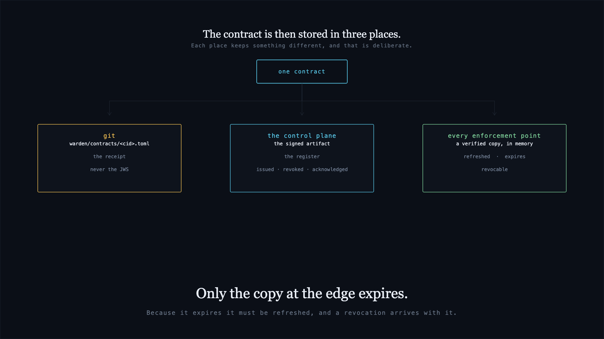

> The contract is then stored in three places. Each place keeps something different, and that is deliberate.
> Only the copy at the edge expires. Because it expires it must be refreshed, and a revocation arrives with it.

| Location | What it holds | Expires |
|---|---|---|
| The repository | a receipt, `warden/contracts/<cid>.toml` — human-readable TOML, never the signed artifact | no |
| The control plane | the signed artifact and the event log that produced it | no |
| The enforcement point | the artifact it verifies against, held in memory | yes |

The enforcement point refreshes its copy on an interval, and the revocation feed
is delivered on the same request. If no refresh succeeds within `max_stale`
seconds, the enforcement point refuses every call.

**Reference** · [LLD §8.8 Storage](docs/08-lld.md#88-storage) · [LLD §8.9.3 Receipts](docs/08-lld.md#893-receipts) · [LLD §8.5.8 containment and distribution](docs/08-lld.md#858-contain-dist-caep--containment) · [HLD §7.11 Non-functional requirements](docs/07-hld.md#711-non-functional-requirements)

### 8 · A contract sets a limit, not a grant

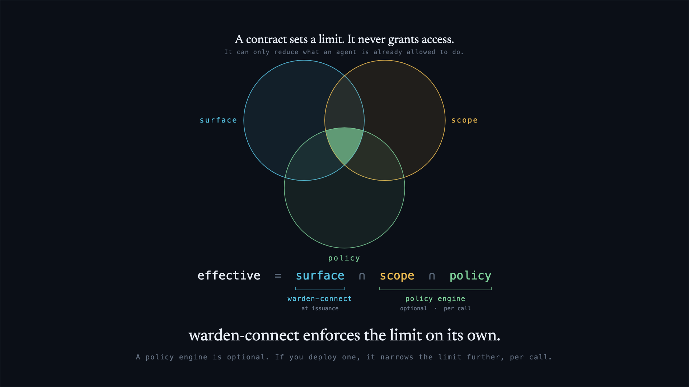

> A contract sets a limit. It never grants access. It can only reduce what an agent is already allowed to do.
> warden-connect enforces the limit on its own. A policy engine is optional; if you deploy one, it narrows the limit further, per call.

```
effective = contract.surface  ∩  token.scope  ∩  policy_decision
```

Every operator in the expression is an intersection or a minimum. There is no
union and no maximum anywhere in the algebra. The property tests assert that no
output contains an item an input excluded, and that the operation is
commutative, idempotent and associative.

**Reference** · [HLD §7.4 The algebra](docs/07-hld.md#the-algebra) · [LLD §8.7.1 The narrowing algebra](docs/08-lld.md#871-the-narrowing-algebra) · [HLD §7.7 Integration with a policy engine](docs/07-hld.md#77-integration-with-a-policy-engine)

### 9 · Three places to run the check

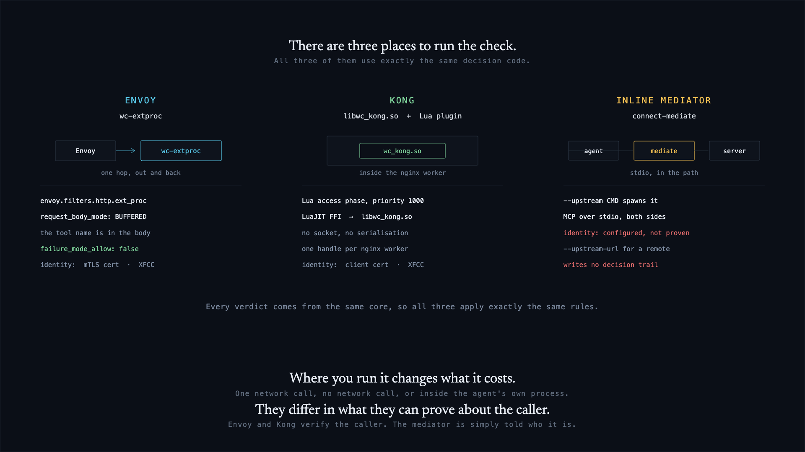

> There are three places to run the check. All three use exactly the same decision code.
> Where you run it changes what it costs — one network call, no network call, or inside the agent's own process.
> They differ in what they can prove about the caller. Envoy and Kong verify the caller; the mediator is simply told who it is.

| Enforcement point | Network cost | Caller identity |
|---|---|---|
| Envoy — `wc-extproc` | one loopback gRPC call | verified: XFCC header, origin-checked |
| Kong — `libwc_kong.so` | none; runs in the nginx worker | verified: peer certificate URI SAN, or XFCC |
| Inline mediator — `connect-mediate` | none; runs in the agent's process | configured by the operator, not authenticated |

All three link the same crate, `wc-gateway`, which holds the decision. Each
binding handles transport only: it collects identity evidence and moves bytes.
The verdict is therefore the same in all three; the cost and the identity source
differ.

**Reference** · [HLD §7.9 Deployment topologies](docs/07-hld.md#79-deployment-topologies) · [LLD §8.6b.2 The two bindings](docs/08-lld.md#86b2-the-two-bindings) · [LLD §8.6b.1 The three layers](docs/08-lld.md#86b1-the-three-layers) · [install guide](docs/guides/install.md)

### 10 · The refusal, at three points

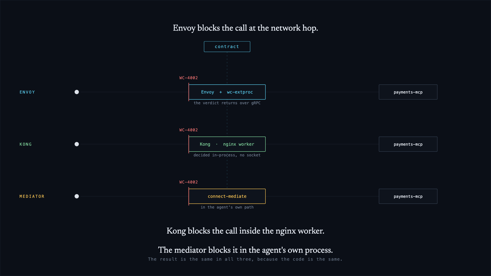

> Envoy blocks the call at the network hop.
> Kong blocks the call inside the nginx worker.
> The mediator blocks it in the agent's own process.
> The result is the same in all three, because the code is the same.

A call to a tool outside the contract's surface is refused at whichever point is
in the path, before it reaches the server. The `tools/list` response is filtered
to the contracted surface first, so the catalogue the model receives lists only
contracted tools. A catalogue that cannot be filtered is refused with
`WC-4007`.

**Reference** · [HLD §7.4 Verification — the 14 gates](docs/07-hld.md#verification--fail-closed-at-every-step) · [LLD §8.6.4 the catalogue filter](docs/08-lld.md#864-filter--the-catalogue) · [UC-04 · Establish a connection](docs/use-cases/UC-04-establish-a-connection.md) · [guide §16–§17](docs/guides/end-to-end.md)

### 11 · One revocation reaches every enforcement point

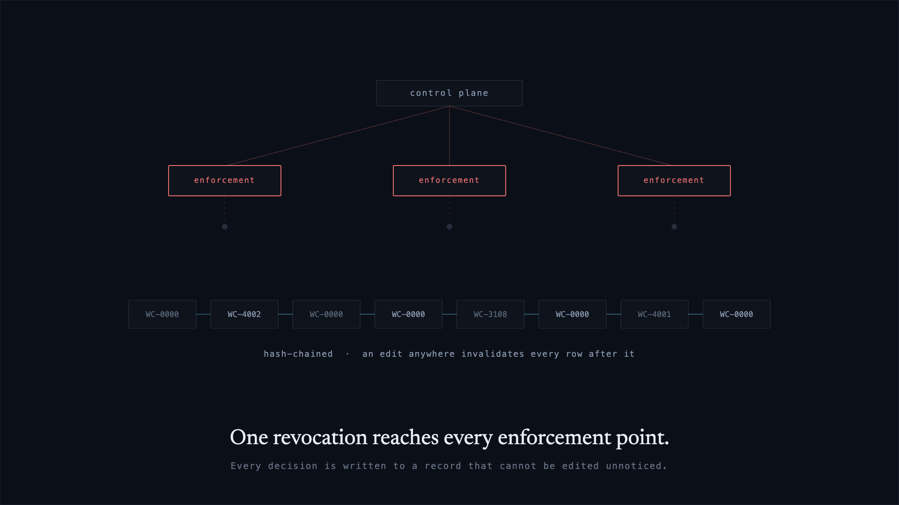

> One revocation reaches every enforcement point. Every decision is written to a record that cannot be edited unnoticed.

`connect quarantine` writes a signed revocation feed. Each enforcement point
fetches it on its refresh interval. The control plane records which points have
acknowledged; one that has not is reported as `WC-6003` and is not counted as
confirmed.

Each enforcement point appends its decisions to a local file, and every row
carries the hash of the row before it. An edit anywhere invalidates every row
after it. `connect evidence verify` reports the first row whose hash does not
match.

**Reference** · [LLD §8.5.8 the revocation feed](docs/08-lld.md#858-contain-dist-caep--containment) · [LLD §8.5.9 the evidence chain](docs/08-lld.md#859-chain-evidence-sink-export-rekor--evidence) · [UC-07 · Emergency quarantine](docs/use-cases/UC-07-emergency-quarantine.md) · [UC-06 · Surface drift](docs/use-cases/UC-06-surface-drift.md) · [UC-10 · Regulatory register and evidence](docs/use-cases/UC-10-regulatory-register-and-evidence.md)

### 12 · Each part has one job

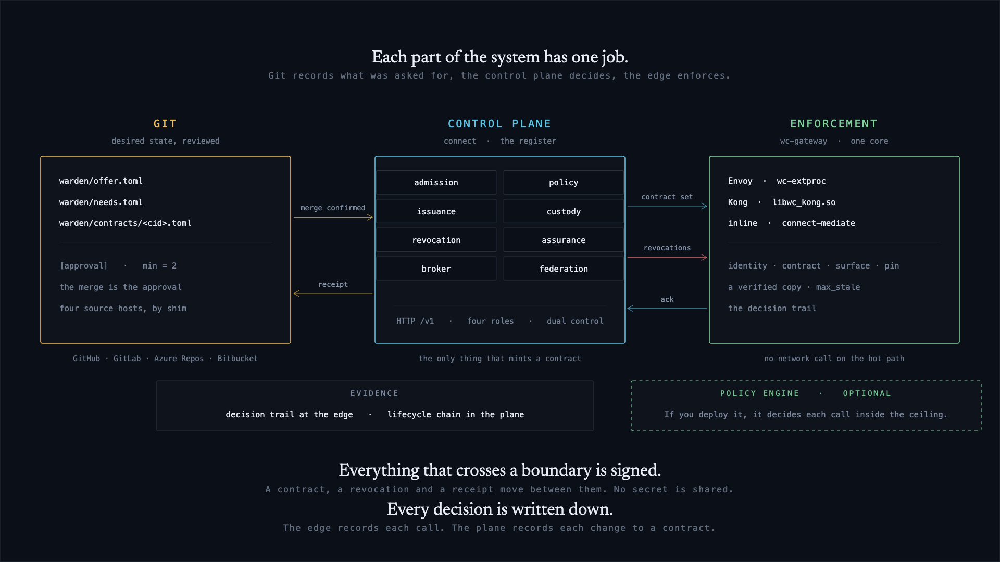

> Each part of the system has one job. Git records what was asked for, the control plane decides, the edge enforces.
> Everything that crosses a boundary is signed. A contract, a revocation and a receipt move between them. No secret is shared.
> Every decision is written down. The edge records each call. The plane records each change to a contract.

| Plane | Job |
|---|---|
| Git | holds the request and the receipt |
| Control plane | decides and signs |
| Enforcement point | verifies and enforces |

Three artifacts cross the boundaries — a contract, a revocation and a receipt —
and all three are signed. No secret is shared between planes. The enforcement
point verifies against the issuer's public keys, so it does not need the control
plane to be reachable or trusted. A control plane that is compromised can
withhold a contract, which fails closed; it cannot produce one.

**Reference** · [HLD §7.2 Architecture overview](docs/07-hld.md#72-architecture-overview) · [LLD §8.3 Crate layout](docs/08-lld.md#83-crate-and-repository-layout) · [HLD §7.8 Trust and threat model](docs/07-hld.md#78-trust-and-threat-model) · [LLD §8.19 The three claims](docs/08-lld.md#819-the-three-claims-this-design-has-to-keep)

---

## Layout

| Crate | What it is |
|---|---|
| `wc-core` | The artifact. Canonicalisation (`wcs1`), the contract format, signing and verification, the error taxonomy. No HTTP, no async, no filesystem assumptions — embeddable. |
| `wc-control` | The control plane. Registry, admission, approvals, evidence chain, keyring and rotation, screening, attestation, revocation, HTTP API. |
| `wc-cli` | `connect` — everything the API does, from a terminal. |
| `wc-mediator` | The enforcing half: contract cache, surface filter, ceilings, peer identity, JWKS-backed issuer trust. Ships `connect-mediate`. |
| `wc-e2e` | The pyramid above unit tests: e2e, failure injection, property, attestation interop. |

Rust 2021, MSRV 1.89. **No async runtime, no ORM, no database, no ML runtime** — and
that is asserted by [`deny.toml`](deny.toml) rather than promised in prose. Clocks are
injected everywhere, so nothing in the test suite depends on the wall clock.

## Build

```sh
cargo build --workspace          # no external checkout needed
cargo test --workspace           # 1,439 tests
cargo clippy --workspace --all-targets
cargo deny check
./scripts/dep-count.sh           # dependency ceilings, asserted
```

Nothing outside this repository is required to build or test it. The optional
`warden-proxy` feature is the only thing that pulls in a policy engine, and it is off
by default.

## Try it

```sh
# 1 · an issuer key, and the two parties
connect keys new --kid k-2026-01 --out .keys      # prints the openssl command
connect register server --endpoint https://payments.internal/mcp \
    --owner human:vijay --zone internal.payments --surface payments-surface.json
connect register agent --card recon-agent.json --owner human:vijay \
    --zone internal.apac-ops

# 2 · ask for a connection, and approve it
connect request --from spiffe://org/ns/agents/sa/recon --to spiffe://org/ns/tools/sa/payments \
    --tools get_balance,list_transactions --justify "nightly reconciliation" --ttl 30d \
    --issuer-key .keys/k-2026-01.pem --kid k-2026-01
connect approve <req-id> --by human:vijay --approver-key .keys/approver.pem \
    --issuer-key .keys/k-2026-01.pem --kid k-2026-01

# 3 · verify the artifact the way a third party would
connect verify contract.jws --jwks jwks.json --mediator-id warden:mediator:apac-ops \
    --issuer-id https://connect.internal

# 4 · enforce it, inline, in front of the real server
connect-mediate --upstream "python payments_mcp.py" \
    --mediator-id warden:mediator:apac-ops --issuer-id https://connect.internal \
    --caller spiffe://org/ns/agents/sa/recon --callee spiffe://org/ns/tools/sa/payments \
    --jwks-url https://connect.internal/v1/jwks.json \
    --contracts https://connect.internal --token "$MEDIATOR_TOKEN"
```

`connect --help` is the full surface: registration and attestation, the connect loop,
estate queries (`posture`, `blast-radius`, `discover`), keys and rotation, air-gapped
bundles, CAEP shared signals, evidence export (CSV, JSON, DORA, CPS 230, OSCAL, BOM),
and `serve`.

## Running the control plane

```sh
connect serve --listen 0.0.0.0:8787 --issuer-key .keys/k-2026-01.pem --kid k-2026-01 \
    --behind-tls-proxy --trusted-proxy 10.0.1.5 \
    --tokens tokens.toml --approvers approvers.toml
```

`serve` speaks **plain HTTP on purpose** — every supported topology terminates TLS at an ALB,
an Ingress, HAProxy or Front Door. So a non-loopback listener **refuses to start**
unless you say how TLS is handled, and with `--behind-tls-proxy` every authenticated
request must carry `x-forwarded-proto: https` from an address you named. A request that
reaches the port directly, bypassing the ingress, is refused rather than trusted.

Signing keys have a **delegated form** everywhere they have a PEM form
([docs/08-lld.md §8.12.1](docs/08-lld.md)): `--signer COMMAND` reads a base64url
signing input on stdin and writes a base64url signature on stdout, so the private key
can live in an HSM, a smartcard or a KMS and never reach this process.
`--require-external-signing` refuses to start if any key would be read from local disk.

## Documentation

| | |
|---|---|
| [docs/07-hld.md](docs/07-hld.md) | **Start here.** High-level design — the plane split, the artifact, the algebra, the trust and threat model, the adoption ladder |
| [docs/08-lld.md](docs/08-lld.md) | Low-level design — every crate, every module, every check, the error taxonomy, the build order |
| [docs/use-cases/](docs/use-cases/) | Ten use cases, one file each, with a sequence diagram per use case |
| [sdk/python/](sdk/python) · [examples/](examples) | A dependency-free client for the control-plane API, and three runnable examples |
| [SECURITY.md](.github/SECURITY.md) | Reporting a vulnerability; what is in and out of scope |

> `docs/` was rebuilt on 2026-08-21. The previous set — capability matrices, journey maps,
> threat model, limitations, production readiness, key custody, runbook, deployment,
> observability, operations, releasing, conformance, prerequisites, physical architecture,
> twelve-factor, and the HTML/video explainer estate — is preserved in git history at
> `3f30697`. Comments throughout the source still cite those paths.

## Conformance

The contract format is meant to be a candidate standard, not a product format: **any
implementation may mint a contract, and a contract is valid iff a conforming verifier
accepts it.** `fixtures/contracts/` is the test vector set — nineteen artifacts and an
`expected.json` naming the `WC-*` code a conforming verifier must produce for each,
including alg confusion, `alg: none`, HMAC substitution, a tampered payload, a
superset surface and a wrong audience.

```sh
scripts/conformance.sh ./my-verifier          # your implementation
scripts/conformance.sh                         # ours, as a self-check
```

Fifteen vectors any verifier can run; four need a mediator (an authenticated peer, a
presented surface, a revocation feed) and are reported as **deferred** rather than passed —
counting them would tell you you had covered nineteen checks when you had covered fifteen.
`fixtures/contracts/README.md` has the calling convention and the version policy.

If your verifier and this one disagree on any vector, one of us has a bug — and that is
a more useful conversation than a specification document.

## Licence

[FSL-1.1-ALv2](LICENSE) — Functional Source License, converting to
[Apache 2.0](LICENSE-APACHE) two years after each release. Use it, run it, modify it;
do not ship a competing product with it until the conversion date.
