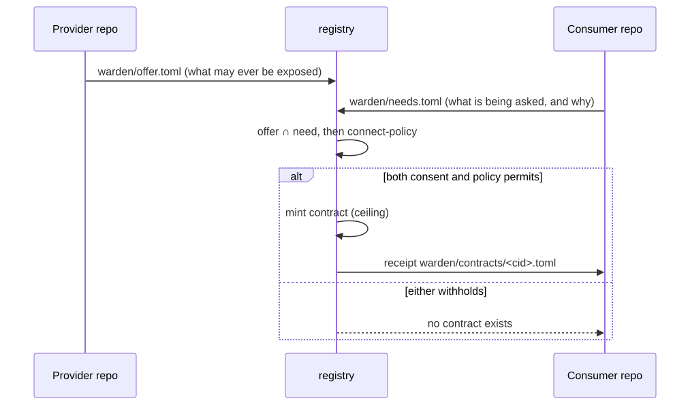

# 7 · warden-connect — High-Level Design

> **One sentence.** warden-connect decides whether a connection between two
> parties may *exist*; warden decides whether each *call* on that connection may
> proceed. Neither can do the other's job, and the interface between them is two
> signed artifacts and one identifier.

| | |
|---|---|
| **Status** | v0.1.1 · Rust 2021 · MSRV 1.89 · 5 crates · 1,273 tests |
| **Audience** | Architects, reviewers, implementers of a competing verifier |
| **Companion** | [08-lld.md](08-lld.md) for every module and every check · [use-cases/](use-cases/) for the ten flows · [explainer.html](explainer.html) for the narrative |

---

## 7.1 Scope and context

### What this is

A **connection control plane** for AI agents. It answers a question that neither
authentication nor authorization answers:

> Who agreed to this, and can you show me?

Authentication answers *who is calling*. Authorization answers *what they may
do*. Neither asks the party being called whether it agreed to be called by this
caller, for these tools, on these terms, until this date.

### What it is not

| Not | Because |
|---|---|
| A policy engine | warden already is one. This produces the ceiling warden intersects |
| An identity provider | Identity arrives already proven; this binds to it |
| A service mesh | No traffic management, no retries, no load balancing |
| A secrets manager | No credential is ever minted, held or distributed here |
| A gateway product | `wc-mediator` runs standalone or compiles into warden's proxy |

### System context



---

## 7.2 Architecture overview

### Plane split

| Plane | Crate | Decides | Latency budget | Failure stance |
|---|---|---|---|---|
| **Control** | `wc-control`, `wc-cli` | May this connection exist? | Human timescale | Fail closed; a withheld contract denies |
| **Data** | `wc-mediator` | Is this call inside the ceiling? | Sub-millisecond, no network call | Fail closed on every gate |
| **Shared** | `wc-core` | The artifact, its canonical form, the 79 codes | — | — |

The control plane can be entirely offline and the data plane still enforces
correctly against contracts it already holds. **A compromised control plane can
withhold a contract, which fails closed. It cannot manufacture one** — contracts
are verified against issuer keys, not looked up in a database the mediator
trusts.

### Component inventory

| Component | Crate | Responsibility |
|---|---|---|
| Registry | `wc-control::registry` | Entities, lifecycle, posture, ownership |
| Admission | `wc-control::admission` | Identity, provenance, screening, pinning, tiering |
| Issuance | `wc-control::issuance` | Request → disposition → mint → distribute |
| Connect policy | `wc-control::cpolicy` | May this contract exist? |
| Assurance | `wc-control::assurance` | Re-attestation, drift, posture scoring |
| Containment | `wc-control::contain` | Quarantine, revocation, blast radius |
| Federation | `wc-control::federate` | Trust anchors, chains, monotonic narrowing |
| Inventory | `wc-control::inventory` | Reserved-path sweep across SCM hosts |
| Evidence | `wc-control::chain`, `evidence`, `export` | Tamper-evident chain, DORA/CPS230/OSCAL/OCSF |
| Portal | `wc-control::portal` | Read-only, server-rendered discovery view |
| Mediator | `wc-mediator` | Contract verification, surface filter, ceilings |
| Contract | `wc-core::contract` | Payload, canonical form, verification, the algebra |

---

## 7.3 Domain model

```
Entity (agent | mcp_server | a2a_agent)
  id            spiffe:// | urn:                        the wire identity
  owner         human:…                                 accountable, required
  service       business service reference
  tier          1..4                                    derived at admission
  zone          internal.<domain> | partner.<org> | public
  surface_hash  sha256 of the canonical card/manifest   ← the pin
  provenance    [slsa | sigstore refs]
  posture       attested | degraded | unattested | quarantined
  lifecycle     pending | active | suspended | retired
  data_classes  [...]        jurisdictions [...]

Contract        cid, caller→Entity, callee→Entity, surface, terms,
                assurance, approval, exp                (§7.4)

Zone            id, trust_level, assurance_bar { identity, provenance,
                ttl_max, approval, oversight, max_delegation_depth }

Approval        id, cid, approver (human), signature, ticket,
                policy_version, ts

PostureEvent    entity, kind (drift | reattest | expiry | screening |
                quarantine), diff, severity, ts

AuditEntry      warden's shape, extended with cid, contract_jti,
                entity ids, policy_version — folded into row_hash
```

### Lifecycle and posture



`Posture` is orthogonal to lifecycle: `Attested` · `Degraded` · `Unattested` ·
`Quarantined`. Quarantined is **terminal until a full re-admission** — never a
state flip.

### Key invariants

1. An `Entity` with no `owner` cannot be `active`.
2. A `Contract` cannot reference an entity whose posture is `quarantined`.
3. `contract.surface ⊆ callee.declared_surface` at mint time. Always.
4. `contract.exp − iat ≤ zone.assurance_bar.ttl_max`.
5. The presented surface hash must equal `entity.surface_hash` at connect time.
6. A quarantined entity's contracts are revoked; clearing requires new admission.
7. **No signed JWS is ever committed to a repository.** Receipts only.

---

## 7.4 The connection contract

The single coupling point, exactly as the session token is for warden. Media
type `application/warden-connection+jws`; asymmetric signatures only
(ES256/ES384/EdDSA/PS256/RS256), which precludes algorithm confusion.

### Payload

```jsonc
{
  "typ": "warden-connection+jws",
  "cid": "conn_7f3a91c4",
  "iss": "https://connect.internal/t/apac",
  "aud": "warden:mediator:apac-ops",        // MUST match this mediator
  "jti": "cx_84be…",
  "iat": 1785312000, "nbf": 1785312000, "exp": 1785398400,

  "caller": { "id": "spiffe://org/ns/agents/sa/recon-bot-7",
              "card": "sha256:9c1f…", "zone": "internal.apac-ops", "tier": 2 },
  "callee": { "id": "spiffe://org/ns/tools/sa/payments-mcp",
              "manifest": "sha256:41ab…", "zone": "internal.payments", "tier": 1 },

  "surface": { "tools": ["get_balance", "list_transactions"],
               "skills": [], "resources": ["ledger://apac/*"] },

  "terms": {
    "data_classes": ["internal"],
    "jurisdictions": ["SG", "AU"],
    "max_calls_per_hour": 500,
    "max_concurrent": 8,
    "max_spend_usd_per_day": 200,
    "human_oversight": "required_above:10000_usd",
    "delegation": { "max_depth": 2, "attenuation": "monotonic" },
    "evidence": { "sink": "ocsf://siem", "delivery": "blocking" }
  },

  "assurance": { "attestation": ["slsa-provenance:sha256:…", "sigstore-bundle:…"],
                 "reattest_every": "24h", "posture": "attested" },

  "approval": { "by": "human:cecil@org", "jti": "apr_5d2e…",
                "ticket": "RISK-4471", "mode": "human" },

  "policy_version": "connect-policy@v37"
}
```

### Verification algorithm — fail-closed at every step

```
verify(contract, peer_caller, peer_callee, presented_surface_hash)

  1. JWS signature valid against a trusted issuer key (JWKS by kid)   else WC-3102
  2. alg ∈ {ES256, ES384, EdDSA, PS256, RS256}  — no HMAC             else WC-3101
  3. nbf ≤ now < exp                                                  else WC-3103
  4. aud == this mediator id                                          else WC-3104
  5. jti ∉ revocation set; cid not revoked; parties not quarantined   else WC-3105
  6. peer_caller.identity == contract.caller.id  (authenticated)      else WC-3106
  7. peer_callee.identity == contract.callee.id                       else WC-3107
  8. presented_surface_hash == contract.callee.manifest               else WC-3108 + DRIFT
  9. assurance.posture == attested  (observe-mode override is logged) else WC-3109
 10. zone_pair(caller.zone, callee.zone) permitted locally            else WC-3110
 11. token binding matches                                            else WC-3111
 12. issuer matches the expected issuer for this tenant               else WC-3112
 13. schema version known                                             else WC-3120
 14. contract within size bound                                       else WC-3121

  → Admit; install surface filter, ceilings and terms for this connection
```

Steps 1–5 are local constant-time checks. Steps 6–7 come from already-established
peer identity. Step 8 compares against a value captured during `initialize`.
**No network call on the hot path.**

### The narrowing algebra

```
per-action authority  =  contract.surface ∩ token.scope ∩ policy_decision
per-hop authority     =  contract.terms.delegation ⊇ delegate's attenuation
federated term        =  min(local_term, superior_term)
```

A contract is a **ceiling, never a grant**. A contract naming `transfer_funds`
does not permit `transfer_funds` — it permits *at most* that. The worst a forged
or over-broad contract can do is fail to widen anything.

### Conformance

`connect verify <contract>` is ground truth, exactly as `warden token verify` is
for the token spec. Any registry or framework may mint contracts; a contract is
valid iff the verifier accepts it. That is what makes the artifact a candidate
standard rather than a product format.

---

## 7.5 Key flows

Each flow is specified in full, with a sequence diagram, in [use-cases/](use-cases/).

| Flow | Use case | One line |
|---|---|---|
| **F1 · Admission** | [UC-01](use-cases/UC-01-register-and-admit-an-agent.md), [UC-02](use-cases/UC-02-onboard-a-tool-server.md) | Prove identity, screen the surface, pin the hash. Registration is not connectivity |
| **F2 · Connection establishment** | [UC-04](use-cases/UC-04-establish-a-connection.md) | Offer meets need, policy disposes, a ceiling is minted and distributed |
| **F3 · Drift detection** | [UC-06](use-cases/UC-06-surface-drift.md) | Re-hash on an interval; material drift suspends every dependent contract |
| **F4 · Quarantine** | [UC-07](use-cases/UC-07-emergency-quarantine.md) | Terminal state, revoke everywhere, report non-confirmation |
| **F5 · Federation** | [UC-05](use-cases/UC-05-cross-organisation-federation.md) | Anchors and chains, terms narrowed by `min`, one hop only |

### Bilateral consent



Two pipelines, two repositories, two reviews. Neither party can produce a
contract alone — that is the whole point.

---

## 7.6 Interfaces

### CLI — 61 commands, mirroring warden's verb style

| Group | Commands |
|---|---|
| Admission | `register agent` · `register server` · `activate` · `attest verify` · `attest surface` · `screen` |
| Registry | `entities` · `show` · `posture` · `discover` · `blast-radius` · `tenants` |
| GitOps | `offer publish` · `offer lint` · `offer list` · `offer show` · `offer status` · `need check` · `need apply` · `receipt` · `scm probe` |
| Issuance | `request` · `approve` · `deny` · `requests` · `contracts` · `breakglass` |
| Containment | `quarantine` · `unquarantine` · `revoke` |
| Distribution | `mediators` · `distribution` |
| Discovery | `inventory` · `inventory promote` · `proposals apply` |
| Federation | `federate` |
| Keys | `keys list` · `new` · `add` · `rotate` · `retire` · `jwks` · `note` |
| Evidence | `audit verify` · `export` · `bundle export` · `bundle verify` · `backup` · `restore` · `retention` |
| Policy | `policy lint` · `policy dry-run` · `policy show` |
| Runtime | `serve` · `canon` · `verify` · `bench` · `caep ingest` · `version` |

### Reserved paths — the declarative interface

| Path | Written by | Meaning |
|---|---|---|
| `warden/offer.toml` | provider | this repo provides capability |
| `warden/needs.toml` | consumer | this repo consumes capability |
| `warden/surface.json` | provider | the declared surface, as captured |
| `warden/contracts/<cid>.toml` | control plane | a receipt — **never a JWS** |

Discovery reads these paths and nothing else. **The scanner probes nothing:** no
port scans, no endpoint calls, no fetching what a repository has not published.

### Policy-as-code

Two distinct policies, at two distinct moments:

| | `connect-policy.toml` | warden policy |
|---|---|---|
| Question | May this contract **exist**? | May this **call** proceed? |
| Evaluated | at issuance | per call |
| Owned by | warden-connect | warden |
| Inputs | zone, tier, surface, data class, jurisdiction, authority | token scope, context, action |

---

## 7.7 Integration with the family

The family — warden, warden-connect, warden-delegate, warden-trace — is coupled
by **two signed artifacts and one identifier**, never a shared library.

| Term in `effective` | Owned by | Decided |
|---|---|---|
| `contract.surface` | **warden-connect** | at issuance |
| `token.scope` | warden | at authentication |
| `policy_decision` | warden | per call |
| `effective` | warden — it computes the intersection | per call |

warden-connect owns the first set, the terms and the `cid`. It hands that ceiling
to warden and never learns what warden decides inside it. Signal runs the other
way too: denied-action patterns and ceiling breaches feed posture scoring in
connect, so repeated denials degrade a party and shorten its re-attestation
interval.

Only `wc-mediator` runs **standalone by default** — connection enforcement with
no warden and no `warden.policy.toml`. The `warden-proxy` build feature adds the
decorator topology back, compiling the mediator into warden's proxy so per-action
policy applies as well. One process, no extra hop.

---

## 7.8 Trust and threat model

### Trust boundaries



A compromised control plane **cannot mint a valid contract** without the signing
keys. It can withhold — and withholding fails closed.

### Fail-closed matrix

| Dependency unavailable | Behaviour | Code |
|---|---|---|
| Issuer JWKS unreachable | Refuse the connection | `WC-3102` |
| Revocation feed unwritable | Refuse to quarantine silently | `WC-6002` |
| A mediator does not acknowledge | Report **not confirmed**; it fails closed itself | `WC-6003` |
| Blocking evidence sink down | Refuse the call | `WC-7001` |
| Audit chain broken | Refuse to export | `WC-7003` |
| Registry lock held | Refuse to write | `WC-8003` |
| Policy file invalid | Refuse to start | `WC-8001` |
| Surface unobtainable at attest | Degrade posture, never pass | `WC-1002` |

The single exception is **posture in observe mode**, which admits with
`Unattested` and logs — deliberately, because that is the adoption wedge.

### The recurring bug class

The defect this system produces is not a crash. It is **a control that reads as
configured and does nothing**: a flag parsed and never enforced, a role required
and never checked, a gate deleted with every test still green. Review here
targets that class specifically, and mutation testing is standard practice
because it is what exposes it.

---

## 7.9 Deployment topologies

| Topology | Mediator placement | When |
|---|---|---|
| **Standalone** | Its own process in the path | No warden deployed; connection enforcement only |
| **Decorator** | Compiled into warden's proxy (`warden-proxy` feature) | warden already in the path; one process, no extra hop |
| **Sidecar** | One mediator per agent | Enforcement at the edge; highest fidelity, highest cost |
| **Observe-only** | In the path, refusing nothing | Stage ① — inventory before enforcement |

---

## 7.10 The adoption ladder

| Rung | What you get | What it costs |
|---|---|---|
| **1 · Inventory** | What is being used, and by whom | A read token. No infrastructure |
| **2 · Register** | Contracts issued, nothing enforced | One service, one key |
| **3 · Enforce at the gateway** | Calls actually bounded | A mediator in the path |
| **4 · Enforce per agent** | Bounded at the edge | A sidecar per agent |

Most of the value is at rungs 1 and 2, and they cost almost nothing. The original
design started at rung 4 — which is why nobody could adopt it.

---

## 7.11 Non-functional requirements

| Property | Target | How |
|---|---|---|
| Hot-path latency | No network call | Contracts and pins cached; verification is local |
| Availability | Data plane survives control-plane outage | Contracts already distributed remain valid to `exp` |
| Integrity | Independently verifiable | Anchored hash chain; `connect audit verify` needs no trust in the plane |
| Dependency budget | Enforced in CI | `scripts/dep-count.sh` ceilings per crate |
| Determinism | Byte-identical canonical form | `wc-core::canon`, depth-bounded |
| Portability | No async runtime | Threads and blocking I/O throughout |

---

## 7.12 Data protection

- Contracts carry **references**, never payloads: hashes, identifiers, terms.
- `terms.data_classes` and `terms.jurisdictions` are enforced as egress control.
- The evidence chain is append-only and **must never move to Postgres** — its
  value is that it is independently verifiable, not that it is queryable.
- Retention deletes nothing; it retires. The regulatory clock outlives the entity.

---

## 7.13 Open questions

| # | Question | Current stance |
|---|---|---|
| 1 | Does `terms.delegation.max_depth` bind anything today? | **No.** It is carried, narrowed and federated correctly, but no chain exists to measure against it. This is the hole [warden-delegate](#) is designed to fill |
| 2 | Are ADO and Bitbucket at parity with GitHub? | Merge parsing is; the `repos` and `open_pr` shim operations are GitHub-only so far |
| 3 | Cluster-scale behaviour | Unverified — needs a real cluster |
| 4 | Independent security review | Not yet done, and it must be done by someone who did not build it |
| 5 | What happens to a contract when the basis of its approval changes? | **Undesigned.** See below |

---

## 7.14 Contract maintenance — the undesigned axis

Assurance today watches one thing: the **surface**. Pin it, re-check it on an
interval, classify benign or material, suspend on material (§7.5 F3).

Nothing watches the **consent**. A contract records who approved it and on what
basis, and then that basis is never revisited until `exp`. Three events change it
and none of them is a trigger today:

| Event | What changes | Status |
|---|---|---|
| **Repo transfer** | The host-designated owner changes, so who may approve changes — silently, mid-contract. Acute after Wave 8, which moves the authority for consent to the source host | undesigned |
| **Approver leaver** | The human who consented no longer exists. Their contracts remain valid to `exp` | partial: [UC-09](use-cases/UC-09-renewal-review-offboarding.md) A2 flags an orphaned *owner*, but only at renewal, and only for the owner — not the approver |
| **Approver mover** | Role or team changed, so the authority they held when they approved is gone | undesigned |
| **Approver set moves without a re-apply** | W8.6 compares `[approval]` at `offer publish` and `need apply`. A manifest whose approver set changes but is never re-applied is never compared, so the change lands silently | **known gap** |

The shape is the same as drift and should reuse it: **pin the consent basis, re-check
it, classify, suspend on material**. Surface drift and consent drift are two axes of
one loop, not two mechanisms.

Open questions before this can be built:

1. Is a leaver's approval retroactively void, or valid until `exp` with a flag? (Voiding is safer and will cause an outage the first time someone resigns.)
2. Does a repo transfer suspend, or only degrade posture and block renewal?
3. What is the pinned artifact — CODEOWNERS content hash, the ADO policy id, the approver identity, or all three?

Until this exists, the honest statement is: **a contract's approval is checked once,
at issuance, and never again.**
