# 8 · warden-connect — Low-Level Design

> Every crate, every module, every check, and the order they were built in.
> Section numbers are load-bearing: source files cite them in their `//!`
> headers (`registry.rs` says §8.5.3, `gate.rs` says §8.6.1). Renumbering breaks
> those references.

| | |
|---|---|
| **Version** | v0.1.1 · Rust 2021 · MSRV 1.89 |
| **Scale** | 5 crates · 64 modules · 79 error codes · 1,273 tests |
| **Companion** | [07-hld.md](07-hld.md) for the model · [use-cases/](use-cases/) for the flows |

---

## 8.1 How to read this document

Three rules govern everything below.

1. **A contract is a ceiling, never a grant.** Every algorithm here either
   narrows or refuses. Nothing widens. If you find code that widens, it is a bug
   regardless of what it was trying to do.
2. **Fail closed, and say which dependency failed.** A control that degrades to
   "allow" on a dependency failure is the defect class this system produces.
   Every dependency has a named code in §8.11.
3. **Configured is not enforced.** A flag parsed and never read, a role required
   and never checked, a gate that passes with its body deleted — these are the
   bugs that survive review here. §8.15 exists because of them.

---

## 8.2 Design constraints inherited from warden

| Constraint | Consequence |
|---|---|
| Asymmetric signatures only | No HMAC anywhere. `ALG_NOT_ASYMMETRIC` (`WC-3101`) rejects at parse |
| Locally-derived input may only narrow | The narrowing algebra in §8.7.1 is total; there is no widening operator |
| No async runtime | Threads and blocking I/O. No `tokio`, no `async fn` in any crate |
| Dependency ceilings | `scripts/dep-count.sh` fails CI when a crate exceeds its budget |
| Deterministic canonical form | `wc-core::canon` (`wcs1`), depth-bounded at 32 |
| Errors carry codes, not prose | `WcError { code, detail, source }`; the code is the contract |

---

## 8.3 Crate and repository layout

```
warden-connect/
├── crates/
│   ├── wc-core/          shared types, the artifact, the codes   (9 modules)
│   ├── wc-control/       the control plane                      (39 modules)
│   ├── wc-mediator/      the data plane                         (13 modules)
│   ├── wc-cli/           the `connect` binary                    (3 modules)
│   └── wc-e2e/           end-to-end and property tests
├── docs/                 this document, the HLD, the use cases, the explainer
├── fixtures/contracts/   conformance vectors
├── scripts/              drills, dependency ceilings, SCM shims
├── connect-policy.toml   may this contract exist?
└── screen-rules.toml     declared-surface screening ruleset (§8.7.4)
```

**Dependency direction is strictly one-way:**



`wc-mediator` does **not** depend on `wc-control`. That is what lets it run
standalone, and what stops a control-plane compromise from reaching the data
plane through a linked library.

---

## 8.4 Module inventory

### `wc-core` — 9 modules

| Module | Responsibility |
|---|---|
| `contract` | The connection contract: surface, terms, registry record, JWS sign/verify |
| `canon` | `wcs1` canonical surface serialisation and pinning; depth-bounded |
| `error` | The `WC-*` taxonomy — 79 codes — and `WcError` |
| `model` | Identifiers, entities, pins, `Lifecycle`, `Posture` |
| `zone` | The zone lattice: structure, ordering, zone-pair resolution |
| `obs` | Labelled metrics and structured decision logs |
| `thresholds` | The §8.10.3 latency ceilings, in one place |
| `util` | Canonical JSON, hashing |
| `lib` | Re-exports |

### `wc-control` — 39 modules

| Module | Responsibility | §  |
|---|---|---|
| `store` | Append-only event log with an in-memory projection | 8.5.2 |
| `lock` | The single-writer lock | 8.5.2 |
| `registry` | The registry write path | 8.5.3 |
| `admission` | The admission pipeline | 8.5.4 |
| `attest` | Real attestation verifiers for admission stages 1, 3, 4 | 8.5.4 |
| `screen` | Declared-surface injection screening | 8.7.4 |
| `cpolicy` | Connection policy — may this contract exist? | 8.5.5 |
| `issuance` | Request → approval → mint | 8.7.2 |
| `authority` | Who is entitled to say a connection was approved | 8.7.2 |
| `broker` | Mediated capability discovery | 8.5.6 |
| `assurance` | Re-attestation scheduling, drift classification, posture | 8.5.7 |
| `contain` | Signed revocation feed, fan-out, ACK deadlines | 8.5.8 |
| `dist` | Which mediators hold the current contract set | 8.5.8 |
| `federate` | Trust chains, partner resolution, monotonic narrowing | 8.5.11 |
| `chain` | The tamper-evident evidence chain and its signed anchors | 8.5.9 |
| `evidence` | Facade: lifecycle events → chain → sinks | 8.5.9 |
| `sink` | Evidence sinks: format × transport × filter × delivery | 8.5.9 |
| `export` | Regulatory registers and control evidence | 8.5.9 |
| `rekor` | Transparency-log inclusion, verified offline (RFC 6962 §2.1.1) | 8.5.9 |
| `backup` | Backup, restore and retention for the system of record | 8.8 |
| `api` | The control-plane HTTP surface | 8.5.10 |
| `http` | A minimal HTTP/1.1 server | 8.5.10 |
| `portal` | The read-only portal (`connect serve --portal`) | 8.5.10 |
| `offer` | What a provider makes available, and to whom | W1 |
| `need` | What a consumer asks for, and whether an offer permits it | W2 |
| `pipeline` | Which pipeline is asking, and may it speak for this asset? | W3 |
| `scm` | Asking a source host what was merged, via an operator-supplied shim | W4 |
| `proposal` | A contract proposal, reviewed as a pull request | W6 |
| `receipt` | What goes back to a repository, and what never does | W6 |
| `inventory` | What MCP servers an organisation has, read from its repositories | W7 |
| `keys` | The issuer keyring and its rotation lifecycle | 8.12.1 |
| `custody` | Which key signs what, and the rules that keep them apart | 8.12.1 |
| `signer` | External signers: keys this process does not hold | 8.12.1 |
| `bundle` | Air-gapped contract bundles | 8.9.4 |
| `caep` | CAEP ingest: acting on signals from other people's systems | 8.5.8 |
| `tenant` | Validated tenant ids, per-tenant roots, isolation | 8.13 |
| `obs` | The §8.14 metric families, and where each number comes from | 8.14 |
| `bench` | Performance gates | 8.10.3 |
| `lib` | Composition root |

### `wc-mediator` — 13 modules

| Module | Responsibility | § |
|---|---|---|
| `gate` | The inline mediator, as an `Upstream` decorator | 8.6.1 |
| `cache` | The contract cache and revocation set | 8.6.2 |
| `jwks` | Issuer keys from a published key set, so rotation is not a deployment | 8.6.3 |
| `filter` | Catalogue filtering | 8.6.4 |
| `ceiling` | Rate, spend and concurrency ceilings | 8.6.5 |
| `peer` | Where peer identity actually comes from | 8.6.6 |
| `drain` | What happens to in-flight work when a revocation lands | 8.6.5 |
| `client` | Pull a contract set from the control plane, acknowledge it | 8.6.2 |
| `upstream` | The upstream a mediated call is forwarded to | 8.6.1 |
| `mcp` | The few MCP shapes the mediation path needs | 8.9.1 |
| `rpc` | JSON-RPC 2.0 — the wire format MCP uses over stdio | 8.9.1 |
| `obs` | Decision log and the metric families the mediator owns | 8.14 |
| `lib` | Composition root |

---

## 8.5 Control-plane modules

### 8.5.1 Composition

`wc-control::lib` is a composition root and nothing else. Every module takes its
dependencies as parameters; none reaches for a global. This is what makes the
1,273 tests possible without a running service.

### 8.5.2 `store` and `lock` — the system of record

**`store`** is an append-only event log with an in-memory projection. Events are
the truth; the projection is a cache that can always be rebuilt by replay.

Every event struct carries `#[serde(default)]` on fields added after the fact.
Without it, replaying an old log against new code panics — and the log is the
one thing that must survive every upgrade.

**`lock`** is the single-writer lock. Only one process may write the registry at
a time; readers never take it.

> **Implementation note — the macOS `flock` race.** `acquire` retries 8 times
> with backoff (~63 ms total) because on macOS a `flock` taken immediately after
> a release **on the same inode** can transiently return `EWOULDBLOCK`. This was
> reproduced with a minimal probe: 20,000 cycles clean in isolation, blocking
> within one run under load. Set `WARDEN_CONNECT_TRACE_LOCKS` to a file path to
> get pid + inode traces (a path, not stdout, because cargo captures stdout per
> test). Failure code: `WC-8003`.

Commands that only read — `need check`, `entities` — **must not take the writer
lock**. A source-scanning guard test enforces this.

### 8.5.3 `registry` — the write path

Every transition is validated before it is written:

| Guard | Code |
|---|---|
| Entity exists | `WC-2001` |
| Entity is not a duplicate | `WC-2002` |
| The transition is legal for the current lifecycle | `WC-2003` |
| The entity is not quarantined | `WC-2004` |
| The identifier is well-formed | `WC-2005` |

Quarantine is terminal. There is no transition out of it; clearing requires a
fresh admission that creates a new record.

### 8.5.4 `admission` and `attest` — the pipeline

Five stages, each fail-closed, in this order:



Ordering matters: the surface is captured **before** it is screened, and screened
**before** it is pinned. Pinning unscreened text would make the pin an assertion
that the text was reviewed when it was not.

`attest` holds the real verifiers for stages 1, 3 and 4. On OIDC specifically:
a verified OIDC token satisfies the **identity stage only**. It does not reach
`Attested` — provenance and surface capture are separate stages with separate
evidence.

### 8.5.5 `cpolicy` — may this contract exist?

Distinct from warden policy in every dimension: different question, different
moment, different owner. Inputs are zone pair, tier, requested surface, data
classes, jurisdictions and requester authority. Output is a `Disposition`.

Assurance bars are declared per zone and include `max_delegation_depth`. Terms
narrow by `min` when a standing stanza and a specific stanza both apply — the
tighter always wins, never the more recent.

### 8.5.6 `broker` — discovery

Returns capability **summaries** only: no endpoints, no credentials, no full
schemas. An empty result is deliberately indistinguishable from "exists but not
visible to you" (`WC-2020` throttling, `WC-2021` asker not attested).

### 8.5.7 `assurance` — the loop

Re-attestation on a tier-derived interval; drift classified benign or material
(§8.7.5); posture scored from denial patterns and ceiling breaches fed back from
the data plane. Material drift suspends every contract referencing the pin
(`WC-5002`).

### 8.5.8 `contain`, `dist`, `caep` — containment

`contain` writes the signed revocation feed and fans out to every mediator with
an acknowledgement deadline. A mediator that does not acknowledge produces
`WC-6003` — **not confirmed**, reported as such, never assumed benign.

`dist` tracks which mediators hold the current contract set. `caep` ingests
signals from other people's systems, refusing signals from parties not
authorised to send them (`WC-2035`).

### 8.5.9 `chain`, `evidence`, `sink`, `export`, `rekor` — evidence

`chain` is an append-only hash chain with periodically signed anchors. Its whole
value is that an auditor can verify it **without trusting the plane that wrote
it**. It must never move to a database — a queryable chain that requires trusting
the query engine is not evidence.

`sink` composes format × transport × filter × delivery. A **blocking** sink that
is unavailable refuses the call (`WC-7001`); that is a deliberate choice, and it
is configurable per contract via `terms.evidence.delivery`.

`export` produces DORA, CPS230, OSCAL, OCSF and CSV, always with an explicit
exceptions section rather than a silent omission. A broken chain refuses the
export (`WC-7003`).

### 8.5.10 `api`, `http`, `portal` — the surfaces

`http` is a minimal HTTP/1.1 server — no framework, which is what keeps the
dependency budget. `api` is the control-plane surface. `portal` is **read-only**
and server-rendered: catalogue, shadow usage, pending requests, blast radius,
evidence lookup by `cid`, and a command generator that emits the CLI line rather
than performing the action.

The portal deliberately has no write path and no session state. Discovery in the
browser, execution in the CLI.

### 8.5.11 `offer`, `need`, `pipeline`, `scm`, `proposal`, `receipt`, `inventory`

The GitOps path — waves W1 to W7.

**`offer`** parses `warden/offer.toml`: what a provider makes available, and to
whom. `TermApproval` is either `PreGranted` or `NamedConsumer`.

**`need`** parses `warden/needs.toml` and returns a `Disposition`:

```rust
pub enum Disposition {
    Grant(Box<Matched>),
    NeedsApproval(Box<Gated>),
    Refused(Vec<ItemRefusal>),
}
```

Refusals outrank gating; one gated item holds the whole need. Accessors are
**consuming** (`granted()`, `refusals()`, `gated()`) — the borrowing versions
dangled on temporaries.

**`pipeline`** answers whether the calling pipeline may speak for this asset.
**`scm`** asks the source host what was merged through an operator-supplied
shim, with per-host `jq` extractors loaded by `jq -f` (never copied inline).

**`receipt`** writes `warden/contracts/<cid>.toml`. It **never carries a JWS**.

**`inventory`** sweeps reserved paths across repositories. It probes nothing. It
reports `watermark` and `repos_skipped` so a partial sweep never reads as
complete coverage.

---

## 8.6 Data plane — `wc-mediator`

### 8.6.1 `gate` — the decorator

The mediator is an `Upstream` decorator, not a proxy of its own. Standalone by
default; the `warden-proxy` feature compiles it into warden's proxy so per-action
policy applies in the same process, with no extra hop.

The 14 verification gates are §7.4 of the HLD, implemented in `wc-core::contract`
and driven from here. Every one is fail-closed; the single exception is posture
in observe mode, which admits and logs.

### 8.6.2 `cache` and `client`

The contract cache and revocation set are held in memory. `client` pulls a
contract set from the control plane and acknowledges it — the acknowledgement is
what `contain` waits for. **No network call happens on the hot path**; the cache
is the hot path.

### 8.6.3 `jwks`

Issuer keys are pulled from a published key set so rotation is not a deployment.
Both EC and **RSA** branches are implemented — the RSA branch yields its `alg`
and falls through to the shared verification tail. (GitHub's OIDC JWKS is
RSA-only; skipping RSA made it unreachable.)

### 8.6.4 `filter` — the catalogue

`tools/list` is filtered down to `surface.tools` before the response reaches the
agent. This is the single most valuable thing the mediator does: **the model
never sees the tool it is not contracted for**, so it cannot be talked into
attempting it. A catalogue that cannot be filtered is refused (`WC-4007`).

### 8.6.5 `ceiling` and `drain`

Rate (`WC-4003`), spend (`WC-4004`) and concurrency (`WC-4005`) ceilings.
Breaching a ceiling denies the call and notifies the owner — it does **not**
invalidate the contract. `drain` decides what happens to in-flight work when a
revocation lands: `drain` or `abort`, per policy.

### 8.6.6 `peer`

Peer identity comes from the established transport — mTLS or SVID — never from a
header. A header claiming peer identity is rejected (`WC-4020`). This is what
makes gates 6 and 7 meaningful.

---

## 8.7 Algorithms

### 8.7.1 The narrowing algebra

```
meet(a, b).surface        = a.surface ∩ b.surface
meet(a, b).max_calls      = min(a.max_calls, b.max_calls)
meet(a, b).max_spend      = min(a.max_spend, b.max_spend)
meet(a, b).max_depth      = min(a.max_depth, b.max_depth)
meet(a, b).data_classes   = a.data_classes ∩ b.data_classes
meet(a, b).jurisdictions  = a.jurisdictions ∩ b.jurisdictions
meet(a, b).exp            = min(a.exp, b.exp)
```

`meet` is commutative, associative and idempotent, and the property tests assert
all three plus the crucial one: `meet(a,b) ≤ a` and `meet(a,b) ≤ b`, always.
**There is no `join`.** The absence is the design.

### 8.7.2 Issuance — `issuance`, `authority`

```
request → cpolicy → Disposition
  Grant          → mint
  NeedsApproval  → park as PendingRequest, await approval
  Refused        → return the diff
```

`PendingRequest` carries `owner_must_approve` and `owner_merge_approves`, both
`#[serde(default)]` so an old event log still replays.

Approval by merge is the keyless path: the provider approves by merging a pull
request, and no key ceremony is required of them. The choke point that keeps it
honest is:

```rust
fn merge_evidence_cannot_stand_in_for(
    pending: &PendingRequest,
    approval: &ApprovalRef,
) -> Result<()>
```

A merge cannot satisfy a request that requires a role holder unless
`owner_merge_approves` was explicitly opted into. `authority` resolves who is
entitled to say a connection was approved, and the owner is re-read from the
registry **at approval time**, not at request time.

`ApprovalFile` binds by digest *and* restates the parties, items and TTL in
words, so a human reviewing the pull request sees what they are approving without
computing a hash.

Break-glass (`WC-6004` outside policy) explicitly sets `owner_must_approve: false`
— visibly, in code, rather than by omission.

### 8.7.3 Admission — see §8.5.4

### 8.7.4 Screening — `screen`

Declared-surface text is screened against `screen-rules.toml` for
instruction-injection shapes. It runs at admission and again at every
re-attestation, because the text can change under a stable endpoint.

Blocking is `WC-1005`, and the finding quotes the offending text — a screening
result that says "blocked" without saying what triggered it is unactionable.

### 8.7.5 Drift classification — `assurance`

| Change | Class |
|---|---|
| Documentation typo | benign |
| Tool added **outside** the contracted surface | benign |
| Contracted tool's description changed | **material** |
| Contracted tool's parameters changed | **material** |
| New exfiltration-shaped instruction | **material** |
| Endpoint moved | **material** |

Benign drift auto-updates the pin under standing policy. Material drift suspends
every dependent contract (`WC-5002`) and notifies owners with the diff.

### 8.7.6 Federation narrowing — `federate`

Every federated term is `min`-intersected with the superior's. A subordinate
statement that would widen is rejected with `WC-2033`. Anchors that go stale
stop new issuance (`WC-2034`) while existing contracts run to `exp`.

### 8.7.7 Canonicalisation — `wc-core::canon`

`wcs1`: deterministic key ordering, no insignificant whitespace, depth bounded at
32. Two implementations of `wcs1` must agree byte-for-byte, or the pin is
meaningless across implementations. `connect canon` exposes it for conformance.

---

## 8.8 Storage

| Store | Shape | Durability |
|---|---|---|
| Event log | Append-only, one file per tenant | The system of record |
| Projection | In-memory, rebuilt by replay | Disposable |
| Evidence chain | Append-only hash chain + signed anchors | Never deleted, never relocated to a database |
| Contract set | Distributed to mediators, cached in memory | Rebuilt from the log |

`backup` covers backup, restore and retention. **Retention retires; it never
deletes** — the regulatory clock outlives the entity.

---

## 8.9 Wire formats

### 8.9.1 MCP and JSON-RPC

`rpc` implements JSON-RPC 2.0 over stdio. `mcp` implements only the shapes the
mediation path needs: `initialize`, `tools/list`, `tools/call`. A malformed frame
is `WC-4008`.

### 8.9.2 The contract JWS

`application/warden-connection+jws`. Asymmetric only. Size-bounded
(`WC-3121`); unknown schema versions refused (`WC-3120`).

### 8.9.3 Receipts

TOML at `warden/contracts/<cid>.toml`. Human-readable, digest-bound, and
**never** the signed artifact.

### 8.9.4 Air-gapped bundles — `bundle`

`bundle export` / `bundle verify` move a contract set across an air gap without a
network path between the planes.

---

## 8.10 Concurrency and the latency budget

### 8.10.1 Threading

No async runtime. Threads and blocking I/O. The control plane is single-writer
(§8.5.2); the data plane is lock-free on the hot path because the cache is
read-mostly.

### 8.10.2 The hot path

Contract verification performs **no network call**. Everything gate 1–14 needs is
either in the contract, in the cache, or already established by the transport.

### 8.10.3 Ceilings — `thresholds`, `bench`

Latency ceilings live in one place (`wc-core::thresholds`) and are asserted by
`bench` as gates, not as reports. A benchmark that only prints a number does not
fail a regression.

---

## 8.11 Error taxonomy

79 codes. The family is the triage:

| Family | Range | Domain |
|---|---|---|
| Admission | `WC-1001`–`WC-1010` | Identity, provenance, screening, pinning, tiering |
| Registry | `WC-2001`–`WC-2005` | Existence, duplication, transitions, quarantine |
| Zones & discovery | `WC-2011`–`WC-2021` | Zone pairs, throttling, attestation |
| Federation | `WC-2030`–`WC-2035` | Anchors, chains, expiry, widening, signals |
| Issuance | `WC-3001`–`WC-3015` | Subsets, policy, preconditions, TTL, widening, caps |
| Approval | `WC-3020`–`WC-3024` | Roles, staleness, dual control, signatures, owner |
| Renewal | `WC-3030`–`WC-3033` | Posture, re-attestation, ended contracts, withdrawal |
| **Mediation** | `WC-3101`–`WC-3121` | The 14 verification gates |
| Runtime | `WC-4001`–`WC-4020` | No contract, uncontracted tool, ceilings, egress, frames, peer headers |
| Assurance | `WC-5001`–`WC-5030` | Re-attestation, drift, credentials, blast-radius truncation |
| Containment | `WC-6001`–`WC-6004` | Dual control, feed, acknowledgement, break-glass |
| Evidence | `WC-7001`–`WC-7020` | Sinks, chain, export, PDP |
| Platform | `WC-8001`–`WC-8004` | Policy, tenant, lock, config |

Every code carries a fail direction. `Code::fail_direction` and `is_fail_closed`
are an exhaustive match — adding a code without deciding its direction does not
compile.

---

## 8.12 Security implementation

### 8.12.1 Keys — `keys`, `custody`, `signer`

Six signing operations, each with its own key: issuer, anchor, revocation,
approver, second approver, bundle. `custody` enforces which key signs what and
the rules that keep them apart.

**Every key flag has a delegated partner.** `--signer COMMAND` runs an
operator-supplied command — stdin is the base64url signing input, stdout is the
signature — so the process never holds the key. Two guard tests enforce the
pairing across every command that accepts a key.

`--require-external-signing` refuses to start if any key is on local disk. It is
deliberately satisfiable: a delegated key passes, so the posture is not a way to
refuse everything.

**Which loss is unrecoverable:** the anchor key. Move it first.

### 8.12.2 What never leaves

| Never | Where enforced |
|---|---|
| A signed JWS in a repository | `receipt` — receipts only |
| A credential minted by this system | There is no credential path |
| The evidence chain in a database | §8.8, by design |
| A peer identity taken from a header | `peer` (`WC-4020`) |

### 8.12.3 The `open_pr` token

Needs `contents:write` and `pull-requests:write` on one repository, and **must not
be able to merge**. There is no merge operation in the shim protocol, by design —
the shim cannot merge even if its token could.

---

## 8.13 Configuration

Resolved after the command is known and before flags are checked, because which
keys apply depends on the command. `--config FILE` is explicit; otherwise
`connect.toml` beside the process is used if present.

**Absent is fine. Present and broken is a startup failure** (`WC-8004`) — a file
that exists was written on purpose.

`tenant` validates tenant ids before any path is built, because a tenant id is a
path component.

---

## 8.14 Observability, operations, compatibility

Metric families are declared once in `wc-core::obs` and populated by
`wc-control::obs` and `wc-mediator::obs`. Each family documents **where its
number comes from**, so a dashboard that shows zero can be distinguished from a
metric nobody increments.

Decision logs are structured and carry `cid` as the correlation root, which is
what lets a warden audit row, a mediator decision and a control-plane lifecycle
event be joined after the fact.

---

## 8.15 Test strategy

| Layer | What it proves | Where |
|---|---|---|
| Unit | Each module's guards fire | `crates/*/src/*.rs` |
| Property | `meet` narrows, always | `wc-e2e/tests/property.rs` |
| Conformance | Fixture vectors verify identically | `fixtures/contracts/` |
| End-to-end | The whole loop, including federation | `wc-e2e/tests/` |
| Drills | 12 scripted drills + `parse-drill` | `scripts/`, all in CI |
| **Mutation** | That the tests would notice | standard practice here |

**Mutation testing is not optional.** It has repeatedly exposed weak tests and
dead code in this repository — including a drill phase that passed with its guard
deleted, and a redundant sort in `receipt.rs`. If a mutant survives, the test is
decorative.

`cargo test --workspace` aborts at the first failing crate. Use `--no-fail-fast`.

### Known flake

SCM shim tests occasionally fail under heavy parallel load — 2 failures in 55
runs, both spawning subprocesses. Open, and tracked as such rather than retried
away.

---

## 8.16 Build order

| Wave | Delivered |
|---|---|
| 1 | `offer` — what a provider makes available |
| 2 | `need` — what a consumer asks for, and the `Disposition` |
| 3 | `pipeline` — may this pipeline speak for this asset |
| 4 | `scm` — what was merged, via the shim |
| 5 | Keyless approval by merge, and the choke point |
| 6 | `proposal`, `receipt`, `dist` |
| 7 | `inventory`, `portal` |

## 8.16b Deliberately not built: a database adapter

The event log and the evidence chain are files on purpose. A database would make
them queryable and simultaneously destroy the property that makes them evidence:
that they can be verified by someone who does not trust the system that wrote
them. This is a permanent decision, not a backlog item.

---

## 8.17 Resolved HLD open questions

| Q | Resolution |
|---|---|
| Q1 · Where does approval authority live? | `authority`, resolved at approval time from the registry (§8.7.2) |
| Q2 · Can a provider approve without holding a key? | Yes — approval by merge, with `merge_evidence_cannot_stand_in_for` as the choke point |
| Q3 · How does discovery scale to thousands of repositories? | Reserved paths, read not probed, with a reported watermark (§8.5.11) |
| Q4 · One policy or two? | Two. `connect-policy.toml` gates existence; warden policy gates calls (§8.5.5) |

---

## 8.18 Traceability

| Use case | Primary modules | Codes |
|---|---|---|
| [UC-01](use-cases/UC-01-register-and-admit-an-agent.md) | `admission`, `attest`, `screen`, `registry` | `WC-1001`–`WC-1010` |
| [UC-02](use-cases/UC-02-onboard-a-tool-server.md) | `admission`, `canon`, `screen` | `WC-1002`, `WC-1005`, `WC-1010` |
| [UC-03](use-cases/UC-03-mediated-capability-discovery.md) | `broker` | `WC-2020`, `WC-2021` |
| [UC-04](use-cases/UC-04-establish-a-connection.md) | `issuance`, `cpolicy`, `authority`, `gate`, `filter` | `WC-3010`–`WC-3121`, `WC-4002`–`WC-4005` |
| [UC-05](use-cases/UC-05-cross-organisation-federation.md) | `federate` | `WC-2030`–`WC-2035` |
| [UC-06](use-cases/UC-06-surface-drift.md) | `assurance`, `canon`, `screen` | `WC-5001`, `WC-5002`, `WC-3108` |
| [UC-07](use-cases/UC-07-emergency-quarantine.md) | `contain`, `dist`, `caep` | `WC-6001`–`WC-6004`, `WC-5030` |
| [UC-08](use-cases/UC-08-shadow-estate-detection.md) | `inventory`, `portal` | `WC-2001`, `WC-4001` |
| [UC-09](use-cases/UC-09-renewal-review-offboarding.md) | `issuance`, `assurance`, `backup` | `WC-3030`–`WC-3033` |
| [UC-10](use-cases/UC-10-regulatory-register-and-evidence.md) | `export`, `chain`, `rekor` | `WC-7001`–`WC-7010` |

---

## 8.19 The three claims this design has to keep

1. **A contract can only narrow.** If any path widens authority, the artifact is
   unsafe to hand to a party you do not fully trust, and the whole premise fails.
2. **A compromised control plane cannot manufacture a contract.** Verification is
   against issuer keys, never against a database the mediator trusts.
3. **The evidence is verifiable by someone who does not trust us.** The moment the
   chain requires trusting the plane that wrote it, it stops being evidence and
   becomes a claim.

Every design decision above is downstream of one of these three.
