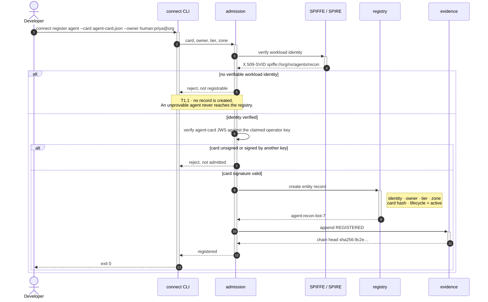
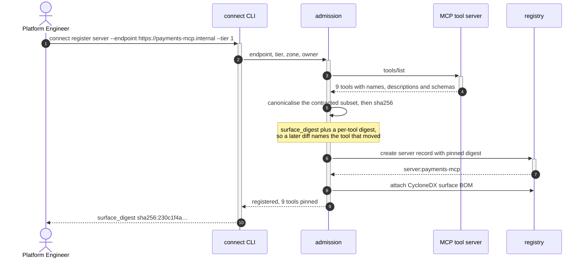
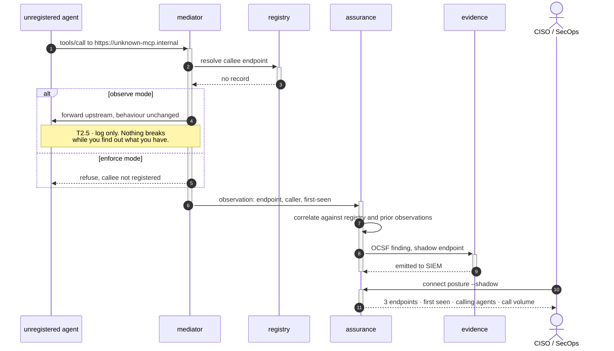
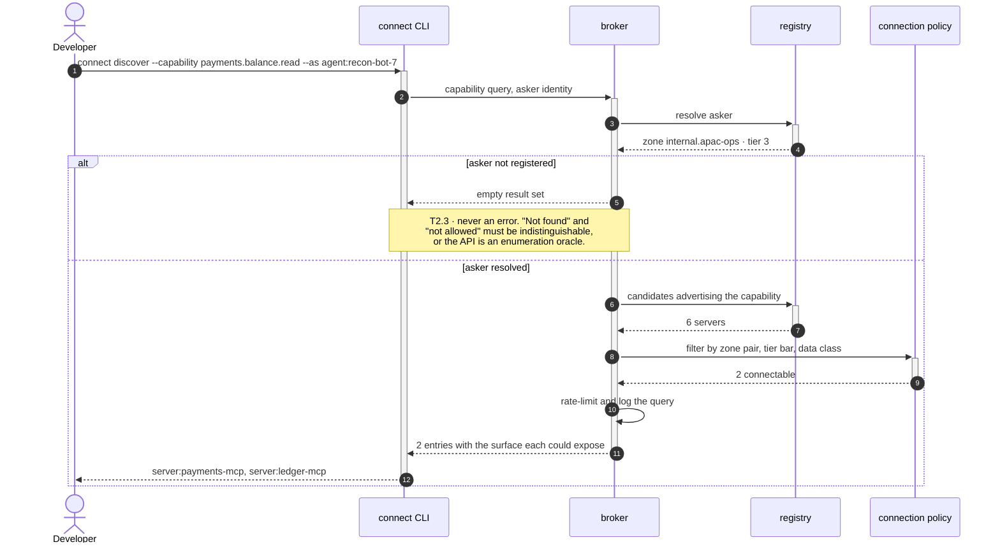
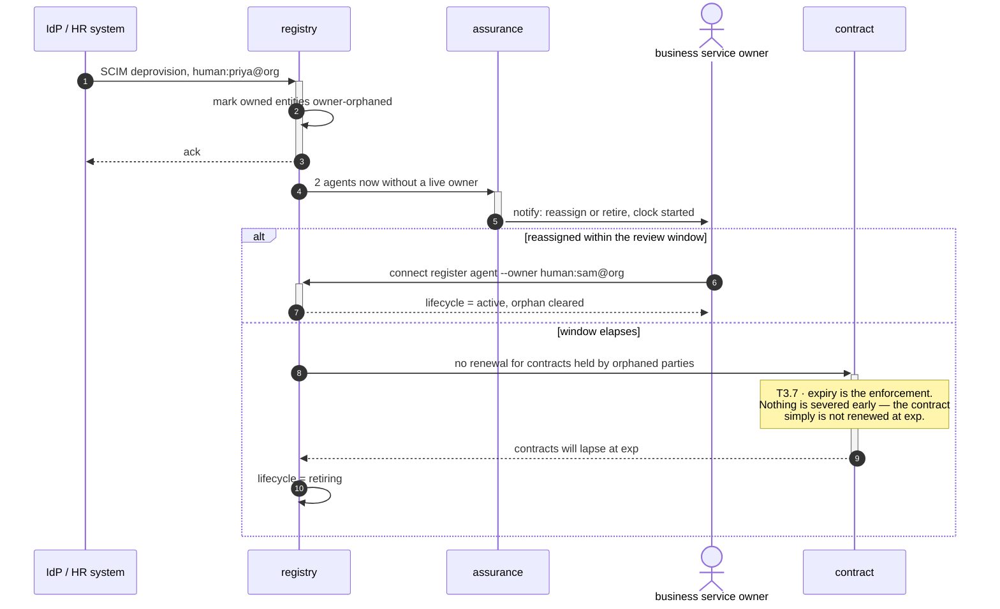
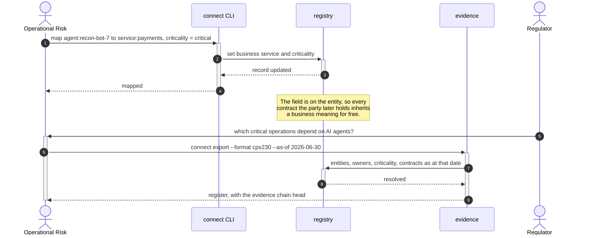

# B1 · Agent & Tool Estate Management

> *"know what we run"*

The domain that answers the first of the four questions with no owner: **which
parties exist at all, and who owns each of them.**

Five of the six capabilities below need no mediator and change no behaviour on the
request path. Only **B1.3** touches the data plane, and only because a shadow
endpoint is by definition absent from the registry and can therefore only be seen in
traffic. An estate that adopts B1 alone gets a truthful register with named owners
and nothing else — which is the honest description, and the reason B1 is reachable
before anyone has agreed to enforcement.

| L2 | Capability | Realised by | Component |
|---|---|---|---|
| [B1.1](#b11--agent-registry) | Agent registry | T2.1 · T1.5 · T1.1 | `admission`, `registry` |
| [B1.2](#b12--tool-server--mcp-registry) | Tool-server / MCP registry | T2.1 · T2.2 · T2.6 | `admission`, `registry` |
| [B1.3](#b13--shadow-agent--shadow-mcp-discovery) | Shadow-agent & shadow-MCP discovery | T2.5 · T7.2 | `mediator`, `assurance`, `evidence` |
| [B1.4](#b14--capability--surface-catalogue) | Capability & surface catalogue | T2.3 · T2.4 | `broker` |
| [B1.5](#b15--ownership--lifecycle-state) | Ownership & lifecycle state | T1.6 · T2.1 | `registry` |
| [B1.6](#b16--business-service-mapping) | Business-service mapping | T2.1 · T7.4 | `registry`, `evidence` |

---

## B1.1 · Agent registry

> **Outcome** — a single authoritative answer to "what agents do we run, and who owns each".
> **Owner** Head of AI Platform · **KPI** % of production agents registered with a named owner, target 100% · **Stage** ①

| Technical capability | Failure mode |
|---|---|
| **T1.1** Workload identity verification | No verifiable identity → **not registrable** |
| **T1.5** Agent-card signature verification | Unsigned or mis-signed card → **not admitted** |
| **T2.1** Agent & server registry | Registry unavailable → strict mode denies new connections |

**What the diagram argues.** The owner is captured at the same moment as the
identity, not bolted on afterwards. That is what makes the KPI *"registered with a
named owner"* rather than merely *"registered"* — a record cannot exist without one.

---

## B1.2 · Tool-server / MCP registry

> **Outcome** — every tool server inventoried with its exposed surface and dependencies.
> **Owner** Platform Engineering · **KPI** % of MCP endpoints registered; count of unregistered endpoints observed · **Stage** ①

| Technical capability | Failure mode |
|---|---|
| **T2.1** Agent & server registry | — |
| **T2.2** Surface pinning | Presented hash ≠ pinned hash → refused, drift event raised |
| **T2.6** Surface BOM | — |

**What the diagram argues.** The pin is taken from the server's own `tools/list`
response, not from its documentation — so the record is what the server *actually
serves*. Every later drift check in **B5.1** is a comparison against this one
message.

---

## B1.3 · Shadow-agent & shadow-MCP discovery

> **Outcome** — unsanctioned agents and servers surfaced from live traffic, not from surveys.
> **Owner** CISO · **KPI** shadow endpoints detected per month; mean time to registration or removal · **Stage** ①

| Technical capability | Failure mode |
|---|---|
| **T2.5** Shadow-endpoint detection | Observe mode logs only. Enforce mode refuses |
| **T7.2** SIEM export | Blocking sink unavailable → connection not issued |

**What the diagram argues.** The survey is replaced by the traffic. Note that the
finding carries the *calling agent*, because the KPI is mean time to registration or
removal — and that needs a person to chase, which the caller's owner supplies.

---

## B1.4 · Capability & surface catalogue

> **Outcome** — developers find the right existing agent instead of building a fourth one.
> **Owner** Head of AI Platform · **KPI** reuse rate: connections to existing agents ÷ new agent builds · **Stage** ①

| Technical capability | Failure mode |
|---|---|
| **T2.3** Mediated discovery | Unknown asker → **empty result set**, never an error that confirms existence |
| **T2.4** Anti-enumeration | Enumeration attempt → throttled and logged as reconnaissance |

**What the diagram argues.** There is no list endpoint. The answer to a capability
question is bounded by what the asker could be *connected to*, so discovery can never
return more than governance would allow — and repeated near-miss queries become a
reconnaissance signal rather than just a throttle.

---

## B1.5 · Ownership & lifecycle state

> **Outcome** — no orphaned agents; leavers do not leave live authority behind.
> **Owner** Business service owner · **KPI** orphaned-agent count, target 0; age of oldest unreviewed record · **Stage** ②

| Technical capability | Failure mode |
|---|---|
| **T1.6** Identity lifecycle sync | Owner leaves → connections flagged, then expired |
| **T2.1** Registry lifecycle field | — |

**What the diagram argues.** The leaver event does not cut anything. It starts a
clock, and the *absence of renewal* does the work — so an HR feed can never cause an
outage, which is what makes it safe to wire an HR feed to a production control at
all.

---

## B1.6 · Business-service mapping

> **Outcome** — agent risk expressed in business terms, not infrastructure terms.
> **Owner** Operational Risk · **KPI** % of agents mapped to a critical business service · **Stage** ②

| Technical capability | Failure mode |
|---|---|
| **T2.1** Registry record fields | — |
| **T7.4** Regulatory register export | — |

**What the diagram argues.** Criticality is recorded once on the entity and inherited
by every relationship it later forms. That is what turns **B7.1**'s register from a
reconstruction into a query — the business meaning was captured at registration, not
assembled at audit time.

---

## What B1 does not do

It does not decide whether two parties may connect — that is **B3**, and no contract
exists at this stage. It records a provenance attestation but does not gate on it —
that is **B2.2**. And it enforces nothing on the request path unless the mediator is
deployed, which only **B1.3** requires.
