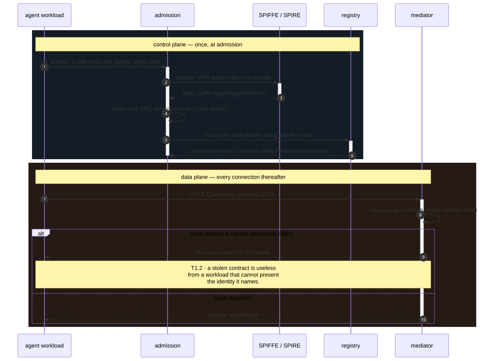
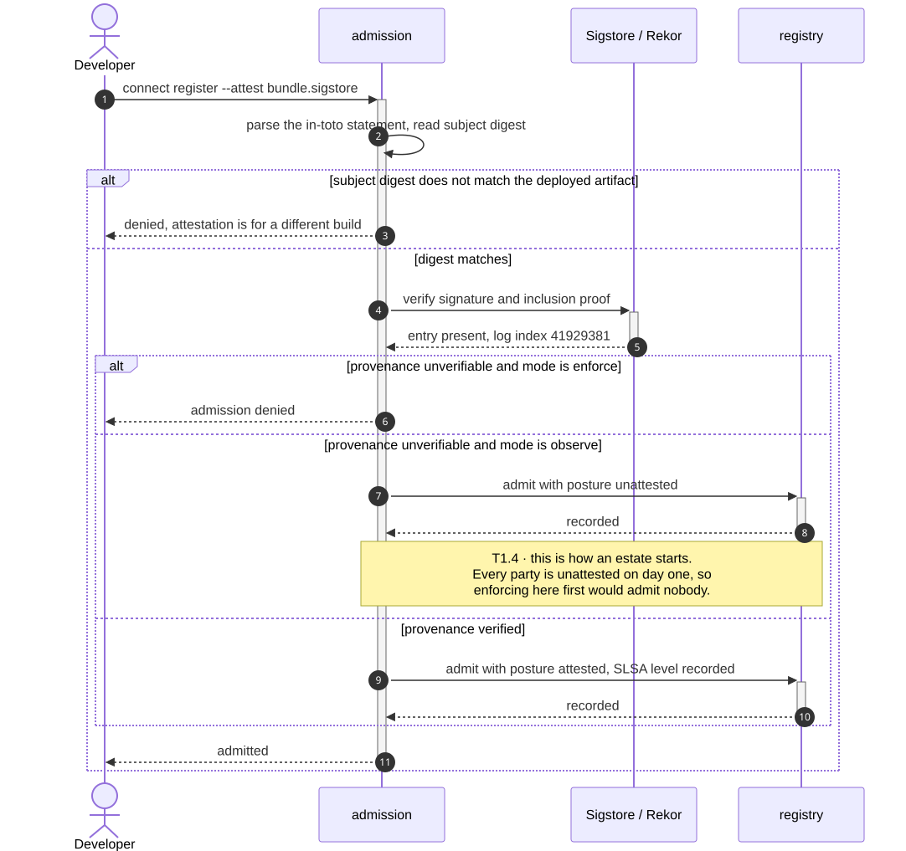
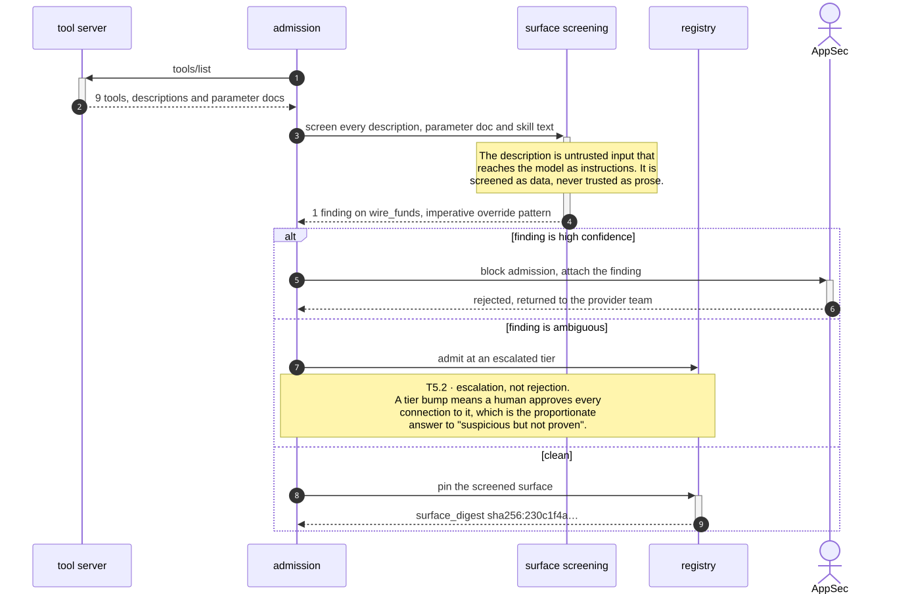
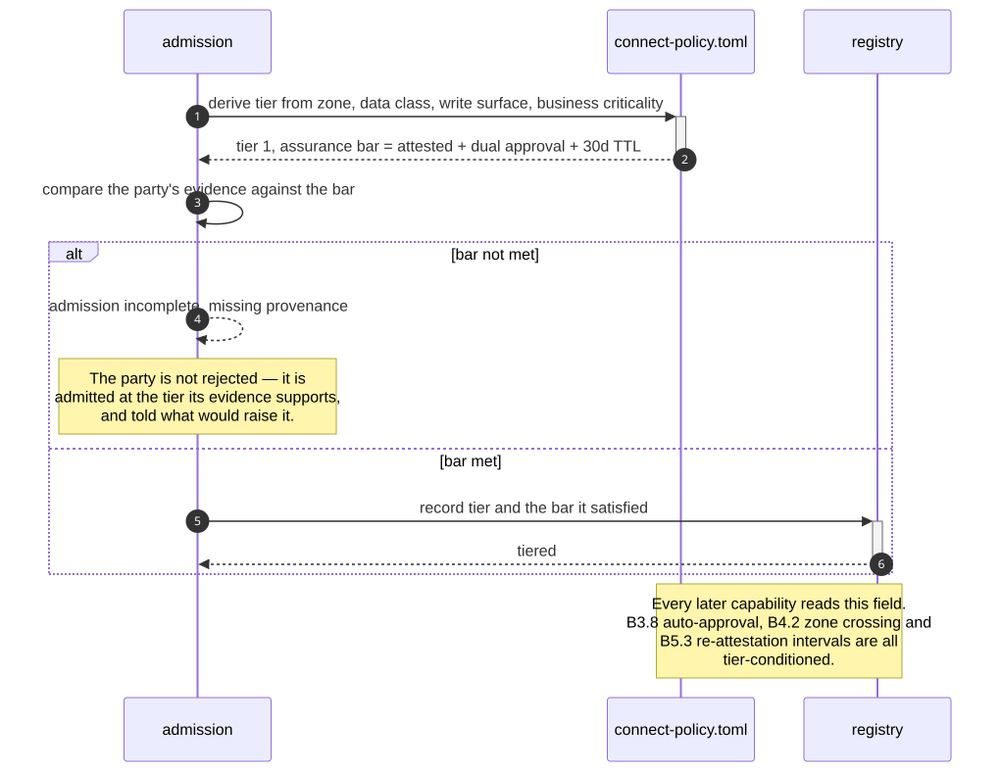
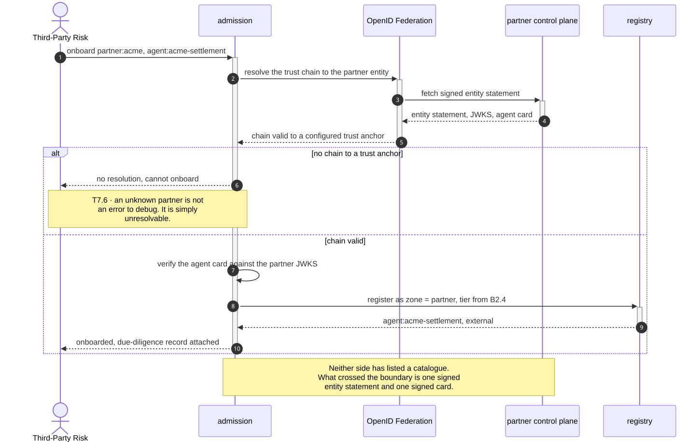
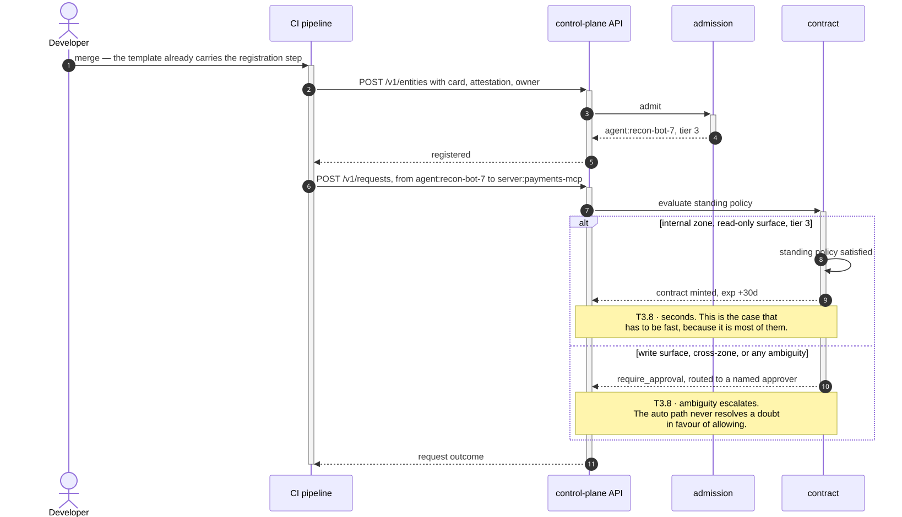

# B2 · Admission & Onboarding

> *"nothing joins unproven"*

B1 recorded what exists. B2 decides what is allowed to exist. Every flow here runs
**before** a party has a record it can use, so a rejection costs nothing — which is
the cheapest possible place to put an assurance bar.

The domain's spine is that **the bar is proportionate**: B2.4 derives a tier, and
every other capability reads it. A read-only reporting agent and a payments agent
pass through the same pipeline and meet different thresholds in it.

| L2 | Capability | Realised by | Component |
|---|---|---|---|
| [B2.1](#b21--identity-attestation) | Identity attestation | T1.1 · T1.2 · T1.5 | `admission`, `mediator` |
| [B2.2](#b22--build-provenance-verification) | Build provenance verification | T1.4 | `admission` |
| [B2.3](#b23--declared-surface-screening) | Declared-surface screening | T5.2 · T2.2 | `admission` |
| [B2.4](#b24--risk-tiering--assurance-bar) | Risk tiering & assurance bar | T2.1 · T8.2 | `admission`, policy |
| [B2.5](#b25--third-party--partner-agent-onboarding) | Third-party / partner onboarding | T7.6 · T1.5 · T1.4 | `admission`, `registry` |
| [B2.6](#b26--self-service-developer-onboarding) | Self-service developer onboarding | T8.1 · T3.8 · T8.2 | `admission`, `contract` |

---

## B2.1 · Identity attestation

> **Outcome** — only cryptographically identified workloads join the estate.
> **Owner** Security Architecture · **KPI** % of registered parties with verified workload identity · **Stage** ②

| Technical capability | Failure mode |
|---|---|
| **T1.1** Workload identity verification | No verifiable identity → not registrable, not connectable |
| **T1.2** Mutual channel authentication | Peer mismatch → connection refused **before the first frame** |
| **T1.5** Agent-card signature verification | Unsigned or mis-signed card → not admitted |



<details>
<summary>Mermaid source</summary>

```text
sequenceDiagram
    autonumber
    participant Wl as agent workload
    participant Adm as admission
    participant SPIRE as SPIFFE / SPIRE
    participant Reg as registry
    participant Med as mediator

    rect rgb(20,28,38)
    Note over Wl,Reg: control plane — once, at admission
    Wl->>+Adm: present X.509-SVID and signed agent card
    Adm->>+SPIRE: validate SVID against the trust bundle
    SPIRE-->>-Adm: valid, spiffe://org/ns/agents/recon
    Adm->>Adm: verify card JWS, bind card to the SVID subject
    Adm->>+Reg: record the wire identity alongside the entity
    Reg-->>-Adm: agent:recon-bot-7 bound to spiffe://org/ns/agents/recon
    deactivate Adm
    end

    rect rgb(38,26,20)
    Note over Wl,Med: data plane — every connection thereafter
    Wl->>+Med: mTLS ClientHello, presents SVID
    Med->>Med: compare peer identity to the contract caller
    alt peer identity is not the contracted caller
        Med-->>Wl: refused before the first frame
        Note over Med,Wl: T1.2 · a stolen contract is useless<br/>from a workload that cannot present<br/>the identity it names.
    else peer matches
        Med-->>-Wl: channel established
    end
    end
```

</details>

**What the diagram argues.** Identity is checked twice, and the second check is the
one that matters. Admission binds a name to a key. The mediator then refuses any
channel whose peer is not the party the contract names — so the contract cannot be
replayed by whoever obtains a copy of it.

---

## B2.2 · Build provenance verification

> **Outcome** — supply-chain assurance for the agent and its tool servers.
> **Owner** AppSec · **KPI** % of admissions with valid SLSA/Sigstore provenance · **Stage** ③

| Technical capability | Failure mode |
|---|---|
| **T1.4** Build provenance verification | Unverifiable provenance → admission denied, **or `posture: unattested` in observe mode** |



<details>
<summary>Mermaid source</summary>

```text
sequenceDiagram
    autonumber
    actor Dev as Developer
    participant Adm as admission
    participant Rekor as Sigstore / Rekor
    participant Reg as registry

    Dev->>+Adm: connect register --attest bundle.sigstore
    Adm->>Adm: parse the in-toto statement, read subject digest

    alt subject digest does not match the deployed artifact
        Adm-->>Dev: denied, attestation is for a different build
    else digest matches
        Adm->>+Rekor: verify signature and inclusion proof
        Rekor-->>-Adm: entry present, log index 41929381

        alt provenance unverifiable and mode is enforce
            Adm-->>Dev: admission denied
        else provenance unverifiable and mode is observe
            Adm->>+Reg: admit with posture unattested
            Reg-->>-Adm: recorded
            Note over Adm,Reg: T1.4 · this is how an estate starts.<br/>Every party is unattested on day one, so<br/>enforcing here first would admit nobody.
        else provenance verified
            Adm->>+Reg: admit with posture attested, SLSA level recorded
            Reg-->>-Adm: recorded
        end
        Adm-->>-Dev: admitted
    end
```

</details>

**What the diagram argues.** The observe branch is not a weakening — it is the only
order in which the control can be introduced. An estate turning this on for the first
time has zero attested parties, so an enforce-first deployment would deny every
admission and be removed within a day. Posture is the intermediate state that lets
**B5.3** report the gap while the estate closes it.

---

## B2.3 · Declared-surface screening

> **Outcome** — poisoned tool descriptions and cards rejected before a model ever reads them.
> **Owner** AppSec · **KPI** injection-pattern findings per 100 admissions; false-negative rate at re-review · **Stage** ②

| Technical capability | Failure mode |
|---|---|
| **T5.2** Declared-surface injection screening | Finding → admission blocked, or tier escalated |
| **T2.2** Surface pinning | Presented hash ≠ pinned hash → refused, drift event raised |



<details>
<summary>Mermaid source</summary>

```text
sequenceDiagram
    autonumber
    participant MCP as tool server
    participant Adm as admission
    participant Scr as surface screening
    participant Reg as registry
    actor AppSec as AppSec

    Adm->>+MCP: tools/list
    MCP-->>-Adm: 9 tools, descriptions and parameter docs

    Adm->>+Scr: screen every description, parameter doc and skill text
    Note over Scr: The description is untrusted input that<br/>reaches the model as instructions. It is<br/>screened as data, never trusted as prose.
    Scr-->>-Adm: 1 finding on wire_funds, imperative override pattern

    alt finding is high confidence
        Adm->>+AppSec: block admission, attach the finding
        AppSec-->>-Adm: rejected, returned to the provider team
    else finding is ambiguous
        Adm->>Reg: admit at an escalated tier
        Note over Adm,Reg: T5.2 · escalation, not rejection.<br/>A tier bump means a human approves every<br/>connection to it, which is the proportionate<br/>answer to "suspicious but not proven".
    else clean
        Adm->>+Reg: pin the screened surface
        Reg-->>-Adm: surface_digest sha256:230c1f4a…
    end
```

</details>

**What the diagram argues.** Screening happens at admission, *before* the surface is
pinned — so the hash that every later drift check compares against is a hash of a
surface that has already been read for hostile content. Pinning an unscreened
surface would faithfully preserve a poisoned description forever.

---

## B2.4 · Risk tiering & assurance bar

> **Outcome** — proportionate control: a read-only reporting agent is not treated like a payments agent.
> **Owner** Operational Risk · **KPI** % of parties tiered; tier-appropriate control coverage · **Stage** ②

| Technical capability | Failure mode |
|---|---|
| **T2.1** Registry tier field | — |
| **T8.2** Policy-as-code | Invalid policy → keep last-known-good, alert |



<details>
<summary>Mermaid source</summary>

```text
sequenceDiagram
    autonumber
    participant Adm as admission
    participant Pol as connect-policy.toml
    participant Reg as registry

    Adm->>+Pol: derive tier from zone, data class, write surface, business criticality
    Pol-->>-Adm: tier 1, assurance bar = attested + dual approval + 30d TTL

    Adm->>Adm: compare the party's evidence against the bar
    alt bar not met
        Adm-->>Adm: admission incomplete, missing provenance
        Note over Adm: The party is not rejected — it is<br/>admitted at the tier its evidence supports,<br/>and told what would raise it.
    else bar met
        Adm->>+Reg: record tier and the bar it satisfied
        Reg-->>-Adm: tiered
    end

    Note over Pol,Reg: Every later capability reads this field.<br/>B3.8 auto-approval, B4.2 zone crossing and<br/>B5.3 re-attestation intervals are all<br/>tier-conditioned.
```

</details>

**What the diagram argues.** Tier is derived, not declared. A team cannot self-select
a lower bar, because the inputs — zone, data class, whether the surface contains a
write — are properties of the registration rather than assertions in it.

---

## B2.5 · Third-party / partner agent onboarding

> **Outcome** — external agents pass a real supplier gate, in days not months.
> **Owner** Third-Party Risk · **KPI** onboarding cycle time; % of external connections with completed due diligence · **Stage** ③

| Technical capability | Failure mode |
|---|---|
| **T7.6** Cross-org federation | Untrusted federation entity → no resolution |
| **T1.5** Agent-card signature verification | Unsigned or mis-signed card → not admitted |
| **T1.4** Build provenance verification | Unverifiable provenance → denied or unattested |



<details>
<summary>Mermaid source</summary>

```text
sequenceDiagram
    autonumber
    actor TPR as Third-Party Risk
    participant Adm as admission
    participant Fed as OpenID Federation
    participant Partner as partner control plane
    participant Reg as registry

    TPR->>+Adm: onboard partner:acme, agent:acme-settlement
    Adm->>+Fed: resolve the trust chain to the partner entity
    Fed->>+Partner: fetch signed entity statement
    Partner-->>-Fed: entity statement, JWKS, agent card
    Fed-->>-Adm: chain valid to a configured trust anchor

    alt no chain to a trust anchor
        Adm-->>TPR: no resolution, cannot onboard
        Note over Adm,TPR: T7.6 · an unknown partner is not<br/>an error to debug. It is simply<br/>unresolvable.
    else chain valid
        Adm->>Adm: verify the agent card against the partner JWKS
        Adm->>+Reg: register as zone = partner, tier from B2.4
        Reg-->>-Adm: agent:acme-settlement, external
        Adm-->>-TPR: onboarded, due-diligence record attached
    end

    Note over Adm,Partner: Neither side has listed a catalogue.<br/>What crossed the boundary is one signed<br/>entity statement and one signed card.
```

</details>

**What the diagram argues.** The supplier gate is a trust-chain resolution, not a
questionnaire. That is what compresses the cycle time — and the two organisations
exchange signed statements about *named* entities, never a directory either could
enumerate.

---

## B2.6 · Self-service developer onboarding

> **Outcome** — a paved road: registration in minutes, not a ticket queue.
> **Owner** Head of AI Platform · **KPI** median time from "agent exists" to "agent registered and connectable" · **Stage** ①

| Technical capability | Failure mode |
|---|---|
| **T8.1** Control-plane API | — |
| **T3.8** Standing-policy auto-approval | Ambiguity → escalate to a human, **never auto-allow** |
| **T8.2** Policy-as-code | Invalid policy → keep last-known-good, alert |



<details>
<summary>Mermaid source</summary>

```text
sequenceDiagram
    autonumber
    actor Dev as Developer
    participant CI as CI pipeline
    participant API as control-plane API
    participant Adm as admission
    participant Ct as contract

    Dev->>+CI: merge — the template already carries the registration step
    CI->>+API: POST /v1/entities with card, attestation, owner
    API->>+Adm: admit
    Adm-->>-API: agent:recon-bot-7, tier 3
    API-->>-CI: registered

    CI->>+API: POST /v1/requests, from agent:recon-bot-7 to server:payments-mcp
    API->>+Ct: evaluate standing policy

    alt internal zone, read-only surface, tier 3
        Ct->>Ct: standing policy satisfied
        Ct-->>API: contract minted, exp +30d
        Note over Ct,API: T3.8 · seconds. This is the case that<br/>has to be fast, because it is most of them.
    else write surface, cross-zone, or any ambiguity
        Ct-->>-API: require_approval, routed to a named approver
        Note over Ct,API: T3.8 · ambiguity escalates.<br/>The auto path never resolves a doubt<br/>in favour of allowing.
    end
    API-->>-CI: request outcome
    deactivate CI
```

</details>

**What the diagram argues.** The paved road and the approval gate are the same code
path with different inputs. There is no "fast lane" that skips checks — the fast case
is fast because policy answered it, and the KPI it moves is the one that decides
whether developers use the system at all.

---

## What B2 does not do

It does not decide who may talk to whom — admission qualifies a *party*, **B3**
governs a *relationship*. A fully admitted, attested, tier-1 agent still holds no
connectivity until a contract exists.
