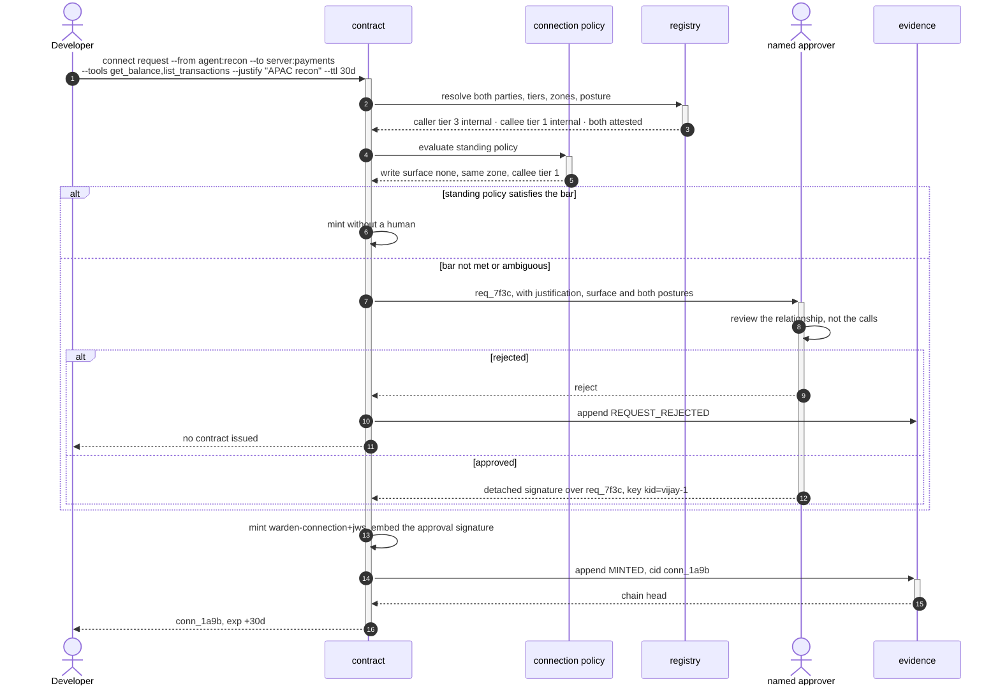
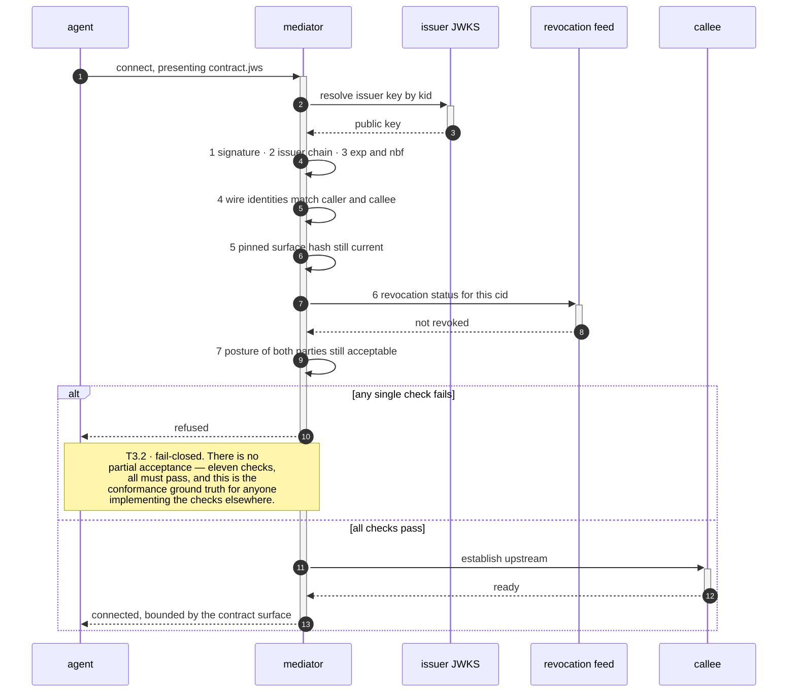
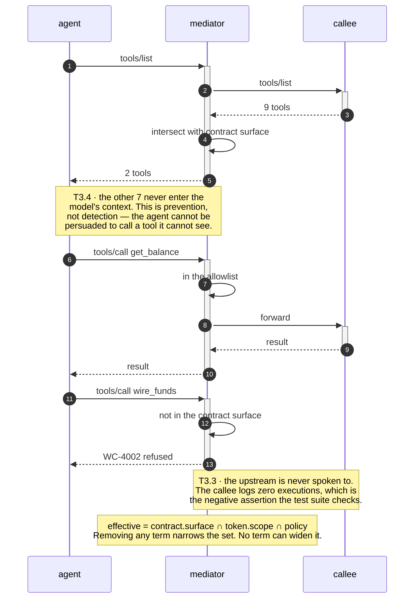
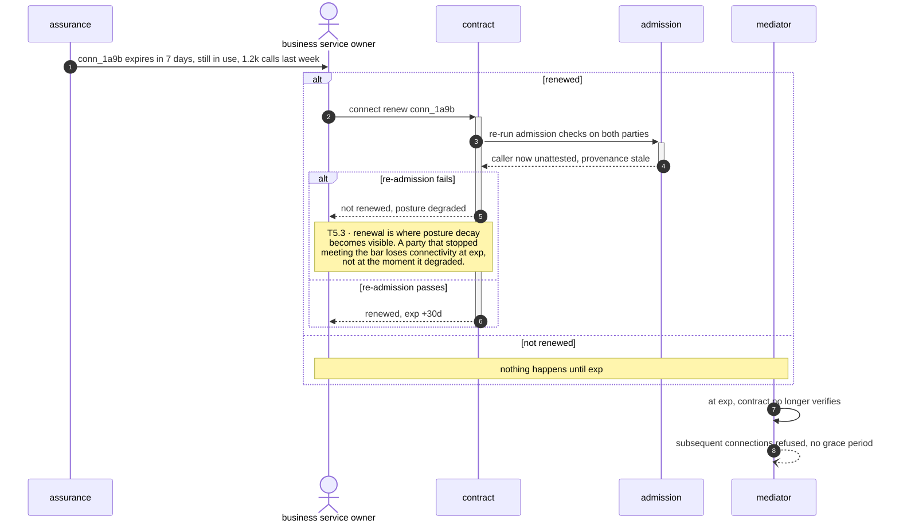
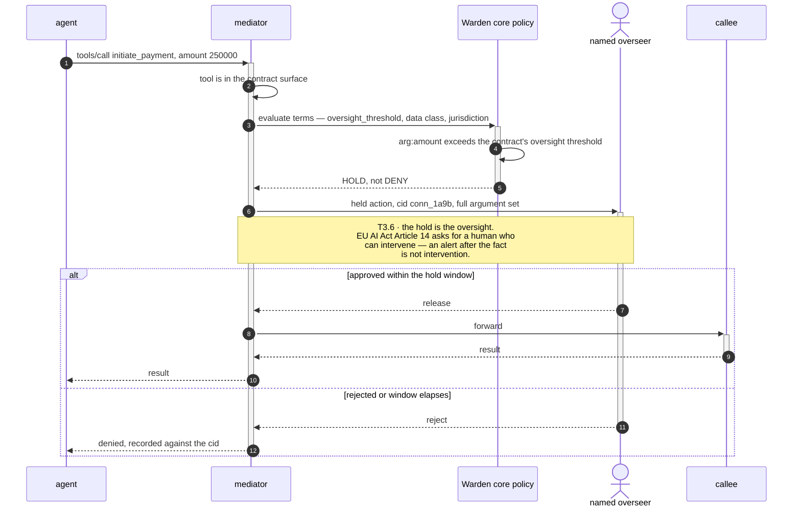
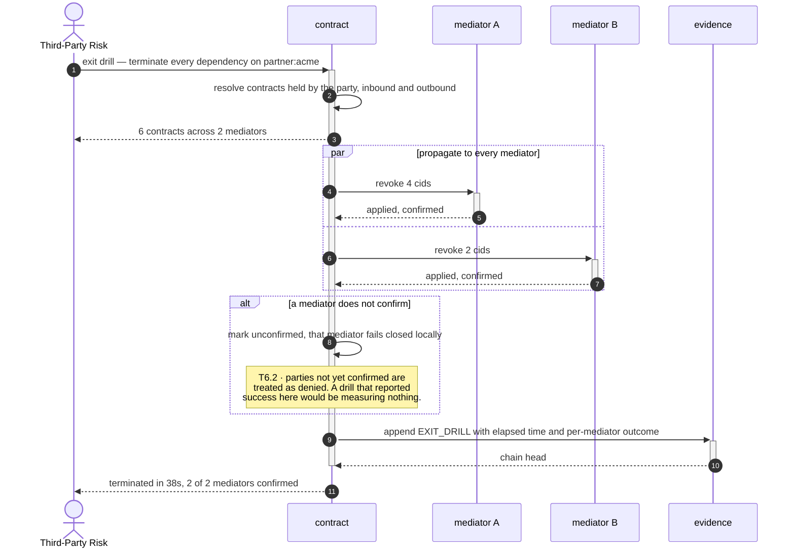

# B3 · Connection Governance

> *"relationships have terms and owners"*

The centre of the system. B1 said what exists, B2 said what may exist — B3 is where a
**relationship** acquires terms, an owner, an expiry and a signature, and becomes the
artifact everything downstream reads.

One idea runs through all six capabilities and is worth stating before the diagrams:
**a contract is a ceiling, never a grant.** Holding one does not authorise a call. It
bounds what a call could possibly be, and the bound composes with token scope and
policy by intersection — so no contract can widen anything.

| L2 | Capability | Realised by | Component |
|---|---|---|---|
| [B3.1](#b31--connection-request--approval-workflow) | Request & approval workflow | T3.1 · T3.8 · T7.1 | `contract`, `evidence` |
| [B3.2](#b32--connection-contracts-terms-of-use) | Connection contracts | T3.1 · T3.2 · T3.6 | `contract`, `mediator` |
| [B3.3](#b33--surface-scoping-least-connectivity) | Surface scoping | T3.3 · T3.4 · T3.5 | `mediator` |
| [B3.4](#b34--time-boxing--renewal) | Time-boxing & renewal | T3.7 | `contract` |
| [B3.5](#b35--human-oversight-terms) | Human-oversight terms | T3.6 | `mediator`, Warden core |
| [B3.6](#b36--exit--offboarding) | Exit & offboarding | T6.1 · T3.7 | `contract`, `mediator` |

---

## B3.1 · Connection request & approval workflow

> **Outcome** — every relationship has a documented, human-approved justification.
> **Owner** Security Architecture · **KPI** median approval latency; % auto-approved under standing policy · **Stage** ②

| Technical capability | Failure mode |
|---|---|
| **T3.1** Contract minting | Any policy miss → **no contract issued** |
| **T3.8** Standing-policy auto-approval | Ambiguity → escalate to a human, never auto-allow |
| **T7.1** Connection-lifecycle audit | Chain break detected on verify → alert |

**What the diagram argues.** The approval is a **detached signature carried inside
the contract**, not a row in a workflow table. An operator with database access can
alter a ticketing system. They cannot forge a signature over a request they do not
hold the key for — which is what makes the approval itself the enforcement rather
than a record of an intention to enforce.

---

## B3.2 · Connection contracts (terms of use)

> **Outcome** — a machine-enforced equivalent of a supplier contract, per relationship.
> **Owner** Legal / Third-Party Risk · **KPI** % of active connections under a valid contract, target 100% · **Stage** ②

| Technical capability | Failure mode |
|---|---|
| **T3.1** Contract minting | Any policy miss → no contract issued |
| **T3.2** Contract verification | Any failure → connection refused, **fail-closed** |
| **T3.6** Terms enforcement | Condition false → deny or hold |

**What the diagram argues.** Verification is local. Signature, expiry, hash
comparison and set membership — no network call to a policy server on the hot path,
which is why the target is p99 under 5 ms and why a control-plane outage does not
stop traffic that already holds a valid contract.

---

## B3.3 · Surface scoping (least connectivity)

> **Outcome** — an agent sees and can attempt only the tools it was granted.
> **Owner** Security Architecture · **KPI** mean tools exposed per connection vs mean granted; scope-creep rate · **Stage** ②

| Technical capability | Failure mode |
|---|---|
| **T3.3** Surface allowlist enforcement | Uncontracted call → blocked **before upstream** |
| **T3.4** `tools/list` surface filtering | Filter failure → return an **empty list**, fail-closed |
| **T3.5** Narrowing algebra | Attempted widening is **structurally impossible**, not merely denied |

**What the diagram argues.** Two different mechanisms, deliberately. Filtering
`tools/list` means the wrong tool is never *offered*. The allowlist means it is never
*executed* even if the agent asks anyway. The first is what actually prevents
accidents — the second is what survives an agent that has been told to try.

---

## B3.4 · Time-boxing & renewal

> **Outcome** — no permanent, forgotten connectivity.
> **Owner** Business service owner · **KPI** % of connections older than policy TTL, target 0; renewal-on-time rate · **Stage** ②

| Technical capability | Failure mode |
|---|---|
| **T3.7** Time-boxing & renewal | Expired → refused. **No grace period by default** |

**What the diagram argues.** Expiry is the enforcement, and it is passive. Nothing
watches the clock and cuts a connection — the contract simply stops verifying. That
makes the control impossible to fail open: a control plane that is down cannot renew,
and not renewing is the safe direction.

---

## B3.5 · Human-oversight terms

> **Outcome** — high-consequence relationships carry a standing oversight obligation.
> **Owner** Operational Risk · **KPI** % of high-tier connections with an oversight term; hold-to-decision latency · **Stage** ③

| Technical capability | Failure mode |
|---|---|
| **T3.6** Terms enforcement | Condition false → **deny or hold** |

**What the diagram argues.** The oversight term lives in the contract but is
evaluated by Warden core per call, against the actual argument values. That is the
division the whole system rests on: **warden-connect bounds the relationship, Warden
core decides the action** — and a hold is an action decision, so it belongs to core.

---

## B3.6 · Exit & offboarding

> **Outcome** — a demonstrable, rehearsed termination path per dependency.
> **Owner** Third-Party Risk · **KPI** time-to-terminate in a drill; % of dependencies with a tested exit · **Stage** ③

| Technical capability | Failure mode |
|---|---|
| **T6.1** Contract revocation | Revocation feed unreadable → strict mode denies all, fail-closed |
| **T3.7** Time-boxing | Expired → refused, no grace period |

**What the diagram argues.** The exit path is the quarantine verb pointed at a
partner rather than an incident, which is why it can be *rehearsed*. DORA asks for a
tested exit strategy — a drill that produces a timed, signed record of every
dependency severed is that test, and it costs one command.

---

## What B3 does not do

It does not decide whether an individual call proceeds — that is Warden core, reading
the contract as an outer bound. And it does not detect that a surface has changed
under a live contract: the contract pins a hash, but noticing the hash has moved is
**B5.1**.
