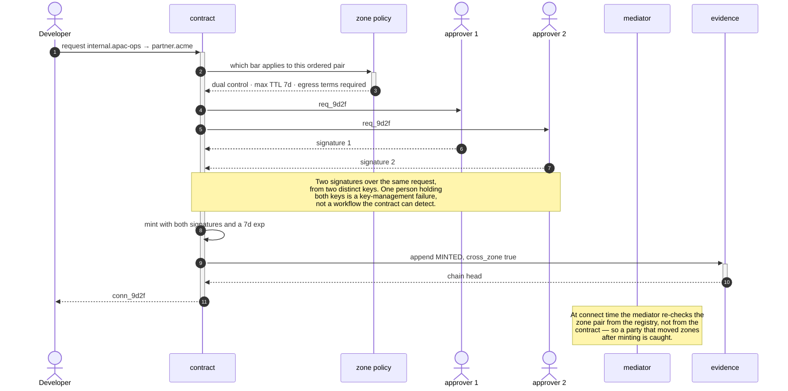
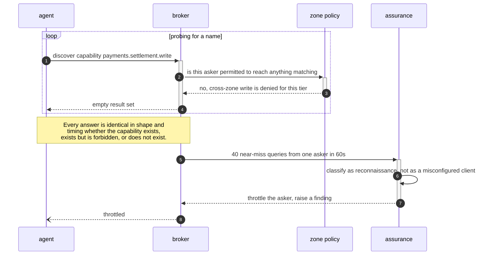
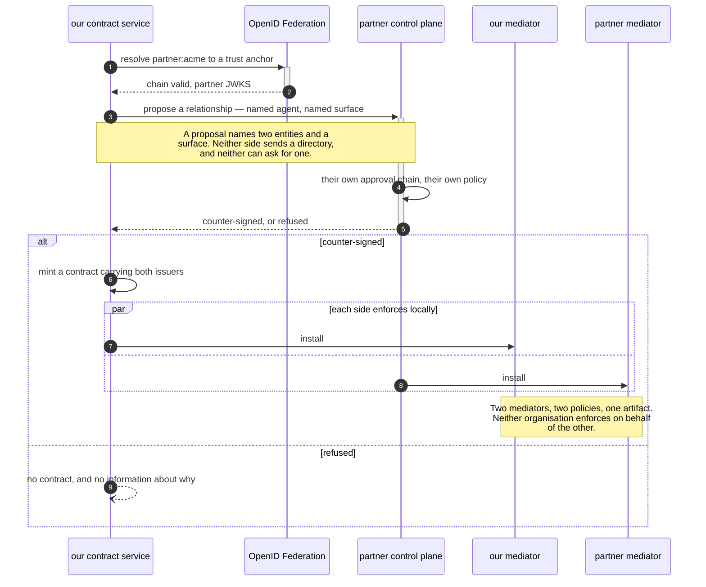
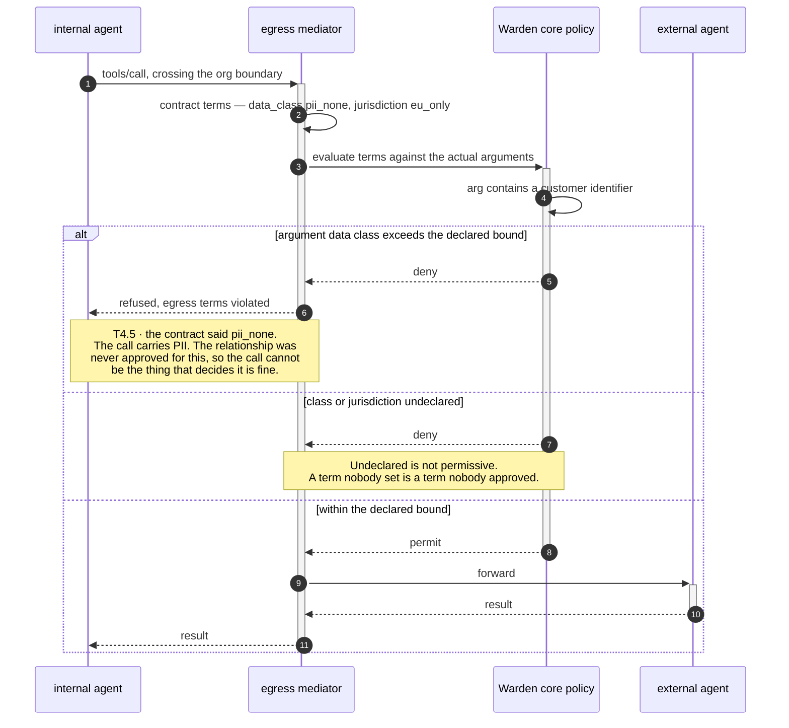

# B4 · Exposure & Trust-Zone Management

> *"who may reach whom, across boundaries"*

B3 governs a relationship in isolation. B4 governs it **in context** — the same two
parties, the same surface, judged differently depending on which side of a boundary
each one sits.

The domain has one structural rule that the diagrams keep returning to: an
unclassified zone pair is treated as the **most restrictive**, never the most
convenient. A boundary you forgot to declare behaves like the hardest one you have.

| L2 | Capability | Realised by | Component |
|---|---|---|---|
| [B4.1](#b41--trust-zone-model) | Trust-zone model | T4.2 · T8.2 | policy, `registry` |
| [B4.2](#b42--zone-crossing-control) | Zone-crossing control | T4.2 · T3.1 · T7.1 | `contract`, `mediator` |
| [B4.3](#b43--mediated-discovery-anti-reconnaissance) | Mediated discovery | T2.3 · T2.4 | `broker` |
| [B4.4](#b44--cross-org-federation) | Cross-org federation | T7.6 · T1.5 | `registry`, `admission` |
| [B4.5](#b45--egress-control-for-external-agents) | Egress control | T4.5 · T3.6 | `mediator` |

---

## B4.1 · Trust-zone model

> **Outcome** — internal / partner / public are governed differently, by design.
> **Owner** Security Architecture · **KPI** % of connections with an explicit zone pair; unclassified count, target 0 · **Stage** ②

| Technical capability | Failure mode |
|---|---|
| **T4.2** Zone-crossing enforcement | **Unclassified pair → treated as most-restrictive** |
| **T8.2** Policy-as-code | Invalid policy → keep last-known-good, alert |

```mermaid
sequenceDiagram
    autonumber
    actor Arch as Security Architecture
    participant Pol as connect-policy.toml
    participant Reg as registry
    participant Ct as contract

    Arch->>+Pol: declare zones and the bar for each ordered pair
    Note over Pol: internal→internal · standing policy<br/>internal→partner · human approval, 30d max<br/>partner→internal · dual control, 7d max<br/>any→public · denied
    Pol-->>-Arch: linted, dry-run against the live contract set

    Note over Pol,Ct: dry-run first: the policy is applied to<br/>existing contracts to show what would<br/>have been refused, before it can refuse it.

    Ct->>+Reg: resolve zones for a new request
    Reg-->>-Ct: caller internal.apac-ops · callee unclassified

    alt zone pair not declared
        Ct->>Ct: apply the most restrictive declared bar
        Note over Ct: T4.2 · the default is the hardest rule,<br/>not the softest. Forgetting to classify a<br/>zone cannot buy anyone weaker treatment.
    else pair declared
        Ct->>Ct: apply that pair's bar
    end
```

**What the diagram argues.** The dry-run is part of the model, not an optional
convenience. A zone policy that cannot be evaluated against the contracts already
issued is a policy nobody can safely tighten — so the ability to ask *"what would
this have refused"* is what makes the model changeable at all.

---

## B4.2 · Zone-crossing control

> **Outcome** — every boundary crossing is deliberate, higher-assurance and logged.
> **Owner** CISO · **KPI** cross-zone connections per month, each with approval evidence · **Stage** ②

| Technical capability | Failure mode |
|---|---|
| **T4.2** Zone-crossing enforcement | Unclassified pair → most-restrictive |
| **T3.1** Contract minting | Any policy miss → no contract issued |
| **T7.1** Connection-lifecycle audit | Chain break on verify → alert |

**What the diagram argues.** The zone is re-resolved at connect time rather than
trusted from the contract. A contract is immutable once signed, but a party's zone is
not — moving a service from `internal` to `partner` must invalidate crossings that
were approved under the old classification.

---

## B4.3 · Mediated discovery (anti-reconnaissance)

> **Outcome** — an agent's view of the estate is its permitted connection set, nothing more.
> **Owner** Security Architecture · **KPI** enumeration attempts blocked; catalogue leakage incidents, target 0 · **Stage** ②

| Technical capability | Failure mode |
|---|---|
| **T2.3** Mediated discovery | Unknown asker → empty result set, never an error that confirms existence |
| **T2.4** Anti-enumeration | Enumeration attempt → throttled and logged as reconnaissance |

**What the diagram argues.** Timing matters as much as content. If a forbidden
capability returned faster than a non-existent one, the latency itself would be the
oracle — so the answer must be uniform in shape *and* cost. And the throttle counter
is a detection source: forty near-misses is not a broken client, it is a search.

---

## B4.4 · Cross-org federation

> **Outcome** — partner agents interoperate without either side exposing a full catalogue.
> **Owner** Head of AI Platform · **KPI** federated partners live; connections per partner · **Stage** ③

| Technical capability | Failure mode |
|---|---|
| **T7.6** Cross-org federation | Untrusted federation entity → no resolution |
| **T1.5** Agent-card signature verification | Unsigned or mis-signed card → not admitted |

**What the diagram argues.** Federation is peer-to-peer at the *anchor* level and
independent at the *enforcement* level. Each side keeps its own approvers, its own
policy and its own mediator — what crosses is a signed artifact naming specific
entities. That is the only shape in which two banks can interoperate without either
becoming the other's authorisation authority.

---

## B4.5 · Egress control for external agents

> **Outcome** — data leaving to an external agent is bounded by declared data class and jurisdiction.
> **Owner** Data Protection Officer · **KPI** cross-jurisdiction connections; policy-violating attempts blocked · **Stage** ③

| Technical capability | Failure mode |
|---|---|
| **T4.5** Egress control | **Undeclared class or jurisdiction → deny** |
| **T3.6** Terms enforcement | Condition false → deny or hold |

**What the diagram argues.** The declaration is made once, at approval time, by
someone accountable — and then checked on every call against real argument values.
That split is what makes it a control rather than a label: the DPO approves a bound,
and the data plane refuses anything outside it without asking again.

---

## What B4 does not do

It does not detect that a partner's surface has changed since federation — that is
**B5.1**, and across an org boundary it is the capability that matters most. Nor does
it bound *volume* across a boundary: rate, fan-out and spend are **B8**.
