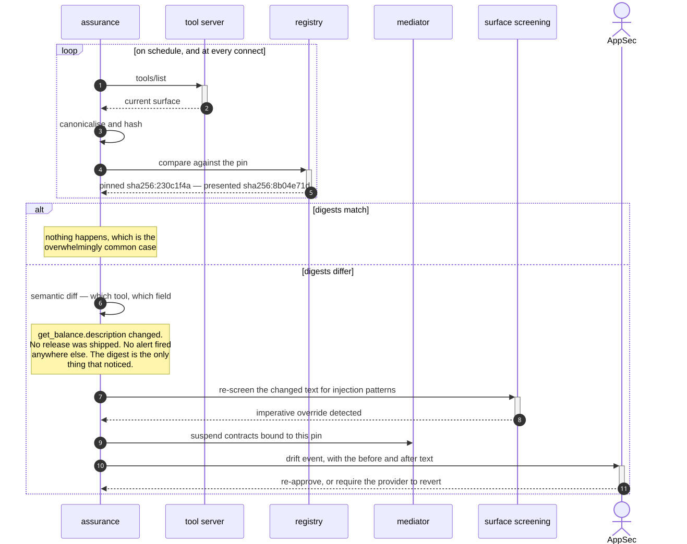
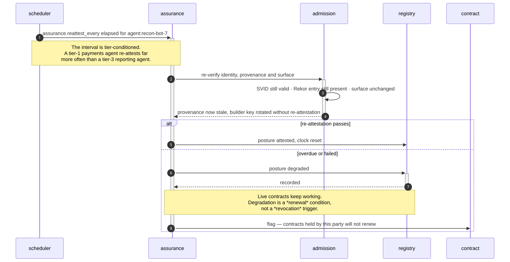
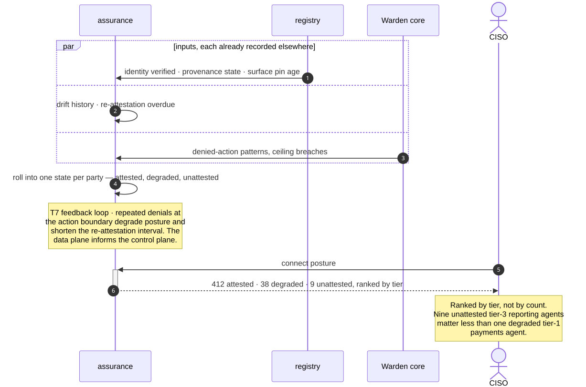
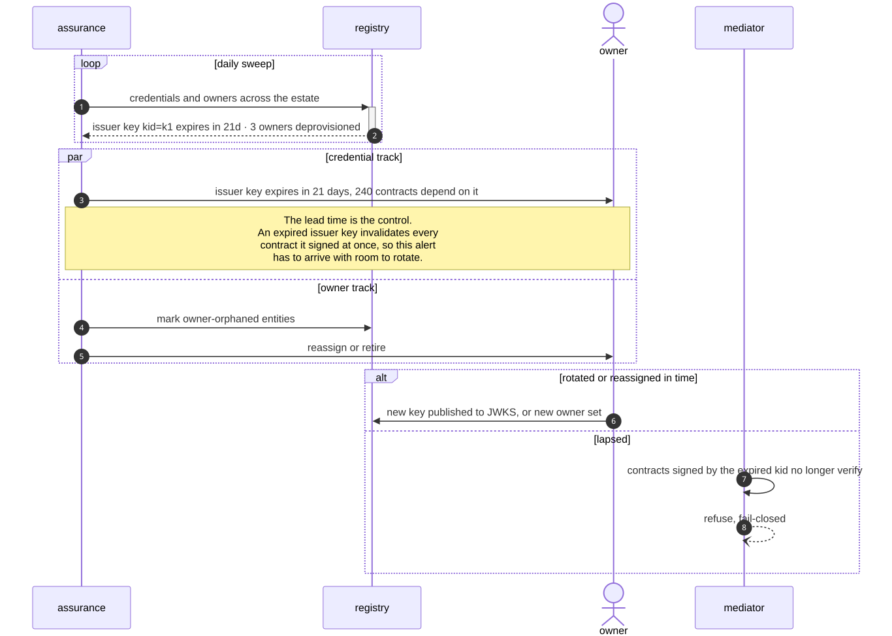
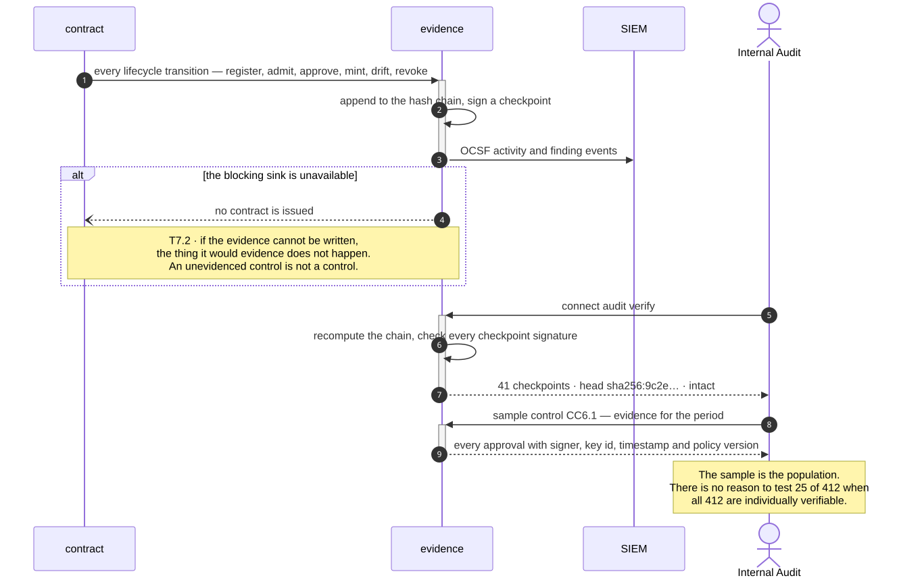

# B5 · Continuous Assurance

> *"trust decays; re-earn it"*

Every other domain makes a decision at a point in time. B5 exists because those
decisions age: a surface changes, an attestation goes stale, a certificate expires, an
owner leaves. This domain is the clock.

Its defining property is that **decay is visible before it is enforced**. Nothing here
severs a live connection. Posture degrades, findings are raised, owners are warned —
and the enforcement, when it comes, is a contract that does not renew. That ordering
is what lets assurance run in a production estate without becoming an outage source.

| L2 | Capability | Realised by | Component |
|---|---|---|---|
| [B5.1](#b51--surface-drift-detection) | Surface-drift detection | T5.1 · T2.2 | `assurance`, `mediator` |
| [B5.2](#b52--scheduled-re-attestation) | Scheduled re-attestation | T5.3 | `assurance`, `admission` |
| [B5.3](#b53--posture-scoring) | Posture scoring | T5.4 | `assurance` |
| [B5.4](#b54--certificate--key--owner-hygiene) | Certificate / key / owner hygiene | T5.5 · T1.6 | `assurance`, `registry` |
| [B5.5](#b55--continuous-control-monitoring--attestation-reporting) | Continuous control monitoring | T7.1 · T7.2 · T7.4 | `evidence` |

---

## B5.1 · Surface-drift detection

> **Outcome** — a rug-pull is an alert in minutes, not an incident in months.
> **Owner** AppSec · **KPI** mean time to detect manifest/card change; drift events per month · **Stage** ②

| Technical capability | Failure mode |
|---|---|
| **T5.1** Drift detection | Drift → **connection suspended pending re-approval** |
| **T2.2** Surface pinning | Presented hash ≠ pinned hash → refused, drift event raised |



<details>
<summary>Mermaid source</summary>

```text
sequenceDiagram
    autonumber
    participant Asr as assurance
    participant MCP as tool server
    participant Reg as registry
    participant Med as mediator
    participant Scr as surface screening
    actor AppSec as AppSec

    loop on schedule, and at every connect
        Asr->>+MCP: tools/list
        MCP-->>-Asr: current surface
        Asr->>Asr: canonicalise and hash
        Asr->>+Reg: compare against the pin
        Reg-->>-Asr: pinned sha256:230c1f4a — presented sha256:8b04e71d
    end

    alt digests match
        Note over Asr: nothing happens, which is the<br/>overwhelmingly common case
    else digests differ
        Asr->>Asr: semantic diff — which tool, which field
        Note over Asr: get_balance.description changed.<br/>No release was shipped. No alert fired<br/>anywhere else. The digest is the only<br/>thing that noticed.
        Asr->>+Scr: re-screen the changed text for injection patterns
        Scr-->>-Asr: imperative override detected
        Asr->>Med: suspend contracts bound to this pin
        Asr->>+AppSec: drift event, with the before and after text
        AppSec-->>-Asr: re-approve, or require the provider to revert
    end
```

</details>

**What the diagram argues.** The check runs on a schedule **and** at every connect,
and the reason is different in each case. The schedule bounds mean-time-to-detect.
The connect-time check makes it impossible to use a drifted surface even in the
window before the scheduler next runs.

---

## B5.2 · Scheduled re-attestation

> **Outcome** — trust decays and must be re-earned on a clock.
> **Owner** Platform Engineering · **KPI** % of connections re-attested within SLA; stale-attestation count · **Stage** ③

| Technical capability | Failure mode |
|---|---|
| **T5.3** Scheduled re-attestation | Overdue → posture `degraded` → **contract not renewed** |



<details>
<summary>Mermaid source</summary>

```text
sequenceDiagram
    autonumber
    participant Sch as scheduler
    participant Asr as assurance
    participant Adm as admission
    participant Reg as registry
    participant Ct as contract

    Sch->>+Asr: assurance.reattest_every elapsed for agent:recon-bot-7
    Note over Sch,Asr: The interval is tier-conditioned.<br/>A tier-1 payments agent re-attests far<br/>more often than a tier-3 reporting agent.

    Asr->>+Adm: re-verify identity, provenance and surface
    Adm->>Adm: SVID still valid · Rekor entry still present · surface unchanged
    Adm-->>-Asr: provenance now stale, builder key rotated without re-attestation

    alt re-attestation passes
        Asr->>Reg: posture attested, clock reset
    else overdue or failed
        Asr->>+Reg: posture degraded
        Reg-->>-Asr: recorded
        Note over Asr,Reg: Live contracts keep working.<br/>Degradation is a *renewal* condition,<br/>not a *revocation* trigger.
        Asr->>Ct: flag — contracts held by this party will not renew
    end
    deactivate Asr
```

</details>

**What the diagram argues.** Nothing is cut. A party that stops meeting the bar keeps
its existing connectivity until the contract expires, and then simply does not get a
new one. That is the difference between an assurance control teams tolerate and one
they disable — and it is why the KPI is *re-attested within SLA* rather than
*incidents caused by re-attestation*.

---

## B5.3 · Posture scoring

> **Outcome** — a risk-ranked view of the estate for prioritised remediation.
> **Owner** CISO · **KPI** % of estate at "attested"; count at "degraded" / "unattested" · **Stage** ③

| Technical capability | Failure mode |
|---|---|
| **T5.4** Posture scoring | — |



<details>
<summary>Mermaid source</summary>

```text
sequenceDiagram
    autonumber
    participant Asr as assurance
    participant Reg as registry
    participant Core as Warden core
    actor CISO as CISO

    par inputs, each already recorded elsewhere
        Reg->>Asr: identity verified · provenance state · surface pin age
    and
        Asr->>Asr: drift history · re-attestation overdue
    and
        Core->>Asr: denied-action patterns, ceiling breaches
    end

    Asr->>Asr: roll into one state per party — attested, degraded, unattested
    Note over Asr: T7 feedback loop · repeated denials at<br/>the action boundary degrade posture and<br/>shorten the re-attestation interval. The<br/>data plane informs the control plane.

    CISO->>+Asr: connect posture
    Asr-->>-CISO: 412 attested · 38 degraded · 9 unattested, ranked by tier
    Note over CISO: Ranked by tier, not by count.<br/>Nine unattested tier-3 reporting agents<br/>matter less than one degraded tier-1<br/>payments agent.
```

</details>

**What the diagram argues.** Posture is a *derived* value with no inputs of its own —
every signal it consumes was already recorded by another capability. That is what
makes it cheap to add and impossible to game: there is no posture field anyone can
set.

---

## B5.4 · Certificate / key / owner hygiene

> **Outcome** — no connection outlives its credentials or its human.
> **Owner** Platform Engineering · **KPI** expiring-credential lead time; orphaned-owner count · **Stage** ②

| Technical capability | Failure mode |
|---|---|
| **T5.5** Credential-expiry watch | Expiring → pre-emptive alert. **Expired → refuse** |
| **T1.6** Identity lifecycle sync | Owner leaves → connections flagged, then expired |



<details>
<summary>Mermaid source</summary>

```text
sequenceDiagram
    autonumber
    participant Asr as assurance
    participant Reg as registry
    actor Owner as owner
    participant Med as mediator

    loop daily sweep
        Asr->>+Reg: credentials and owners across the estate
        Reg-->>-Asr: issuer key kid=k1 expires in 21d · 3 owners deprovisioned
    end

    par credential track
        Asr->>Owner: issuer key expires in 21 days, 240 contracts depend on it
        Note over Asr,Owner: The lead time is the control.<br/>An expired issuer key invalidates every<br/>contract it signed at once, so this alert<br/>has to arrive with room to rotate.
    and owner track
        Asr->>Reg: mark owner-orphaned entities
        Asr->>Owner: reassign or retire
    end

    alt rotated or reassigned in time
        Owner->>Reg: new key published to JWKS, or new owner set
    else lapsed
        Med->>Med: contracts signed by the expired kid no longer verify
        Med--)Med: refuse, fail-closed
    end
```

</details>

**What the diagram argues.** The two tracks look similar and behave differently. A
lapsed *owner* degrades gracefully — contracts run to expiry. A lapsed *issuer key* is
a cliff: every contract it signed stops verifying simultaneously. Which is why the
credential alert carries the blast radius, and the owner alert does not need to.

---

## B5.5 · Continuous control monitoring & attestation reporting

> **Outcome** — control effectiveness is evidenced continuously, not sampled annually.
> **Owner** Internal Audit · **KPI** % of controls with automated evidence; audit findings on the agent estate · **Stage** ③

| Technical capability | Failure mode |
|---|---|
| **T7.1** Connection-lifecycle audit | Chain break detected on verify → alert |
| **T7.2** SIEM export | Blocking sink unavailable → connection not issued |
| **T7.4** Regulatory register export | — |



<details>
<summary>Mermaid source</summary>

```text
sequenceDiagram
    autonumber
    participant Ct as contract
    participant Ev as evidence
    participant SIEM as SIEM
    actor Audit as Internal Audit

    Ct->>+Ev: every lifecycle transition — register, admit, approve, mint, drift, revoke
    Ev->>Ev: append to the hash chain, sign a checkpoint
    Ev->>SIEM: OCSF activity and finding events
    deactivate Ev

    alt the blocking sink is unavailable
        Ev--)Ct: no contract is issued
        Note over Ev,Ct: T7.2 · if the evidence cannot be written,<br/>the thing it would evidence does not happen.<br/>An unevidenced control is not a control.
    end

    Audit->>+Ev: connect audit verify
    Ev->>Ev: recompute the chain, check every checkpoint signature
    Ev-->>-Audit: 41 checkpoints · head sha256:9c2e… · intact

    Audit->>+Ev: sample control CC6.1 — evidence for the period
    Ev-->>-Audit: every approval with signer, key id, timestamp and policy version
    Note over Audit: The sample is the population.<br/>There is no reason to test 25 of 412 when<br/>all 412 are individually verifiable.
```

</details>

**What the diagram argues.** The evidence sink is *blocking*. That is an unusual and
deliberate choice — it means an evidence outage stops new connections being issued
rather than allowing unrecorded ones. The alternative, issuing quietly and
backfilling, produces exactly the gap an auditor is looking for.

---

## What B5 does not do

It does not contain anything. Every response here is a flag, a posture change or a
refusal to renew — the verbs that cut are **B6**. And it does not decide what the
evidence *means* for a regulator: shaping it into a register is **B7**.
