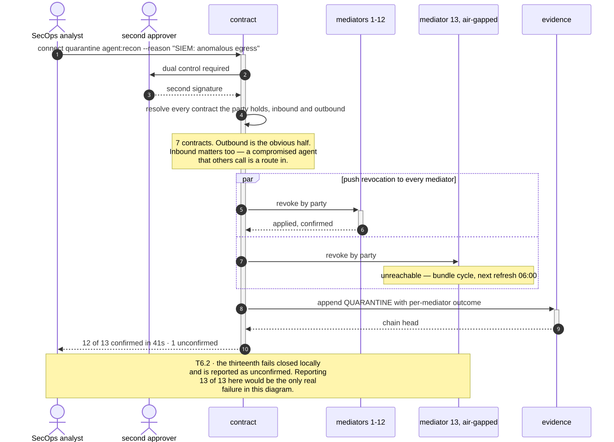
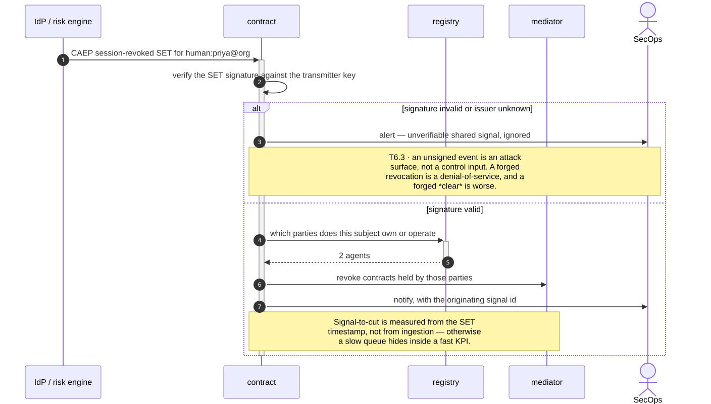
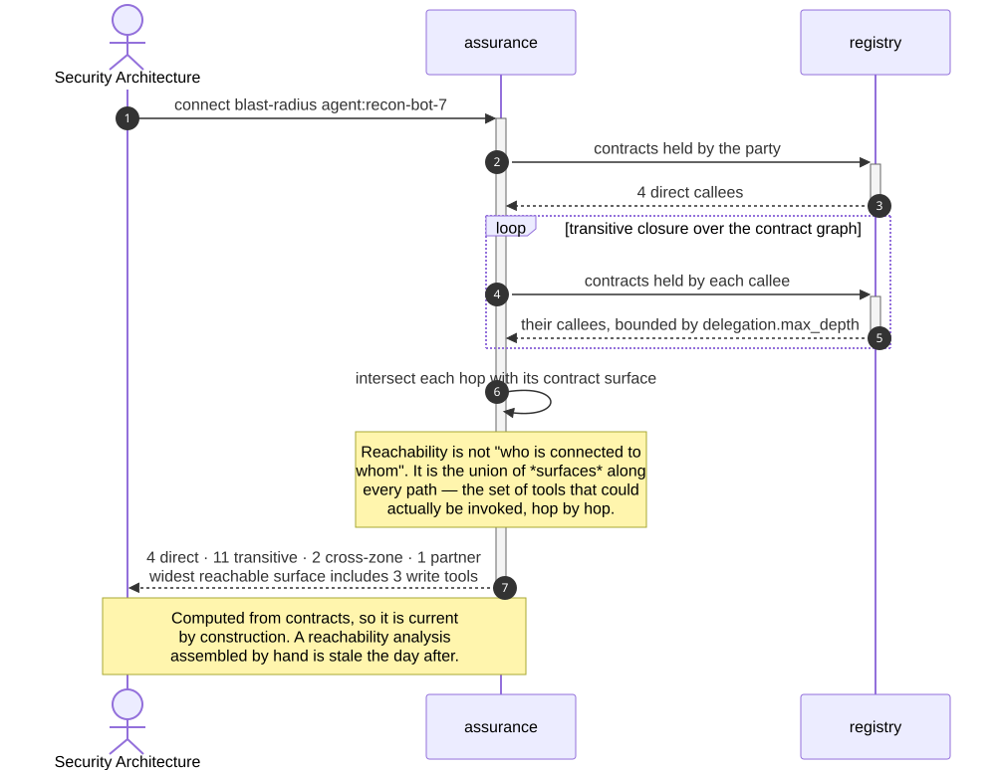
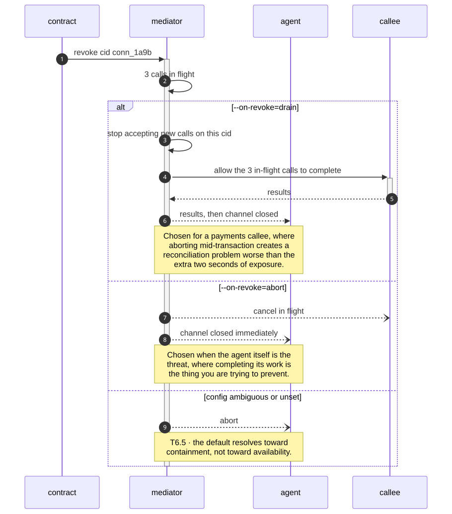
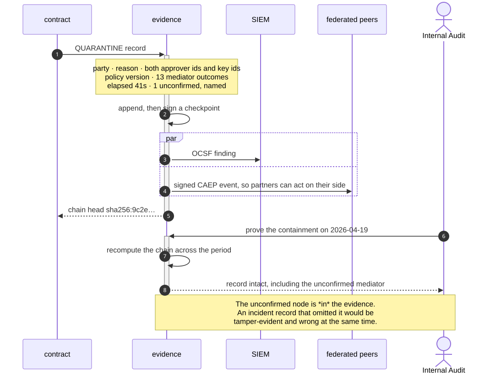

# B6 · Containment & Resilience

> *"cut it, fast, provably"*

The domain that runs at 03:00. Everything else in the system exists partly so that
this one can work: containment is only a single command because B1 knows what exists,
B3 knows which relationships are real, and B7 can prove what happened.

The property that matters most here is not speed. It is **honesty about partial
success** — a containment tool that reports `13 / 13` when it reached twelve nodes has
manufactured false confidence at the exact moment confidence is most expensive.

| L2 | Capability | Realised by | Component |
|---|---|---|---|
| [B6.1](#b61--estate-wide-quarantine) | Estate-wide quarantine | T6.2 · T6.1 | `contract`, `mediator` |
| [B6.2](#b62--signal-driven-revocation-caepssf) | Signal-driven revocation | T6.3 | `contract` |
| [B6.3](#b63--blast-radius-analysis) | Blast-radius analysis | T5.6 | `assurance` |
| [B6.4](#b64--graceful-degradation--drain) | Graceful degradation & drain | T6.5 | `mediator` |
| [B6.5](#b65--containment-evidence) | Containment evidence | T7.1 · T6.4 | `evidence` |

---

## B6.1 · Estate-wide quarantine

> **Outcome** — one command severs every connection a compromised agent holds.
> **Owner** Security Operations · **KPI** mean time to contain, target < 60s; drill success rate · **Stage** ②

| Technical capability | Failure mode |
|---|---|
| **T6.2** Estate-wide quarantine | **Partial propagation → parties not yet confirmed are treated as denied** |
| **T6.1** Contract revocation | Revocation feed unreadable → strict mode denies all, fail-closed |



<details>
<summary>Mermaid source</summary>

```text
sequenceDiagram
    autonumber
    actor SOC as SecOps analyst
    actor CISO as second approver
    participant Ct as contract
    participant M1 as mediators 1-12
    participant M13 as mediator 13, air-gapped
    participant Ev as evidence

    SOC->>+Ct: connect quarantine agent:recon --reason "SIEM: anomalous egress"
    Ct->>CISO: dual control required
    CISO-->>Ct: second signature

    Ct->>Ct: resolve every contract the party holds, inbound and outbound
    Note over Ct: 7 contracts. Outbound is the obvious half.<br/>Inbound matters too — a compromised agent<br/>that others call is a route in.

    par push revocation to every mediator
        Ct->>+M1: revoke by party
        M1-->>-Ct: applied, confirmed
    and
        Ct->>M13: revoke by party
        Note over M13: unreachable — bundle cycle, next refresh 06:00
    end

    Ct->>+Ev: append QUARANTINE with per-mediator outcome
    Ev-->>-Ct: chain head
    Ct-->>-SOC: 12 of 13 confirmed in 41s · 1 unconfirmed

    Note over M13,SOC: T6.2 · the thirteenth fails closed locally<br/>and is reported as unconfirmed. Reporting<br/>13 of 13 here would be the only real<br/>failure in this diagram.
```

</details>

**What the diagram argues.** Two things a containment tool is usually wrong about.
Inbound contracts are revoked as well as outbound, because a compromised agent that
*receives* calls is still a path. And the unreachable node is named in the result
rather than assumed — so the incident record shows an open item instead of a green
tick.

---

## B6.2 · Signal-driven revocation (CAEP/SSF)

> **Outcome** — identity and risk events from the IdP automatically cut connectivity.
> **Owner** Security Operations · **KPI** % of revocations triggered automatically; signal-to-cut latency · **Stage** ③

| Technical capability | Failure mode |
|---|---|
| **T6.3** Shared-signal ingestion | Unsigned or unverifiable event → **ignored and alerted, never trusted** |



<details>
<summary>Mermaid source</summary>

```text
sequenceDiagram
    autonumber
    participant IdP as IdP / risk engine
    participant Ct as contract
    participant Reg as registry
    participant Med as mediator
    actor SOC as SecOps

    IdP->>+Ct: CAEP session-revoked SET for human:priya@org
    Ct->>Ct: verify the SET signature against the transmitter key

    alt signature invalid or issuer unknown
        Ct->>SOC: alert — unverifiable shared signal, ignored
        Note over Ct,SOC: T6.3 · an unsigned event is an attack<br/>surface, not a control input. A forged<br/>revocation is a denial-of-service, and a<br/>forged *clear* is worse.
    else signature valid
        Ct->>+Reg: which parties does this subject own or operate
        Reg-->>-Ct: 2 agents
        Ct->>Med: revoke contracts held by those parties
        Ct->>SOC: notify, with the originating signal id
        Note over Ct,Med: Signal-to-cut is measured from the SET<br/>timestamp, not from ingestion — otherwise<br/>a slow queue hides inside a fast KPI.
    end
    deactivate Ct
```

</details>

**What the diagram argues.** The verification branch is the whole capability. Wiring
an external system to a control that severs production connectivity is only safe if
an unverifiable message is inert — and the KPI is measured from the *event's* clock,
so latency introduced by our own queue cannot be reported away.

---

## B6.3 · Blast-radius analysis

> **Outcome** — "if this agent is compromised, what is reachable?" answered before the incident.
> **Owner** Security Architecture · **KPI** % of critical agents with a current reachability analysis · **Stage** ③

| Technical capability | Failure mode |
|---|---|
| **T5.6** Blast-radius analysis | — |



<details>
<summary>Mermaid source</summary>

```text
sequenceDiagram
    autonumber
    actor Arch as Security Architecture
    participant Asr as assurance
    participant Reg as registry

    Arch->>+Asr: connect blast-radius agent:recon-bot-7
    Asr->>+Reg: contracts held by the party
    Reg-->>-Asr: 4 direct callees

    loop transitive closure over the contract graph
        Asr->>+Reg: contracts held by each callee
        Reg-->>-Asr: their callees, bounded by delegation.max_depth
    end

    Asr->>Asr: intersect each hop with its contract surface
    Note over Asr: Reachability is not "who is connected to<br/>whom". It is the union of *surfaces* along<br/>every path — the set of tools that could<br/>actually be invoked, hop by hop.

    Asr-->>-Arch: 4 direct · 11 transitive · 2 cross-zone · 1 partner<br/>widest reachable surface includes 3 write tools

    Note over Arch,Asr: Computed from contracts, so it is current<br/>by construction. A reachability analysis<br/>assembled by hand is stale the day after.
```

</details>

**What the diagram argues.** Reachability is computed over surfaces, not nodes.
Knowing that agent A can reach service B is nearly useless if the contract to B grants
only `get_balance` — what a responder needs is the union of *what could be invoked*,
which is why the answer names three write tools rather than eleven services.

---

## B6.4 · Graceful degradation & drain

> **Outcome** — containment does not itself cause an outage.
> **Owner** SRE · **KPI** failed-transaction rate during quarantine drills · **Stage** ②

| Technical capability | Failure mode |
|---|---|
| **T6.5** Drain semantics | **Ambiguous config → abort**, the safe default |



<details>
<summary>Mermaid source</summary>

```text
sequenceDiagram
    autonumber
    participant Ct as contract
    participant Med as mediator
    participant Agent as agent
    participant Svc as callee

    Ct->>+Med: revoke cid conn_1a9b
    Med->>Med: 3 calls in flight

    alt --on-revoke=drain
        Med->>Med: stop accepting new calls on this cid
        Med->>+Svc: allow the 3 in-flight calls to complete
        Svc-->>-Med: results
        Med-->>Agent: results, then channel closed
        Note over Med,Agent: Chosen for a payments callee, where<br/>aborting mid-transaction creates a<br/>reconciliation problem worse than the<br/>extra two seconds of exposure.
    else --on-revoke=abort
        Med--)Svc: cancel in flight
        Med--)Agent: channel closed immediately
        Note over Med,Agent: Chosen when the agent itself is the<br/>threat, where completing its work is<br/>the thing you are trying to prevent.
    else config ambiguous or unset
        Med--)Agent: abort
        Note over Med,Agent: T6.5 · the default resolves toward<br/>containment, not toward availability.
    end
    deactivate Med
```

</details>

**What the diagram argues.** Drain and abort are both correct, for different threats,
and the choice belongs to the deployment rather than the incident. Deciding it at
03:00 is how a containment action becomes an outage — so it is configured per
mediator in advance, and an unset value resolves to abort.

---

## B6.5 · Containment evidence

> **Outcome** — the cut is provable: what, when, by whom, under which policy version.
> **Owner** Internal Audit · **KPI** % of containment actions with a tamper-evident record, target 100% · **Stage** ②

| Technical capability | Failure mode |
|---|---|
| **T7.1** Connection-lifecycle audit | Chain break detected on verify → alert |
| **T6.4** Shared-signal emission | — |



<details>
<summary>Mermaid source</summary>

```text
sequenceDiagram
    autonumber
    participant Ct as contract
    participant Ev as evidence
    participant SIEM as SIEM
    participant Peers as federated peers
    actor Audit as Internal Audit

    Ct->>+Ev: QUARANTINE record
    Note over Ev: party · reason · both approver ids and key ids<br/>policy version · 13 mediator outcomes<br/>elapsed 41s · 1 unconfirmed, named
    Ev->>Ev: append, then sign a checkpoint
    par
        Ev->>SIEM: OCSF finding
    and
        Ev->>Peers: signed CAEP event, so partners can act on their side
    end
    Ev-->>-Ct: chain head sha256:9c2e…

    Audit->>+Ev: prove the containment on 2026-04-19
    Ev->>Ev: recompute the chain across the period
    Ev-->>-Audit: record intact, including the unconfirmed mediator

    Note over Audit,Ev: The unconfirmed node is *in* the evidence.<br/>An incident record that omitted it would be<br/>tamper-evident and wrong at the same time.
```

</details>

**What the diagram argues.** The record includes the failure. A tamper-evident chain
only helps if what was appended was true at the time — so the thirteenth mediator's
non-confirmation is a first-class part of the containment record, not an operational
detail resolved before writing.

---

## What B6 does not do

It does not prevent the compromise, and it does not decide what "compromised" means —
that judgement arrives from a SIEM, a risk engine or a human. B6 begins the moment
someone has decided, and its only job is to act completely and say so honestly.
