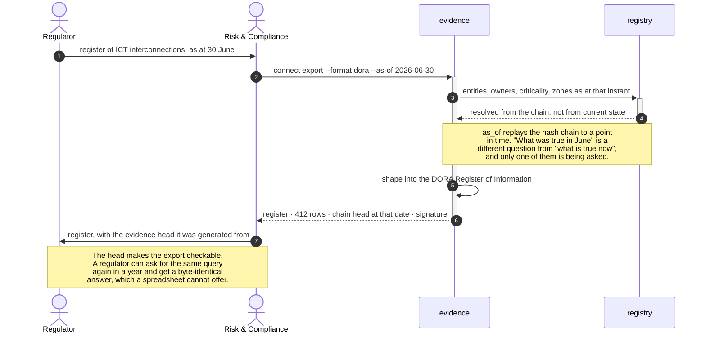
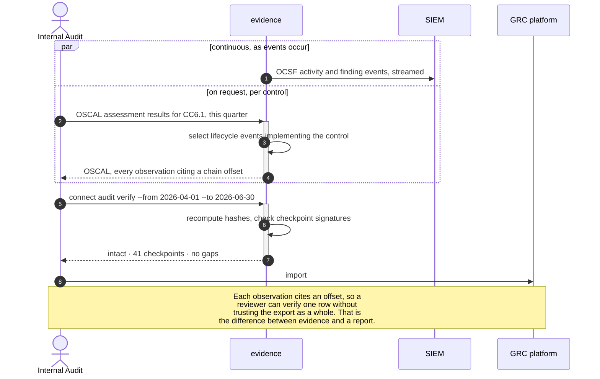
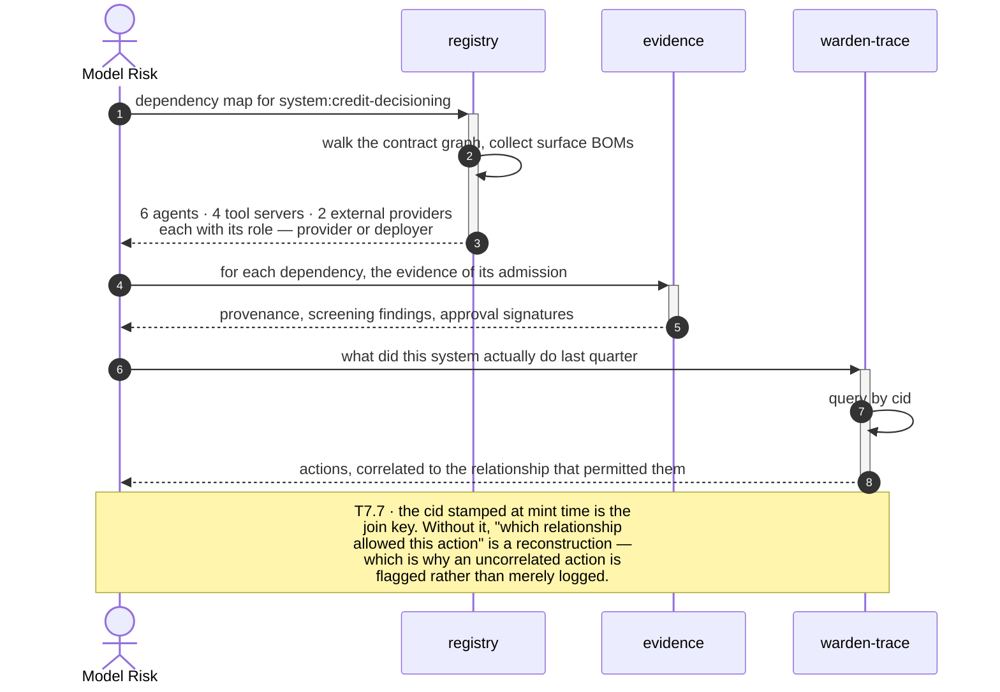
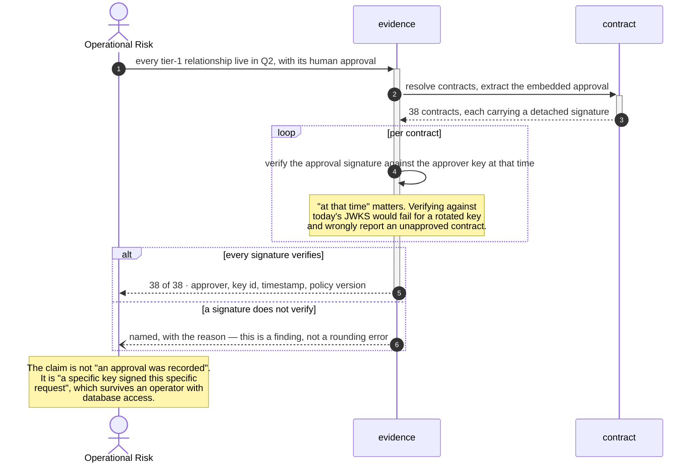

# B7 · Regulatory Evidence & Reporting

> *"hand the register over"*

The domain with the least novel machinery and the clearest test: a regulator asks a
question, and the answer is either **generated** or **reconstructed**. Everything here
turns on that verb.

Nothing in B7 collects new data. Every field it exports was recorded by B1 at
registration, B2 at admission, B3 at approval or B6 at containment — B7 is a set of
queries and shapes over an existing chain. Which is why its KPIs are measured in
*hours to produce* rather than in coverage.

| L2 | Capability | Realised by | Component |
|---|---|---|---|
| [B7.1](#b71--interconnect-register-export) | Interconnect register export | T7.4 | `evidence`, `registry` |
| [B7.2](#b72--control-evidence-export-oscalocsf) | Control-evidence export | T7.2 · T7.4 | `evidence` |
| [B7.3](#b73--ai-value-chain-traceability) | AI value-chain traceability | T2.6 · T7.7 | `registry`, `evidence` |
| [B7.4](#b74--attestation-of-oversight) | Attestation of oversight | T3.1 · T7.1 | `contract`, `evidence` |

---

## B7.1 · Interconnect register export

> **Outcome** — the regulator's register is generated, not reconstructed.
> **Owner** Risk & Compliance · **KPI** hours to produce the register, target < 1; gap findings · **Stage** ③

| Technical capability | Failure mode |
|---|---|
| **T7.4** Regulatory register export | — |

**What the diagram argues.** `as_of` is the whole capability. Exporting *current*
state is easy and answers the wrong question — the register is always retrospective,
and reconstructing June's estate from July's database is exactly the manual work the
control exists to remove.

---

## B7.2 · Control-evidence export (OSCAL / OCSF)

> **Outcome** — auditors and SIEM consume machine-readable, verifiable evidence.
> **Owner** Internal Audit · **KPI** % of requested evidence served automatically · **Stage** ③

| Technical capability | Failure mode |
|---|---|
| **T7.2** SIEM export | Blocking sink unavailable → connection not issued |
| **T7.4** Register export | — |

**What the diagram argues.** Two channels with different tempos and the same source.
The SIEM stream is continuous and lossy-tolerant; the OSCAL export is on demand and
must be exact. Both read the same chain, so a SIEM alert and an audit observation
about the same event cite the same offset.

---

## B7.3 · AI value-chain traceability

> **Outcome** — provider/deployer roles and dependencies documented per system.
> **Owner** Model Risk / AI Governance · **KPI** % of high-risk systems with a complete dependency map · **Stage** ③

| Technical capability | Failure mode |
|---|---|
| **T2.6** Surface BOM | — |
| **T7.7** Correlation root for `warden-trace` | Missing `cid` → action recorded as uncorrelated and **flagged** |

**What the diagram argues.** The dependency map and the behaviour record are joined
by one identifier issued at contract-mint time. The EU AI Act asks a deployer to
document its value chain; a graph of *declared* dependencies is a document, while a
graph joined to what actually executed is evidence.

---

## B7.4 · Attestation of oversight

> **Outcome** — proof that a named human authorised each material relationship.
> **Owner** Operational Risk · **KPI** % of high-tier connections with a signed human approval · **Stage** ②

| Technical capability | Failure mode |
|---|---|
| **T3.1** Contract minting | Any policy miss → no contract issued |
| **T7.1** Connection-lifecycle audit | Chain break detected on verify → alert |

**What the diagram argues.** Historical key resolution is the subtle requirement. An
approval signed in April by a key rotated in May is still a valid approval — verifying
it needs the key set as it stood in April, which is why the chain records key ids and
not just signatures.

---

## What B7 does not do

It does not judge compliance. Every export here states what happened and proves the
statement has not been altered — whether that satisfies DORA, CPS 230 or the AI Act is
a determination made by people, on evidence this domain makes cheap to produce.
