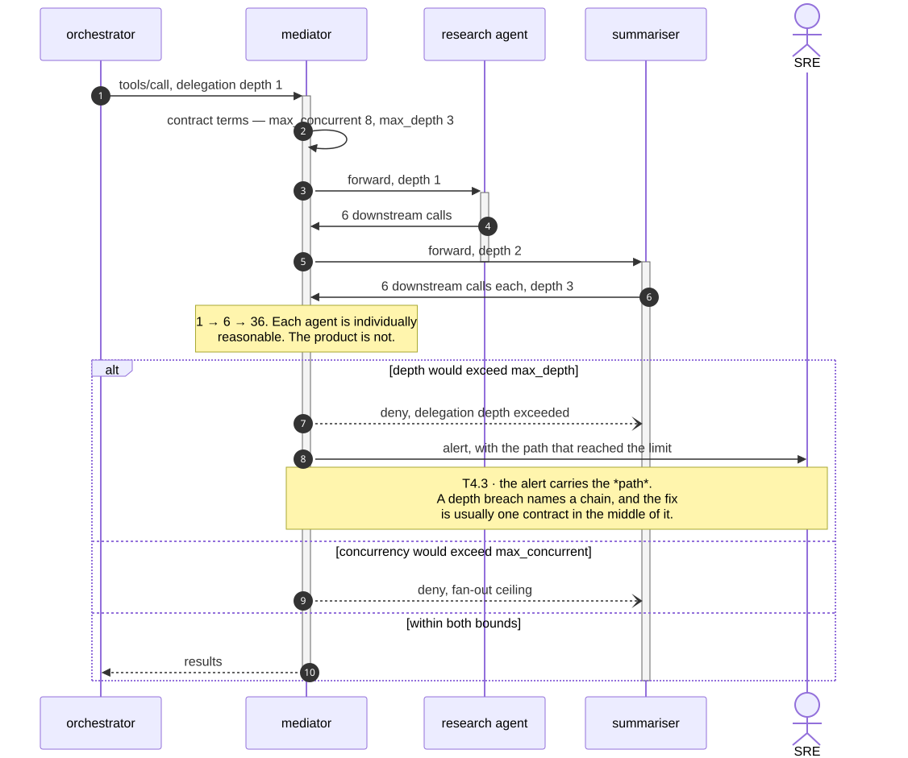
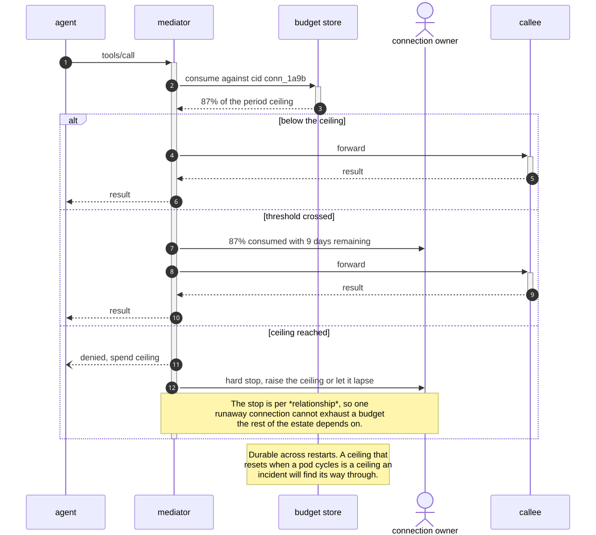
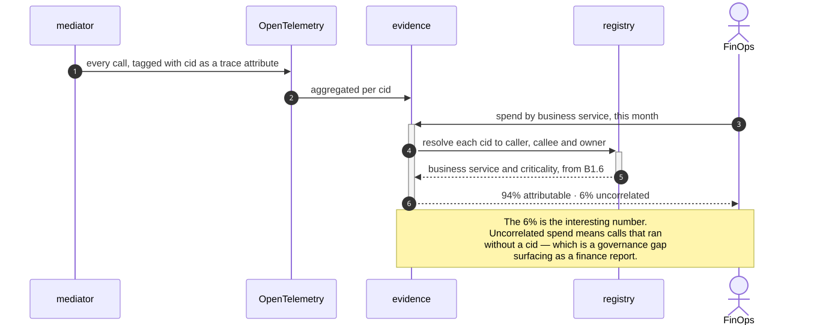
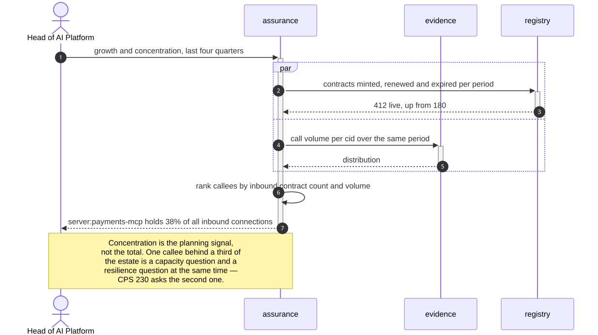

# B8 · Consumption & Cost Control

> *"bound the graph, charge it back"*

The domain that exists because agents call each other. Per-agent limits are a solved
problem and an insufficient one: four agents each politely under their own ceiling can
still produce a call storm, because the thing that grows is not any single rate but
the **product of the fan-out along a path**.

So every ceiling here is attached to a *connection* rather than to a party, and the
two that matter most — fan-out and delegation depth — are properties of the graph.

| L2 | Capability | Realised by | Component |
|---|---|---|---|
| [B8.1](#b81--connection-level-rate--fan-out-ceilings) | Rate & fan-out ceilings | T4.3 · T4.4 | `mediator` |
| [B8.2](#b82--spend-ceilings-per-relationship) | Spend ceilings per relationship | T4.4 | `mediator`, Warden core |
| [B8.3](#b83--chargeback--showback) | Chargeback & showback | T7.3 · T7.7 | `evidence` |
| [B8.4](#b84--capacity--dependency-planning) | Capacity & dependency planning | T5.6 · T7.3 | `assurance` |

---

## B8.1 · Connection-level rate & fan-out ceilings

> **Outcome** — recursive agent storms are bounded at the graph, not just per agent.
> **Owner** SRE · **KPI** ceiling breaches per month; incidents attributed to fan-out, target 0 · **Stage** ②

| Technical capability | Failure mode |
|---|---|
| **T4.3** Fan-out & recursion limits | Limit hit → **deny and alert**, which is what protects against call storms |
| **T4.4** Rate & spend ceilings | Ceiling breach → deny, owner notified |



<details>
<summary>Mermaid source</summary>

```text
sequenceDiagram
    autonumber
    participant A1 as orchestrator
    participant Med as mediator
    participant A2 as research agent
    participant A3 as summariser
    actor SRE as SRE

    A1->>+Med: tools/call, delegation depth 1
    Med->>Med: contract terms — max_concurrent 8, max_depth 3
    Med->>+A2: forward, depth 1
    A2->>Med: 6 downstream calls
    Med->>+A3: forward, depth 2
    deactivate A2

    A3->>Med: 6 downstream calls each, depth 3
    Note over Med: 1 → 6 → 36. Each agent is individually<br/>reasonable. The product is not.

    alt depth would exceed max_depth
        Med--)A3: deny, delegation depth exceeded
        Med->>SRE: alert, with the path that reached the limit
        Note over Med,SRE: T4.3 · the alert carries the *path*.<br/>A depth breach names a chain, and the fix<br/>is usually one contract in the middle of it.
    else concurrency would exceed max_concurrent
        Med--)A3: deny, fan-out ceiling
    else within both bounds
        Med-->>-A1: results
    end
    deactivate A3
```

</details>

**What the diagram argues.** The ceiling is on the contract, so it is inherited by
the *path* rather than owned by a node. That is the only place the arithmetic works:
no participant in a 1 → 6 → 36 expansion is individually misbehaving, so no
per-agent limit would ever fire.

---

## B8.2 · Spend ceilings per relationship

> **Outcome** — denial-of-wallet has a hard stop with a named owner.
> **Owner** FinOps · **KPI** spend variance vs ceiling; runaway events, target 0 · **Stage** ②

| Technical capability | Failure mode |
|---|---|
| **T4.4** Rate & spend ceilings | Ceiling breach → deny, **owner notified**, durable across restarts |



<details>
<summary>Mermaid source</summary>

```text
sequenceDiagram
    autonumber
    participant Agent as agent
    participant Med as mediator
    participant Budget as budget store
    actor Owner as connection owner
    participant Svc as callee

    Agent->>+Med: tools/call
    Med->>+Budget: consume against cid conn_1a9b
    Budget-->>-Med: 87% of the period ceiling

    alt below the ceiling
        Med->>+Svc: forward
        Svc-->>-Med: result
        Med-->>Agent: result
    else threshold crossed
        Med->>Owner: 87% consumed with 9 days remaining
        Med->>+Svc: forward
        Svc-->>-Med: result
        Med-->>Agent: result
    else ceiling reached
        Med--)Agent: denied, spend ceiling
        Med->>Owner: hard stop, raise the ceiling or let it lapse
        Note over Med,Owner: The stop is per *relationship*, so one<br/>runaway connection cannot exhaust a budget<br/>the rest of the estate depends on.
    end
    deactivate Med

    Note over Budget: Durable across restarts. A ceiling that<br/>resets when a pod cycles is a ceiling an<br/>incident will find its way through.
```

</details>

**What the diagram argues.** Durability is the requirement everyone forgets. An
in-memory counter makes the control disappear exactly when a runaway workload is
causing the restarts — so the budget store outlives the mediator by design.

---

## B8.3 · Chargeback & showback

> **Outcome** — agent-to-agent consumption is attributable to a business service.
> **Owner** FinOps · **KPI** % of spend attributable to a connection and owner · **Stage** ③

| Technical capability | Failure mode |
|---|---|
| **T7.3** Telemetry & tracing | — |
| **T7.7** Correlation root | Missing `cid` → action recorded as **uncorrelated and flagged** |



<details>
<summary>Mermaid source</summary>

```text
sequenceDiagram
    autonumber
    participant Med as mediator
    participant Otel as OpenTelemetry
    participant Ev as evidence
    participant Reg as registry
    actor FinOps as FinOps

    Med->>Otel: every call, tagged with cid as a trace attribute
    Otel->>Ev: aggregated per cid

    FinOps->>+Ev: spend by business service, this month
    Ev->>+Reg: resolve each cid to caller, callee and owner
    Reg-->>-Ev: business service and criticality, from B1.6
    Ev-->>-FinOps: 94% attributable · 6% uncorrelated

    Note over Ev,FinOps: The 6% is the interesting number.<br/>Uncorrelated spend means calls that ran<br/>without a cid — which is a governance gap<br/>surfacing as a finance report.
```

</details>

**What the diagram argues.** Cost attribution and connection governance are the same
query. The `cid` minted for control reasons turns out to be the only join key that
maps consumption to an owner — and the unattributable remainder is not a rounding
error, it is a list of calls nobody governed.

---

## B8.4 · Capacity & dependency planning

> **Outcome** — interconnect growth is a planned figure, not a surprise.
> **Owner** Head of AI Platform · **KPI** forecast accuracy on connection growth · **Stage** ③

| Technical capability | Failure mode |
|---|---|
| **T5.6** Blast-radius analysis (graph query) | — |
| **T7.3** Telemetry & tracing | — |



<details>
<summary>Mermaid source</summary>

```text
sequenceDiagram
    autonumber
    actor Plat as Head of AI Platform
    participant Asr as assurance
    participant Ev as evidence
    participant Reg as registry

    Plat->>+Asr: growth and concentration, last four quarters
    par
        Asr->>+Reg: contracts minted, renewed and expired per period
        Reg-->>-Asr: 412 live, up from 180
    and
        Asr->>+Ev: call volume per cid over the same period
        Ev-->>-Asr: distribution
    end

    Asr->>Asr: rank callees by inbound contract count and volume
    Asr-->>-Plat: server:payments-mcp holds 38% of all inbound connections

    Note over Plat,Asr: Concentration is the planning signal,<br/>not the total. One callee behind a third of<br/>the estate is a capacity question and a<br/>resilience question at the same time —<br/>CPS 230 asks the second one.
```

</details>

**What the diagram argues.** The useful output is concentration, not growth. A
forecast of total connections informs capacity; knowing that one tool server sits
behind 38% of them informs whether a single failure is a severe-but-plausible
scenario — which is the same graph, read for a different purpose.

---

## What B8 does not do

It does not price anything. The ceilings are expressed in calls and cost units the
deployment supplies, and the mapping from a tool call to a currency figure comes from
the platform's own billing — B8 bounds and attributes, it does not meter.
