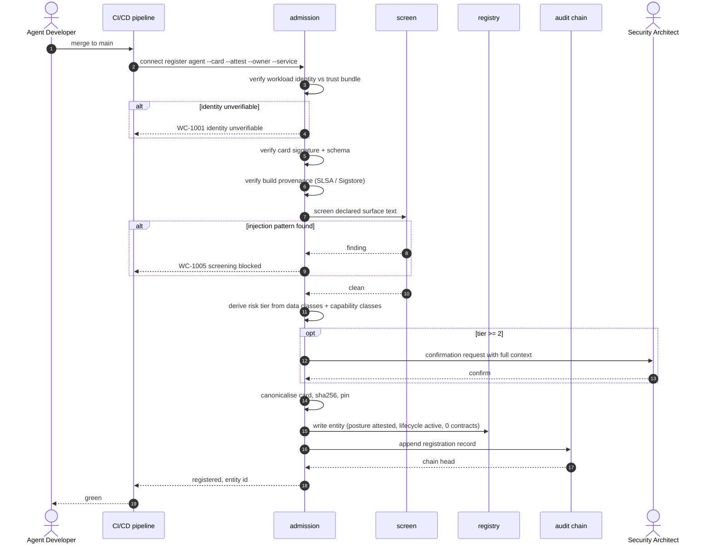

# UC-01 · Register and admit an internal agent

> Registration is not connectivity. A registered agent holds **zero** contracts.
> This use case ends with an entity that exists and is accountable — nothing more.

| Field | Detail |
|---|---|
| **ID** | UC-01 |
| **Primary actor** | Agent Developer |
| **Supporting** | Admission service (`wc-control::admission`), CI/CD pipeline, Security Architect (tier ≥ 2 only) |
| **Trigger** | An agent is being promoted toward a non-development environment |
| **Preconditions** | Agent has a workload identity; the build pipeline emits a provenance attestation; a named human owner exists |
| **Stage** | ① Inventory → ② Register |
| **Command** | `connect register agent` |

## Preconditions in detail

| Precondition | Why it is non-negotiable | Failure code |
|---|---|---|
| Workload identity resolvable | The identity is what a later contract binds to; a claimed id is not an identity | `WC-1001` |
| Agent card obtainable and signed | The card is the thing that gets pinned | `WC-1003` |
| Build provenance available | Links the running artifact to a reviewed source | `WC-1004` |
| Named human owner | An entity nobody owns cannot be suspended, renewed or offboarded | `WC-1008` |

## Main flow

1. The CI job invokes `connect register agent --card agent-card.json --attest bundle.sigstore --owner human:dev@org --service payments-recon`.
2. Admission verifies the **workload identity** against the trust bundle. Identity is proven, never asserted.
3. Admission verifies the **card signature and schema**.
4. Admission verifies **build provenance** and its link to the running artifact.
5. Admission **screens the declared surface** — card description, skill text, parameter documentation — for instruction-injection patterns (`wc-control::screen`, ruleset `screen-rules.toml`).
6. **Risk tier** is derived from declared data classes and requested capability classes. Tier ≥ 2 routes to a Security Architect for confirmation.
7. The card is canonicalised, hashed and **pinned**. The entity is written to the registry with `posture: attested`, `lifecycle: active`.
8. The registration is appended to the tamper-evident chain (`wc-control::chain`) and emitted as OCSF.

## Sequence




## Commands

```sh
connect register agent --card agent-card.json --owner human:dev@org \
  --service payments-recon --zone internal.apac-ops --tier 2 \
  --attest bundle.sigstore --require-card-signature --enforce
connect screen --file agent-card.json --kind agent --rules screen-rules.toml
connect show --id agent:recon-bot-7
connect posture --unattested
```

## Alternate and exception flows

| Ref | Condition | Behaviour |
|---|---|---|
| **A1** | Provenance unverifiable | **Observe mode:** admitted with `posture: unattested`, flagged. **Enforce mode:** denied, `WC-1004` |
| **A2** | Screening finding | Admission blocked, `WC-1005`; finding routed to AppSec with the offending text quoted |
| **A3** | No named owner | Denied, `WC-1008`. Ownership is non-negotiable |
| **A4** | Re-registration with a changed card | Treated as **drift**, not an update — see [UC-06](UC-06-surface-drift.md) |
| **A5** | Declared surface exceeds size limits | Denied, `WC-1010` — an unbounded surface cannot be reviewed |

## Postconditions

- The agent exists in the registry with a named owner and a pinned card hash.
- It is discoverable to the extent policy allows ([UC-03](UC-03-mediated-capability-discovery.md)).
- **It holds zero connections.** Reaching anything requires [UC-04](UC-04-establish-a-connection.md).

## Controls, evidence, threats

| | |
|---|---|
| **Controls** | T1.1, T1.4, T1.5, T2.1, T2.2, T5.2, T7.1, T7.2 |
| **Evidence** | Registration record · pinned card hash · provenance reference · tier decision · approver identity (tier ≥ 2) |
| **Threats mitigated** | T13 rogue agents · T9 spoofing · T12 communication poisoning, at the source |
| **Success measure** | 100% of production agents registered with a named owner; median registration under 5 minutes in CI |

## Related

[UC-02](UC-02-onboard-a-tool-server.md) is the same shape for the callee side · [UC-06](UC-06-surface-drift.md) handles what happens when the pin stops matching · [UC-08](UC-08-shadow-estate-detection.md) finds the agents that never came through here.
