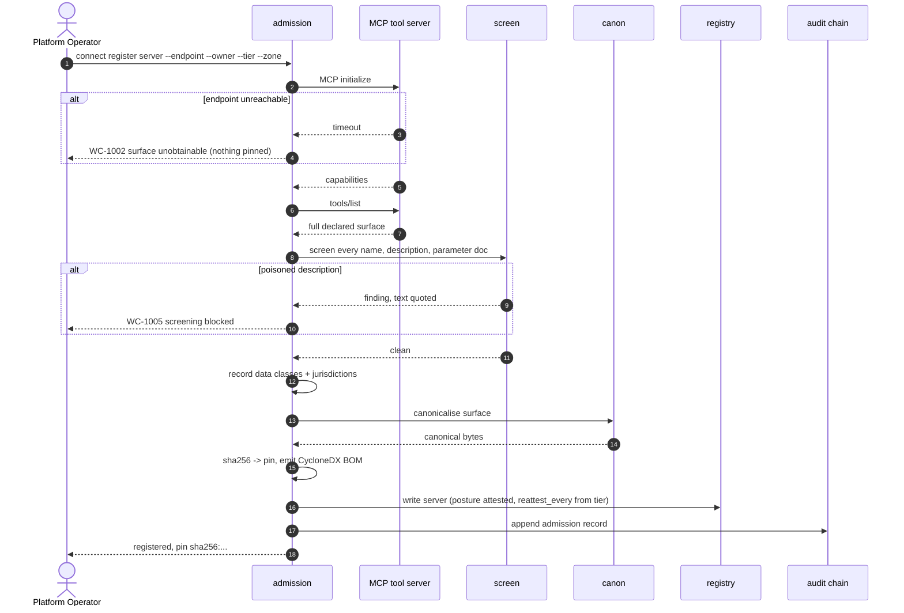

# UC-02 · Onboard a tool server and pin its surface

> This is where a poisoned tool description is caught — **before any agent's model has read it**.
> There is no "register on trust": if the handshake does not complete, nothing is pinned.

| Field | Detail |
|---|---|
| **ID** | UC-02 |
| **Primary actor** | Platform Operator (internal server) · AppSec Engineer (third-party server) |
| **Supporting** | Admission service, Third-Party Risk (external only) |
| **Trigger** | A tool server is to be made available to agents |
| **Preconditions** | Server endpoint reachable; `tools/list` obtainable; owner identified |
| **Stage** | ① Inventory → ② Register |
| **Command** | `connect register server` · `connect attest surface` |

## Main flow

1. `connect register server --endpoint … --owner … --tier 3 --zone internal.payments`.
2. Admission performs an MCP `initialize` + `tools/list` handshake and captures the **full declared surface** — not the subset anyone intends to use.
3. Every tool name, description and parameter document is **screened** (T5.2).
4. Data classes and jurisdictions the server touches are declared and recorded.
5. The surface is canonicalised (`wc-core::canon`) and **hashed**; the hash is pinned. A CycloneDX surface BOM is generated.
6. The server record is written with `posture: attested`; the re-attestation interval is set from the tier.

## Sequence




## Commands

```sh
connect register server --endpoint https://payments-mcp.internal \
  --owner human:ops@org --zone internal.payments --tier 3 \
  --data-classes internal --jurisdictions SG,AU --enforce
connect attest surface --surface surface.json --card-key issuer.pem --out surface.pin
connect offer publish --surface warden/surface.json --terms warden/offer.toml --repo org/payments-mcp
connect offer lint --terms warden/offer.toml --surface warden/surface.json --json
```

## Alternate and exception flows

| Ref | Condition | Behaviour |
|---|---|---|
| **A1** | Third-party server | Additionally requires a completed supplier record; admitted at `zone: partner`, and the higher zone bar applies to **every** future connection |
| **A2** | Surface too large, or wildcard tools | Explicit scoping justification required; unbounded surfaces refused at tier ≥ 2 (`WC-1010`) |
| **A3** | Server unreachable at handshake | Registration fails (`WC-1002`); nothing is pinned |
| **A4** | Surface changes after admission | Drift — [UC-06](UC-06-surface-drift.md) |

## Postconditions

- The server exists with a pinned surface hash and a declared zone and tier.
- Its **full** surface is on record — which is what makes a later contract's subset check meaningful.
- No agent can reach it yet.

## Controls, evidence, threats

| | |
|---|---|
| **Controls** | T2.1, T2.2, T2.6, T5.2, T7.1 |
| **Evidence** | Pinned manifest hash · surface BOM (CycloneDX) · screening report · supplier reference |
| **Threats mitigated** | Tool poisoning · rug-pull (baseline established) · T2 tool misuse |
| **Success measure** | 0 unregistered MCP endpoints observed in production traffic |

## Related

[UC-01](UC-01-register-and-admit-an-agent.md) is the caller-side twin · [UC-04](UC-04-establish-a-connection.md) consumes the pin · [UC-06](UC-06-surface-drift.md) watches it.
