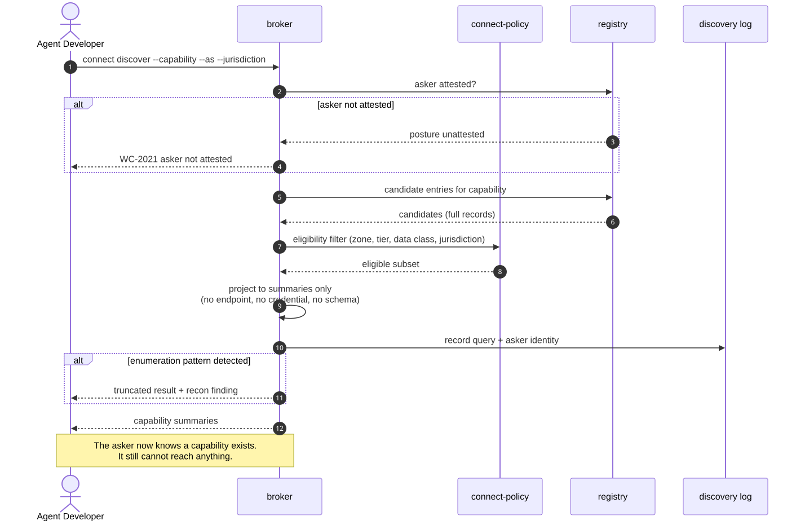

# UC-03 · Mediated capability discovery

> An empty result is never distinguishable from "it exists, but you may not see it".
> The broker does not confirm existence.

| Field | Detail |
|---|---|
| **ID** | UC-03 |
| **Primary actor** | Calling Agent, or its developer at design time |
| **Supporting** | Discovery broker (`wc-control::broker`), catalogue (`wc-control::inventory`) |
| **Trigger** | An agent or developer needs a capability it does not have |
| **Preconditions** | The asker is registered and attested |
| **Stage** | ① Inventory |
| **Command** | `connect discover` · `connect offer list` · the read-only portal |

## Main flow

1. The asker submits a **capability question**: `connect discover --capability "payments.balance.read" --as agent:recon-bot-7 --jurisdiction SG`.
2. The broker resolves candidate entries from the registry.
3. The broker filters to entries the asker is **policy-eligible to connect to** — zone rules, tier compatibility, data class, jurisdiction.
4. The broker returns **capability summaries only**. No endpoints, no credentials, no full tool schemas.
5. The query is logged against the asker's identity.

## Sequence




## Commands

```sh
connect discover --capability payments.balance.read --as agent:recon-bot-7 \
  --jurisdiction SG --data-class internal --limit 20
connect offer status --asset org/payments-mcp --within 30d --json
connect serve --portal --read-only --listen 127.0.0.1:8080
```

## Alternate and exception flows

| Ref | Condition | Behaviour |
|---|---|---|
| **A1** | No eligible entries | Empty result. Indistinguishable from "exists but not visible to you" — by design |
| **A2** | Enumeration pattern detected | Throttled (`WC-2020`) and raised as a reconnaissance finding |
| **A3** | Asker not attested | Refused, `WC-2021` |

## Postconditions

The asker knows a capability exists and may request a connection ([UC-04](UC-04-establish-a-connection.md)). Discovery grants nothing.

## Controls, evidence, threats

| | |
|---|---|
| **Controls** | T2.3, T2.4, T7.1 |
| **Evidence** | Discovery query log, per asker |
| **Threats mitigated** | Reconnaissance · T3 privilege compromise via lateral discovery |
| **Success measure** | 0 catalogue-leakage findings; developer capability-find time under 2 minutes |

## Related

[UC-04](UC-04-establish-a-connection.md) is the only thing discovery leads to · [UC-08](UC-08-shadow-estate-detection.md) covers what happens when people skip this entirely.
