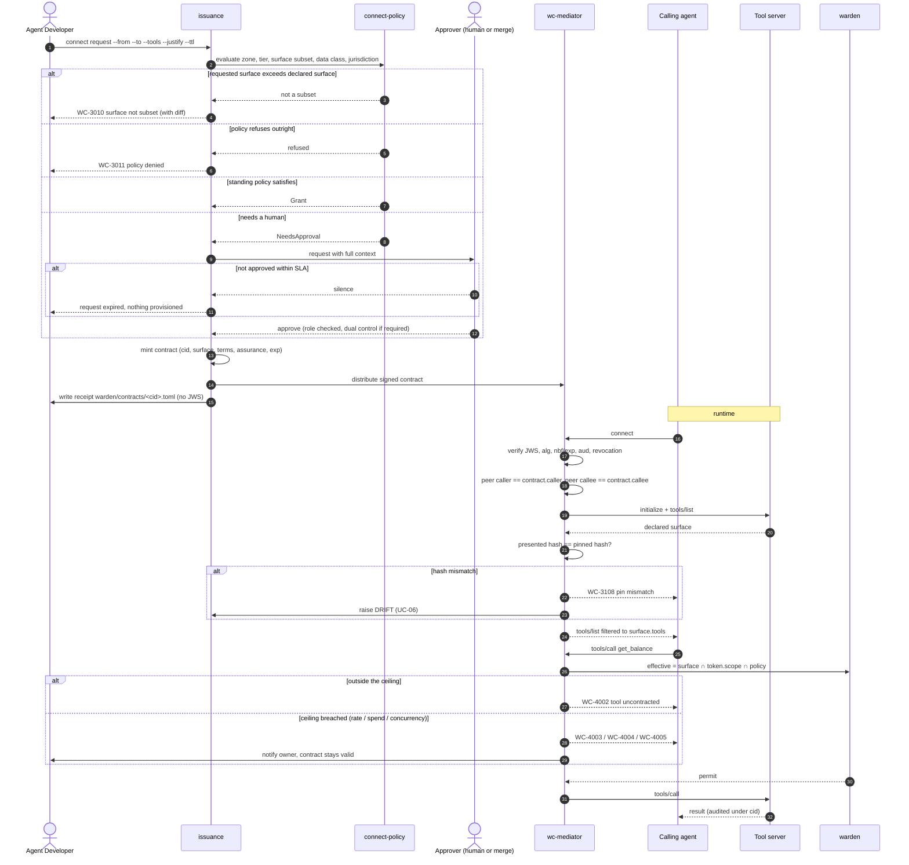

# UC-04 · Establish a connection

> The core loop. Everything else in this system supports it.
> Two parties consent through separate pipelines, and the artifact they produce is a **ceiling**.

| Field | Detail |
|---|---|
| **ID** | UC-04 |
| **Primary actor** | Agent Developer (consumer side) |
| **Supporting** | Issuance (`wc-control::issuance`), Security Architect or a reviewed merge, channel mediator (`wc-mediator`) |
| **Trigger** | A discovered capability is required by a real workload |
| **Preconditions** | Both parties registered and attested; caller holds a valid warden session token |
| **Stage** | ② Register → ③ Enforce |
| **Command** | `connect request` → `connect approve` (or approval by merge) → `connect receipt` |

## The two consents

| Consent | Declared in | Arrives via | Answers |
|---|---|---|---|
| Provider's offer | `warden/offer.toml` | the provider's own repo and pipeline | what may ever be exposed, and to whom |
| Consumer's need | `warden/needs.toml` | the consumer's repo and pipeline | what is being asked for, and why |

They meet in the registry. Neither party can produce a contract alone.

## Main flow

1. `connect request --from agent:recon-bot-7 --to server:payments-mcp --tools get_balance,list_transactions --justify "APAC daily reconciliation" --ttl 30d`.
2. Connect policy (`connect-policy.toml`) evaluates zone pair, tier compatibility, requested surface against the callee's **declared** surface, data classes, jurisdictions and requester authority.
3. **Disposition:** `Grant` under standing policy (low tier, same zone, read-only), `NeedsApproval` (routed to a human or to a reviewed merge), or `Refused` with a precise diff.
4. On approval a **connection contract** is minted: `cid`, caller, callee, pinned hashes, `surface`, `terms`, `assurance`, `approval`, `exp`.
5. The contract is distributed to the mediators on the path. A **receipt** — never the signed JWS — is written to `warden/contracts/<cid>.toml`.
6. At runtime the mediator verifies the contract, verifies **both** peer identities, checks presented hashes against the pins, and admits the channel.
7. The mediator **filters `tools/list`** down to `surface.tools`. The agent's model never sees `wire_funds`, so it cannot be manipulated into attempting it.
8. Each `tools/call` is then enforced by warden inside that ceiling: `effective = surface ∩ token.scope ∩ policy_decision`.
9. Every action is recorded with `cid` as the correlation root.

## Sequence




## Commands

```sh
connect need check --manifest warden/needs.toml --repo org/recon-bot
connect request --from agent:recon-bot-7 --to server:payments-mcp \
  --tools get_balance,list_transactions --justify "APAC daily reconciliation" \
  --ttl 30d --mediator warden:mediator:apac-ops --enforce
connect requests --all
connect approve --id req_4471 --merge-repo org/payments-mcp \
  --approval-file warden/approvals/req_4471.toml --ticket RISK-4471 --enforce
connect receipt --cid conn_7f3a91c4 --repo org/recon-bot --out warden/contracts
connect contracts --cid conn_7f3a91c4
connect verify --file contract.jws --jwks issuer.jwks --mediator-id warden:mediator:apac-ops
```

## Alternate and exception flows

| Ref | Condition | Behaviour | Code |
|---|---|---|---|
| **A1** | Requested surface exceeds the callee's declared surface | Rejected at request time with a precise diff | `WC-3010` |
| **A2** | Cross-zone request | Escalated to the zone-crossing path — [UC-05](UC-05-cross-organisation-federation.md) | `WC-3110` |
| **A3** | Approval not granted within SLA | Request expires; nothing is provisioned | — |
| **A4** | Hash mismatch at connect time | Connection refused, drift raised — [UC-06](UC-06-surface-drift.md) | `WC-3108` |
| **A5** | Contract expired mid-workload | The connection stops. Renewal is [UC-09](UC-09-renewal-review-offboarding.md); there is no implicit grace | `WC-3103` |
| **A6** | Ceiling breach — rate, spend, fan-out | Deny the call, notify the owner, keep the contract valid | `WC-4003`–`WC-4005` |
| **A7** | Either party quarantined | Refused; contracts already revoked | `WC-3105` |

## Postconditions

- A signed contract exists, bounded by `exp`, distributed to the mediators on the path.
- A human-readable receipt sits in the consumer's repo. **No signed JWS is ever committed.**
- Every subsequent action carries `cid`.

## Controls, evidence, threats

| | |
|---|---|
| **Controls** | T3.1–T3.8, T4.1, T4.4, T4.7, T7.1, T7.7 |
| **Evidence** | Signed contract · approval record with approver and ticket · per-connection lifecycle events · per-action warden audit rows carrying `cid` |
| **Threats mitigated** | T2 tool misuse · T3 privilege compromise · T10 human-in-the-loop fatigue (approve the relationship, not each call) |
| **Success measure** | 100% of production connections contracted; median request-to-connected under 1 business day; mean exposed tools per connection trending down |

## Related

[UC-03](UC-03-mediated-capability-discovery.md) precedes it · [UC-06](UC-06-surface-drift.md) can suspend it · [UC-07](UC-07-emergency-quarantine.md) can revoke it · [UC-09](UC-09-renewal-review-offboarding.md) ends or renews it.
