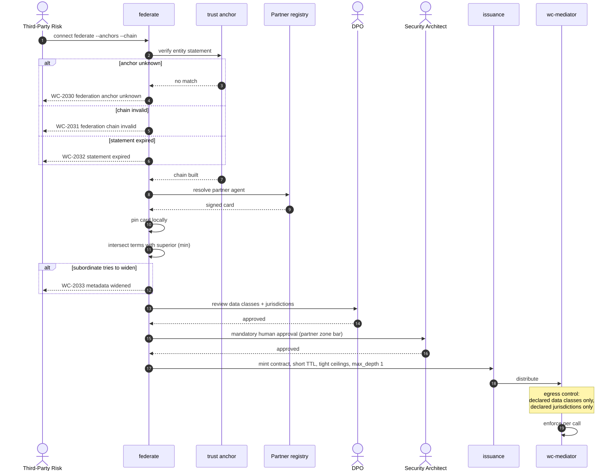

# UC-05 · Cross-organisation federation

> External drift is treated more severely than internal drift.
> A partner agent may not sub-delegate onward, and the callee cannot raise its own ceiling.

| Field | Detail |
|---|---|
| **ID** | UC-05 |
| **Primary actor** | Head of AI Platform · Third-Party Risk |
| **Supporting** | Partner Agent Operator, Security Architect, DPO, `wc-control::federate` |
| **Trigger** | A business process requires an internal agent to invoke a partner's agent, or the reverse |
| **Preconditions** | Partner onboarded as a supplier; a federation trust anchor is agreed |
| **Stage** | ③ Enforce |
| **Command** | `connect federate --anchors --chain` · `connect revoke --party partner:*` |

## Main flow

1. Federation is established: the partner's registry entity statement is verified against the agreed trust anchor and a trust chain is built.
2. The partner agent is resolved through federation; its signed card is fetched and **pinned locally**. Neither side exposes a full catalogue.
3. The elevated `zone: partner` admission bar applies — signed card mandatory, provenance mandatory, short `reattest_every`, mandatory human approval, mandatory data-class and jurisdiction declaration.
4. The DPO reviews declared data classes and cross-border jurisdictions.
5. A contract is minted with a short TTL, tight ceilings, an explicit oversight term and `delegation.max_depth: 1`.
6. The mediator enforces egress control: only declared data classes may cross, only to declared jurisdictions.
7. The connection appears in the third-party register with its termination path recorded.

## Federation narrowing

Every federated term is intersected with the superior's term by `min`. A subordinate can only ever narrow:

```
effective_term = min(local_term, superior_term)
```

A statement that tries to widen is rejected with `WC-2033` — metadata widened.

## Sequence




## Commands

```sh
connect federate --anchors anchors.toml --chain partner-chain.json --leeway 60
connect request --from agent:internal-7 --to partner:acme/settlement \
  --tools quote --justify "cross-border settlement" --ttl 7d --enforce
connect revoke --cid conn_9b21ffde --reason "partner exit executed"
connect export --format dora --out third-party-register.json
```

## Alternate and exception flows

| Ref | Condition | Behaviour | Code |
|---|---|---|---|
| **A1** | Partner card changes | Connection **suspended immediately**; re-approval required | `WC-5002` |
| **A2** | Federation anchor rotation | Existing connections run to `exp`; no new contracts until the anchor is re-verified | `WC-2034` |
| **A3** | Partner requests deeper delegation | Denied by construction. `max_depth` cannot be raised by the callee | `WC-3014` |
| **A4** | Exit triggered — contract end, breach, insolvency | `connect revoke --party partner:*` executes the tested exit and produces the evidence | — |
| **A5** | Signal arrives from an unauthorised party | Rejected | `WC-2035` |

## Postconditions

- The partner appears in the third-party register with a recorded, **tested** exit path.
- Contracts are short-lived, tightly bounded and non-delegable beyond one hop.

## Controls, evidence, threats

| | |
|---|---|
| **Controls** | T1.2, T1.5, T4.2, T4.5, T5.3, T7.4, T7.6 |
| **Evidence** | Federation trust chain · partner supplier record · contract · DPO review · exit drill record |
| **Threats mitigated** | T9 spoofing · T13 rogue agents · T12 communication poisoning · cross-border data exposure |
| **Success measure** | Partner onboarding cycle time measured in days; 100% of external connections with a tested exit |

## Related

[UC-04](UC-04-establish-a-connection.md) is the internal equivalent · [UC-10](UC-10-regulatory-register-and-evidence.md) files what this produces.
