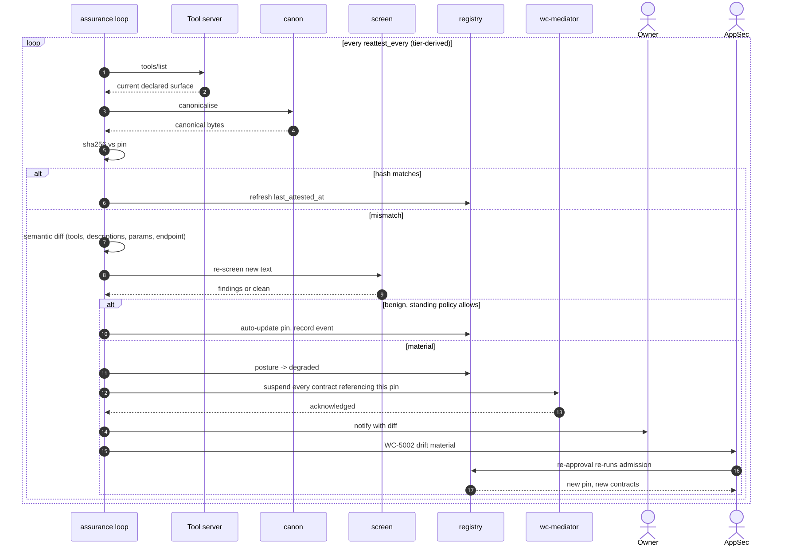

# UC-06 · Detect and respond to surface drift

A tool whose description changed is a different tool. Per-call policy does not detect this; the surface pin does.

| Field | Detail |
|---|---|
| **ID** | UC-06 |
| **Primary actor** | Assurance loop, automated (`wc-control::assurance`) |
| **Supporting** | AppSec Engineer, entity owner |
| **Trigger** | Scheduled re-attestation, or a hash mismatch at connect time |
| **Preconditions** | A pinned card or manifest hash exists |
| **Stage** | ② Register → ③ Enforce |
| **Command** | `connect posture --drift` · `connect attest surface` |

## Main flow

1. The assurance loop re-fetches the callee's declared surface on its interval.
2. Canonicalise and hash; compare against the pin.
3. On mismatch, compute a **semantic diff**: tools added or removed, descriptions changed, parameters changed, endpoints changed.
4. Re-run injection screening against the new text.
5. Classify:

   | Class | Examples | Response |
   |---|---|---|
   | **Benign** | Documentation typo; a tool added *outside* the contracted surface | Pin auto-updated under standing policy, event recorded |
   | **Material** | A contracted tool's description or parameters changed; a new exfiltration-shaped instruction; the endpoint moved | Every contract referencing that pin is **suspended immediately** |

6. Material drift suspends contracts and notifies owners with the diff.
7. Re-approval re-runs admission. On approval, a new pin and new contracts are issued.

## Sequence




## Commands

```sh
connect posture --drift
connect attest surface --surface surface.json --out surface.pin
connect screen --file surface.json --kind server --rules screen-rules.toml --mode enforce
connect show --id server:payments-mcp
```

## Alternate and exception flows

| Ref | Condition | Behaviour | Code |
|---|---|---|---|
| **A1** | Drift detected at connect time, before the scheduled check | Connection refused on the spot; the same flow runs | `WC-3108` |
| **A2** | Benign drift under standing policy | Pin auto-updated, event recorded, no suspension | — |
| **A3** | Repeated drift from one party | Posture degraded, tier escalated, `reattest_every` shortened | — (reported as `Posture::Degraded`) |
| **A4** | Surface unobtainable at re-attestation | Re-attestation fails; posture degrades rather than silently passing | `WC-1002` |

## Postconditions

- Either the pin still matches, or every contract that depended on it has been suspended.
- The diff, the screening result and the decision are all on the chain.

## Controls, evidence, threats

| | |
|---|---|
| **Controls** | T2.2, T5.1, T5.2, T5.3, T5.4, T6.1 |
| **Evidence** | Old and new hashes · semantic diff · screening result · suspension and re-approval records |
| **Threats mitigated** | Tool poisoning · rug-pull · cross-server shadowing · T12 · T11 |
| **Success measure** | Mean time to detect material drift below the re-attestation interval (target ≤ 1 h at tier 1); 0 undetected contracted-surface changes |

## Related

[UC-02](UC-02-onboard-a-tool-server.md) establishes the baseline · [UC-04](UC-04-establish-a-connection.md) is what gets suspended · [UC-09](UC-09-renewal-review-offboarding.md) re-decides on schedule.
