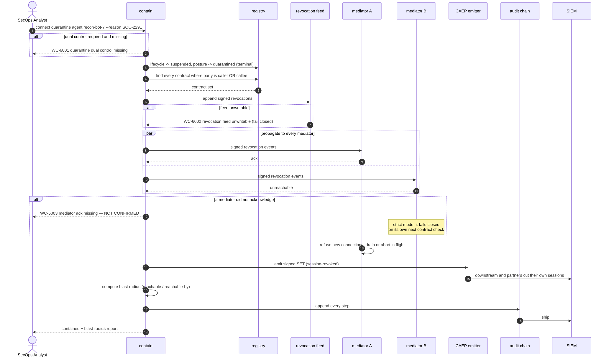

# UC-07 · Emergency quarantine

> A mediator that does not answer is **not confirmed**. Non-confirmation is reported, never assumed benign.
> Clearing quarantine requires full re-admission, not a state flip.

| Field | Detail |
|---|---|
| **ID** | UC-07 |
| **Primary actor** | SecOps Analyst |
| **Supporting** | Control plane (`wc-control::contain`), every mediator, IdP as a signal source |
| **Trigger** | Compromise indication — SOC detection, CAEP `session-revoked`, anomalous fan-out, owner report |
| **Preconditions** | The party is in the registry — which is exactly why [UC-01](UC-01-register-and-admit-an-agent.md) and [UC-02](UC-02-onboard-a-tool-server.md) are mandatory |
| **Stage** | ② Register → ③ Enforce |
| **Command** | `connect quarantine` · `connect blast-radius` · `connect unquarantine` |

## Main flow

1. `connect quarantine agent:recon-bot-7 --reason "SOC-2291 credential theft"`.
2. Registry state → `quarantined`, a **terminal** state until explicitly cleared.
3. Every contract where the party is caller **or** callee is revoked and propagated to all mediators as signed events.
4. Mediators refuse new connections and apply drain policy — `drain` or `abort` — to in-flight calls.
5. A CAEP signed SET is emitted so downstream systems and partners cut their own sessions.
6. A **blast-radius report** is generated: everything the party could reach, and everything that could reach it, at the moment of quarantine.
7. Every step is appended to the tamper-evident chain and shipped to the SIEM.

## Sequence




## Commands

```sh
connect quarantine --id agent:recon-bot-7 --reason "SOC-2291 credential theft" \
  --approver human:soc-lead@org --ack-deadline 60
connect blast-radius --id agent:recon-bot-7 --depth 3 --services
connect revoke --cid conn_7f3a91c4 --reason "contained under SOC-2291"
connect unquarantine --id agent:recon-bot-7 --approver human:ciso@org --why "re-admitted after rebuild"
```

## Alternate and exception flows

| Ref | Condition | Behaviour | Code |
|---|---|---|---|
| **A1** | A mediator is unreachable | Treated as **not confirmed**. Strict mode means it fails closed on its next contract check. Reported, never assumed benign | `WC-6003` |
| **A2** | Quarantine would break a critical business service | The impacted service list is surfaced, but containment is **not silently downgraded**. An override is an explicit, dual-controlled, logged act | `WC-6004` |
| **A3** | Clearing quarantine | Requires full re-admission ([UC-01](UC-01-register-and-admit-an-agent.md)), not a state transition | — |
| **A4** | Blast-radius graph exceeds depth limit | Truncated **and said so** — a truncated graph that claims completeness is worse than none | `WC-5030` |

## Postconditions

- The party holds no valid contracts anywhere, and cannot acquire one.
- The blast-radius report exists as evidence of what was exposed.
- Every propagation confirmation — and every non-confirmation — is on the chain.

## Controls, evidence, threats

| | |
|---|---|
| **Controls** | T6.1, T6.2, T6.3, T6.4, T6.5, T5.6, T7.1, T7.2 |
| **Evidence** | Quarantine order with reason and operator · per-contract revocation records · propagation confirmations · blast-radius report · emitted SETs |
| **Threats mitigated** | T13 rogue agents · T3 privilege compromise · T4 resource overload · T8 repudiation |
| **Success measure** | Mean time to contain under 60 s estate-wide; quarterly drill pass rate 100% |

## Related

[UC-04](UC-04-establish-a-connection.md) creates what this revokes · [UC-06](UC-06-surface-drift.md) is the automated cousin · [UC-10](UC-10-regulatory-register-and-evidence.md) reports the incident.
