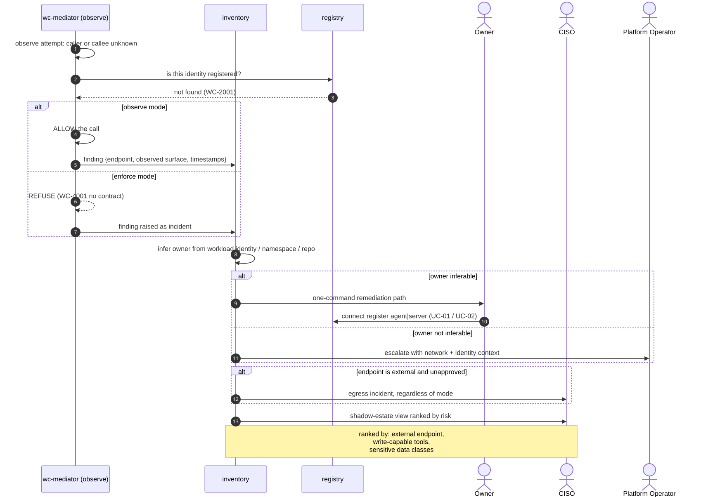

# UC-08 · Shadow agent and shadow MCP detection

> This runs in **observe** mode and requires no behaviour change from any developer.
> It is the wedge: the estate becomes visible before anything becomes enforced.

| Field | Detail |
|---|---|
| **ID** | UC-08 |
| **Primary actor** | Assurance loop, automated |
| **Supporting** | CISO, entity owner, Platform Operator |
| **Trigger** | An observed connection attempt whose caller, callee or both are unregistered |
| **Preconditions** | Mediators deployed on the paths in scope — observe-only is enough |
| **Stage** | ① Inventory |
| **Command** | `connect inventory` · `connect inventory promote` · `connect posture --unattested` |

## Main flow

1. A mediator observes an attempt referencing an unknown identity or endpoint.
2. **Observe mode:** allow, record, and raise a finding carrying the observed surface, the endpoint and the **inferred owner** — from workload identity, namespace or repository.
3. Findings aggregate into a shadow-estate view ranked by risk signals: external endpoint, write-capable tools, sensitive data classes.
4. The owner is contacted with a one-command remediation path: register ([UC-01](UC-01-register-and-admit-an-agent.md) / [UC-02](UC-02-onboard-a-tool-server.md)) or decommission.
5. **Enforce mode:** the attempt is refused and the finding is raised as an incident.

## The scanner probes nothing

Discovery reads declared files at reserved paths. It does not scan ports, does not call endpoints, and does not fetch anything a repository has not published:

| Path | Meaning |
|---|---|
| `warden/offer.toml` | this repo provides capability |
| `warden/needs.toml` | this repo consumes capability |
| `warden/surface.json` | the declared surface, as captured |
| `warden/contracts/<cid>.toml` | a receipt for an issued contract |

## Sequence




## Commands

```sh
connect inventory --org acme --declared --state-repo acme/warden-connect-state --quiet
connect inventory promote --from inventory.json --target org/payments-mcp \
  --owner human:ops@org --zone internal.payments --raise-pr --contracts-repo acme/warden-contracts
connect posture --unattested
connect proposals apply --dir proposals/ --repo acme/warden-contracts
```

## Alternate and exception flows

| Ref | Condition | Behaviour |
|---|---|---|
| **A1** | Owner cannot be inferred | Escalates to the platform team with network and identity context captured |
| **A2** | Endpoint is external and unapproved | Treated as an egress incident immediately, regardless of mode |
| **A3** | Repository count exceeds the sweep budget | The watermark and `repos_skipped` are reported — the sweep never claims coverage it did not achieve |

## Postconditions

- The shadow estate is enumerated and ranked, with an owner attached wherever one could be inferred.
- Nothing was blocked, in observe mode — which is why this can be deployed first.

## Controls, evidence, threats

| | |
|---|---|
| **Controls** | T2.5, T2.1, T4.5, T7.2 |
| **Evidence** | Finding with observed endpoint, surface, timestamps and inferred owner |
| **Threats mitigated** | T13 rogue agents · supply chain · unmanaged egress |
| **Success measure** | Shadow endpoints per month trending to 0; mean time to registration-or-removal under 14 days |

## Related

[UC-01](UC-01-register-and-admit-an-agent.md) and [UC-02](UC-02-onboard-a-tool-server.md) are the remediation · [UC-03](UC-03-mediated-capability-discovery.md) is what people should have used instead.
