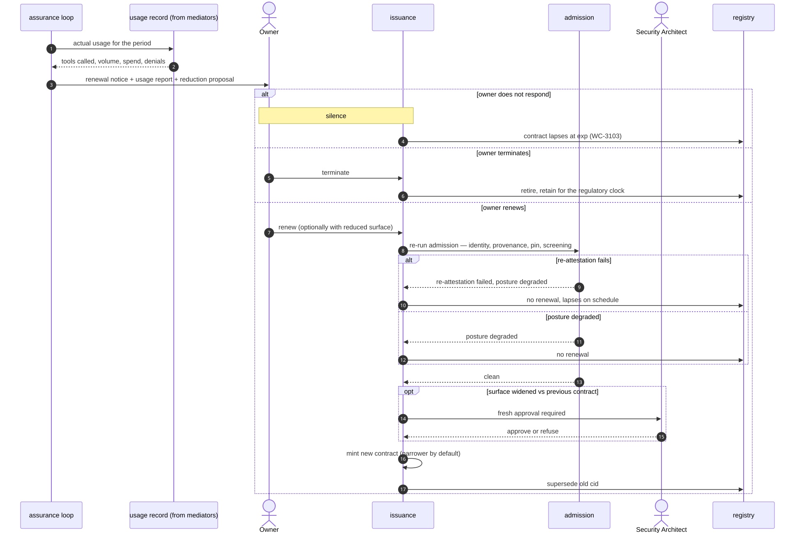

# UC-09 · Renewal, review and offboarding

> Silence terminates. It never renews.
> Renewal is a re-decision, not an extension — it re-runs admission from the top.

| Field | Detail |
|---|---|
| **ID** | UC-09 |
| **Primary actor** | Business service owner · entity owner |
| **Supporting** | Assurance loop, Security Architect |
| **Trigger** | Contract approaching `exp`; periodic access review; agent decommissioned; owner departs |
| **Preconditions** | An active contract exists |
| **Stage** | ② Register → ③ Enforce |
| **Command** | `connect contracts --dormant` · `connect request` (renewal) · `connect revoke` · `connect retention` |

## Main flow

1. The assurance loop notifies the owner ahead of expiry with **actual usage** for the period: tools actually called, volume, spend, denied attempts.
2. The owner elects renew · renew-with-reduced-surface · terminate.
3. Renewal **re-runs admission checks** — identity, provenance, pin, screening.
4. Usage-informed **surface reduction** is proposed automatically: tools granted but never called are dropped by default.
5. A new contract is minted, or the connection lapses at `exp`.
6. On termination the record is retained for the regulatory retention period with a demonstrable exit path.

## The least-connectivity ratchet

| Signal | Default proposal |
|---|---|
| Tool granted, never called | Drop it |
| Spend ceiling never approached | Lower it to observed peak plus headroom |
| Rate ceiling never approached | Lower it |
| Owner unresponsive | Lapse at `exp` |

Every renewal is an opportunity to make the ceiling smaller. It is never an opportunity to make it larger without a fresh approval.

## Sequence




## Commands

```sh
connect contracts --dormant --since 90d
connect request --from agent:recon-bot-7 --to server:payments-mcp \
  --tools get_balance --justify "renewal, surface reduced" --ttl 30d --enforce
connect deny --id req_5510 --reason "tool never called in the last period"
connect retention --contracts --retire --anchor-pub anchor.pub
```

## Alternate and exception flows

| Ref | Condition | Behaviour | Code |
|---|---|---|---|
| **A1** | No owner response | The contract lapses at `exp`. Silence terminates | `WC-3103` |
| **A2** | Owner has left the organisation | Connection flagged **orphaned**; the business service owner must reassign or it lapses | `WC-1008` |
| **A3** | Re-attestation fails at renewal | No renewal; the connection lapses on schedule | `WC-3031` |
| **A4** | Posture degraded at renewal | No renewal | `WC-3030` |
| **A5** | Contract already ended | Renewal refused; a new request is required | `WC-3032` |
| **A6** | Scheduled withdrawal is due | Flagged so it cannot be quietly missed | `WC-3033` |

## Postconditions

- Either a **narrower** contract exists, or the connection has ended cleanly with its record retained.
- No connection outlives its `exp` under any circumstance.

## Controls, evidence, threats

| | |
|---|---|
| **Controls** | T3.7, T5.3, T5.5, T1.6, T7.1 |
| **Evidence** | Renewal decision with usage report · surface-reduction diff · termination record |
| **Threats mitigated** | Standing-privilege accumulation · orphaned authority · T3 |
| **Success measure** | 0 connections past TTL; percentage of renewals with reduced surface — the ratchet |

## Related

[UC-04](UC-04-establish-a-connection.md) created it · [UC-06](UC-06-surface-drift.md) may have degraded it first · [UC-10](UC-10-regulatory-register-and-evidence.md) reports the lifecycle.
