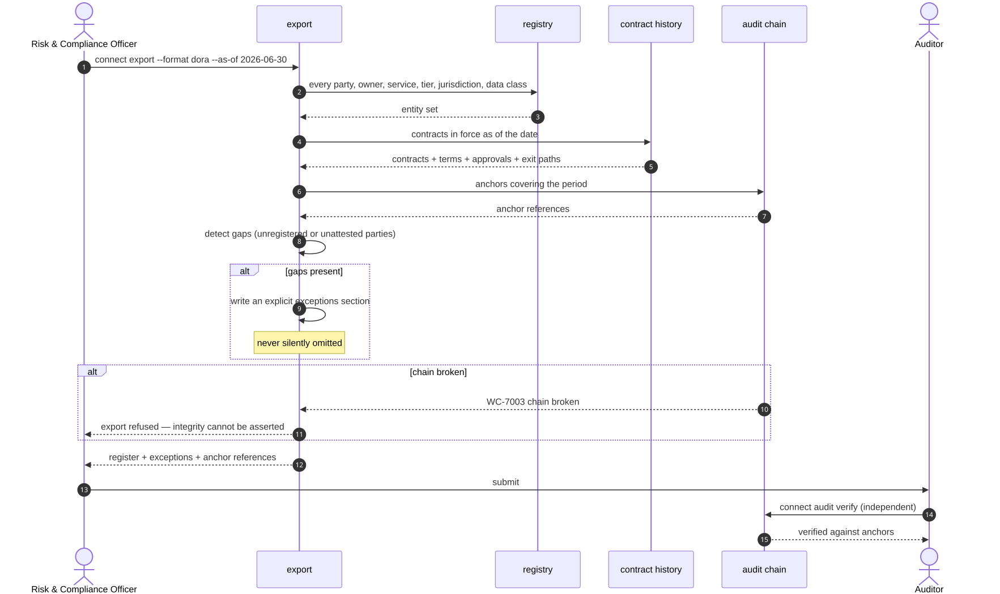

# UC-10 · Regulatory register and evidence export

The register records what is known and marks what is not.

| Field | Detail |
|---|---|
| **ID** | UC-10 |
| **Primary actor** | Risk & Compliance Officer |
| **Supporting** | Internal Audit, external regulator or auditor |
| **Trigger** | Periodic filing, audit request, incident report, or customer security review |
| **Preconditions** | Registry and contract history populated |
| **Stage** | ③ Enforce |
| **Command** | `connect export --format …` · `connect audit verify` · `connect bundle export` |

## Main flow

1. `connect export --format dora --as-of 2026-06-30`. Also `cps230`, `oscal`, `ocsf`, `csv`.
2. The export enumerates every internal and external dependency: party, owner, business service, criticality tier, jurisdictions, data classes, contract terms, approval record, exit path, incident history.
3. External agents appear as **ICT third-party service providers**, with contractual terms drawn from the connection contract itself.
4. Point-in-time integrity is provable: the export references audit-chain anchors, so it is **verifiable rather than merely asserted**.
5. Control evidence exports in OSCAL for the GRC platform; findings and lifecycle events in OCSF for the SIEM.

## Export formats

| Format | Consumer | What it carries |
|---|---|---|
| `dora` | EU regulatory filing | ICT third-party register |
| `cps230` | APRA-regulated entities | Material service provider register |
| `oscal` | GRC platform | Control evidence |
| `ocsf` | SIEM | Findings and lifecycle events |
| `csv` | Anyone | The flat fallback |

## Sequence




## Commands

```sh
connect export --format dora --as-of 2026-06-30 --anchor-pub anchor.pub --out dora-register.json
connect export --format oscal --out control-evidence.json
connect audit verify --anchor-pub anchor.pub
connect backup --out backup.tar --anchor-pub anchor.pub
```

## Alternate and exception flows

| Ref | Condition | Behaviour | Code |
|---|---|---|---|
| **A1** | Gaps present — unregistered or unattested parties | An explicit **exceptions section**, never a silent omission | — |
| **A2** | Historical as-of query | Reconstructed from contract history and verified against anchors | — |
| **A3** | Audit chain broken | Export refused; integrity cannot be asserted over a broken chain | `WC-7003` |
| **A4** | Export generation fails | Reported as a failure, not a partial file | `WC-7010` |

## Postconditions

- A register exists that an auditor can **independently verify** against the chain, without trusting the control plane that produced it.
- Every known gap is stated in the document itself.

## Controls, evidence, threats

| | |
|---|---|
| **Controls** | T7.1, T7.2, T7.4, T2.1, T2.6 |
| **Evidence** | The export itself, with anchor references and an exceptions section |
| **Threats mitigated** | T8 repudiation · regulatory finding |
| **Success measure** | Register produced in under 1 hour; 0 material gaps at audit |

## Related

Every other use case feeds this one. [UC-07](UC-07-emergency-quarantine.md) supplies incident history; [UC-09](UC-09-renewal-review-offboarding.md) supplies lifecycle; [UC-05](UC-05-cross-organisation-federation.md) supplies the third-party rows.
